# ASDE-X

<figure>
    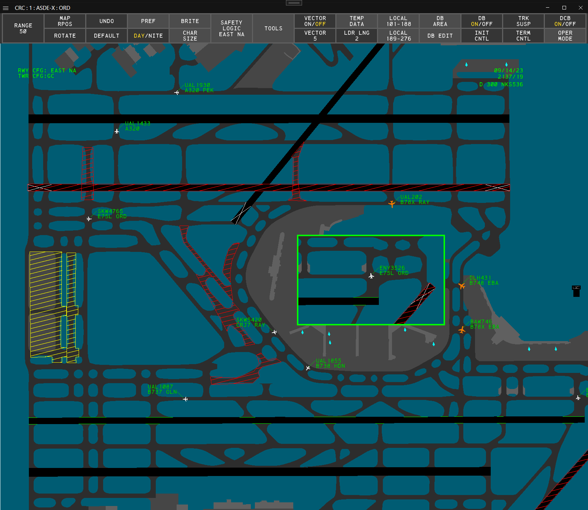
    <figcaption>Fig.  - An ASDE-X display</figcaption>
</figure>

Airport Surface Detection System - Model X (ASDE-X) is a ground radar system used at major airports across the NAS. CRC's ASDE-X displays closely simulate the [real-world system](https://www.faa.gov/air_traffic/technology/asde-x) used by the FAA. It is intended for use by clearance delivery, ground, and local controllers at equipped facilities.

## Contents

- [Display Map](#display-map)
- [Targets](#targets)
- [Data Blocks](#data-blocks)
- [Display Control Bar](#display-control-bar)
- [Preview Area](#preview-area)
- [Coast/Suspend List](#coastsuspend-list)
- [Pref Sets](#pref-sets)
- [Safety Logic](#safety-logic)
- [Temporary Data](#temporary-data)
- [Data Block Areas](#data-block-areas)
- [Secondary Windows](#secondary-windows)
- [Command Reference](#command-reference)
- [Settings](#settings)

## Display Map

The ASDE-X Display Map depicts the airport's runways, taxiways, ramp areas, and structures.

##### To reposition the Display Map:

1. Hold down the right mouse button and drag the Display Map to the desired position

_or_

1. Left-click the **MAP RPOS** button on the [Main](#main-menu) DCB menu or the [Tools](#tools-submenu) DCB submenu
2. Use the mouse to position the Display Map to the desired position
3. Left-click

_or_

1. Press `F8`
2. Use the mouse to position the Display Map to the desired position
3. Left-click

##### To change the Display Map's range:

1. Use the mouse scroll wheel to zoom in or out from the display's center

_or_

1. Hold `Alt` and use the mouse scroll wheel to zoom in or out from the cursor's position

_or_

1. Left-click the **RANGE** button on the Main DCB menu or the Tools DCB submenu
2. Scroll to set the desired range
3. Left-click or press `Enter`

_or_

1. Left-click the **RANGE** button on the Main DCB menu or the Tools DCB submenu
2. Type the desired range (6-300)
3. Press `Enter`

##### To change the Display Map's orientation:

1. Hold `Shift` and use the mouse scroll wheel to rotate the display

_or_

1. Left-click the **ROTATE** button on the Main DCB menu or the Tools DCB submenu
2. Scroll to set the desired orientation
3. Left-click or press `Enter`

_or_

1. Left-click the **ROTATE** button on the Main DCB menu or the Tools DCB submenu
2. Type the desired orientation (0-359)
3. Press `Enter`

<figure>
    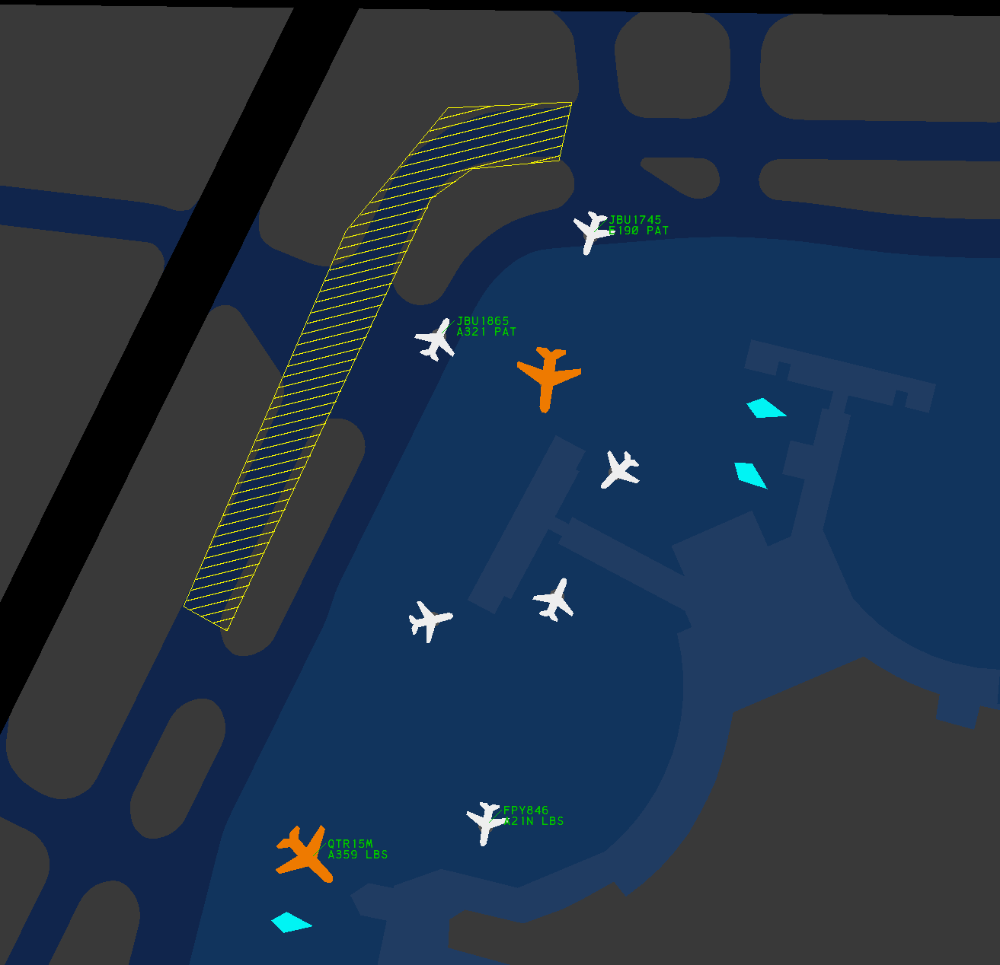
    <figcaption>Fig.  - The night color scheme</figcaption>
</figure>

The Display Map can be shifted between day and night color schemes.

##### To change the Display Map's color scheme:

1. Left-click the **DAY/NITE** button on the Main DCB menu

_or_

1. Press `F10`

## Targets

There are four types of radar Targets displayed in ASDE-X:

| Unknown                                                        | Aircraft                                                        | Heavy Aircraft                                               | Suspended                                                        |
| -------------------------------------------------------------- | --------------------------------------------------------------- | ------------------------------------------------------------ | ---------------------------------------------------------------- |
|  |  |  |  |

<figcaption>Table  - ASDE-X Target icons </figcaption>

An unknown Target is displayed when no information is known about a Target, such as when an aircraft's transponder is in the off/standby mode.

An aircraft or heavy aircraft Target is displayed for an aircraft based on the aircraft's category ([field G](#field-g-aircraft-category) of the aircraft's Data Block).

> :information_source: Boeing 757s are depicted by heavy aircraft Targets.

A suspended Target is displayed for a [suspended](#suspending-a-track) Track. The suspended Track's letter ID (as displayed in the [Coast/Suspend List](#coastsuspend-list)) is also displayed on the associated suspended Target.

### Target History

<figure>
    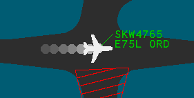
    <figcaption>Fig.  - A Target history trail</figcaption>
</figure>

Target history trails are enabled by left-clicking the **HISTORY ON/OFF** button on the [Tools](#tools-submenu) DCB submenu.

##### To set the number of displayed history data points:

1. Left-click the **HISTORY** button on the Tools DCB submenu
2. Scroll to set the desired value
3. Left-click or press `Enter`

_or_

1. Left-click the **HISTORY** button on the Tools DCB submenu
2. Type the desired value (1-7)
3. Press `Enter`

### Target Vector Lines

<figure>
    
    <figcaption>Fig.  - A Target with a velocity vector line</figcaption>
</figure>

Target velocity vector lines are enabled by left-clicking the **VECTOR ON/OFF** button on the [Main](#main-menu) DCB menu.

##### To set the length of Target velocity vector lines:

1. Left-click the **VECTOR** button on the Main DCB menu
2. Scroll to set the desired value
3. Left-click or press `Enter`

_or_

1. Left-click the **VECTOR** button on the Main DCB menu
2. Type the desired value (1-20)
3. Press `Enter`

## Data Blocks

<figure>
    
    <figcaption>Fig.  - A Data Block displaying all standard fields</figcaption>
</figure>

Data Blocks are attached to aircraft and heavy aircraft Targets and contain information regarding that aircraft's Track.

##### To toggle an aircraft's Data Block:

1. Left-click on the aircraft's Target

##### To toggle all Data Blocks:

1. Left-click the **DB ON/OFF** button on the Main DCB menu

_or_

1. Press `F6`

> :information_source: An aircraft's Data Block is hidden if the aircraft enters a [Data Block Off Area](#data-block-off-areas).

##### To set the length of all Data Block leader lines:

1. Left-click the **LDR LNG** button on the Main DCB menu
2. Scroll to set the desired length
3. Left-click or press `Enter`

_or_

1. Left-click the **LDR LNG** button on the Main DCB menu
2. Type the desired leader length (1-15)
3. Press `Enter`

_or_

1. Press `/`
2. Type the desired leader length (1-15)
3. Press `Enter`

> :information_source: Leader lengths cannot be set on a per-Data Block basis, though an aircraft's Data Block's leader length may be altered if the aircraft enters a [Data Block Trait Area](#data-block-trait-areas).

##### To set the position of all Data Blocks:

1. Type one of the valid inputs from table 1
2. Press `Enter`

##### To set the position of a single Data Block:

1. Type one of the valid inputs from table 1
2. Left-click the Data Block's Target

| Input | Data Block Position |
| ----- | ------------------- |
| 1     | SW                  |
| 2     | S                   |
| 3     | SE                  |
| 4     | W                   |
| 6     | E                   |
| 7     | NW                  |
| 8     | N                   |
| 9     | NE                  |

<figcaption>Table  - Data Block positions </figcaption>

:information_source: An aircraft's Data Block's position may be altered if the aircraft enters a Data Block Trait Area.

Data Blocks contain the following fields:

| Field | Line   | Field Content                                                             |
| ----- | ------ | ------------------------------------------------------------------------- |
| A     | Line 0 | Track status                                                              |
| B     | Line 1 | Callsign                                                                  |
| C     | Line 1 | Beacon code (hidden if under field B)                                     |
| D     | Line 1 | Altitude                                                                  |
| E     | Line 1 | Sensor coverage                                                           |
| F     | Line 2 | Aircraft type                                                             |
| G     | Line 2 | Aircraft category (timeshares with fields J and K)                        |
| H     | Line 2 | Paired fix or departure gate information (timeshares with fields J and K) |
| I     | Line 2 | Velocity (timeshares with fields J and K)                                 |
| J     | Line 2 | Scratchpad area 1 (timeshares with fields F, G, H, and I)                 |
| K     | Line 2 | Scratchpad area 2 (timeshares with fields F, G, H, and I)                 |

<figcaption>Table  - Data Block fields </figcaption>

#### Field A - Track Status

If ASDE-X detects a new Target with a beacon code identical to one already associated with another Target, then field A of both Data Blocks displays **DUP BCN**.

#### Field B - Callsign

When an aircraft squawks the beacon code assigned to its flight plan, field B displays the aircraft's callsign (ACID).

#### Field C - Beacon Code

If an aircraft is not squawking the beacon code assigned to its flight plan, or if no flight plan exists for the aircraft, the aircraft's currently squawked beacon code is displayed.

##### To temporarily display an aircraft's beacon code:

1. Press `F7` to initiate a [Multifunction command](#multifunction-commands)
2. Press `B`
3. Left-click on an aircraft Target

#### Field D - Altitude

The aircraft's altitude in 100s of feet. If no altitude is available, **XXX** is displayed.

#### Field E - Sensor Coverage

For the purposes of VATSIM, an aircraft's sensor coverage is always **FUS** unless the Track is [coasted](#coasted-and-dropped-tracks), in which case **CST** is displayed.

> :information_source: If an aircraft's Track is coasted, field E is always displayed, even if disabled on the [Data Block Edit](#data-block-edit-submenu) DCB submenu or by a Data Block Trait Area.

#### Field F - Aircraft Type

The aircraft type filed in the aircraft's flight plan.

#### Field G - Aircraft Category

An aircraft's category is assigned as listed in table 1 for facilities without CWT, or table 2 for facilities with CWT. The aircraft category also dictates which Target icon is displayed.

| Category | Description                                       | Target Icon    |
| -------- | ------------------------------------------------- | -------------- |
| T        | TCAS (Traffic Alert & Collision Avoidance System) | Aircraft       |
| B        | Heavy and TCAS                                    | Heavy Aircraft |
| L        | B757 and TCAS                                     | Heavy Aircraft |
| J        | Super                                             | Heavy Aircraft |
| V        | VFR                                               | Aircraft       |
| W        | Heavy and VFR                                     | Heavy Aircraft |

<figcaption>Table  - Aircraft categories - no CWT </figcaption>

> :information_source: For the purposes of VATSIM, all non-piston aircraft are assumed to have TCAS.

| Category | Description              | Target Icon    |
| -------- | ------------------------ | -------------- |
| A        | Super                    | Heavy Aircraft |
| B        | Upper Heavy              | Heavy Aircraft |
| C        | Lower Heavy              | Heavy Aircraft |
| D        | Non-Pairwise Heavy       | Heavy Aircraft |
| E        | B757                     | Heavy Aircraft |
| F        | Upper Large              | Aircraft       |
| G        | Lower Large              | Aircraft       |
| H        | Upper Small > 15,400 lbs | Aircraft       |
| I        | Lower Small < 15,400 lbs | Aircraft       |

<figcaption>Table  - Aircraft categories - CWT </figcaption>

#### Field H - Paired Fix or Departure Gate Information

An aircraft's three-letter fix ID is determined by the routing and destination in the aircraft's flight plan.

#### Field I - Velocity

The aircraft's ground speed in 10s of knots.

#### Fields J and K - Scratchpad Areas 1 and 2

Scratchpad areas are free form fields for up to seven alphanumeric characters.

##### To edit a Data Block's scratchpad:

1. Right-click on the Target and [modify](#modifying-data-block-fields) the Data Block.

_or_

1. Press `F7` to initiate a Multifunction command
2. Press `Y` to edit scratchpad area 1, or `H` to edit scratchpad area 2
3. Left-click the Target
4. Type the desired scratchpad value
5. Press `Enter`

### Manually Tagging An Unknown Target

An unknown Target can be manually tagged to associate a Data Block with the Target.

##### To manually tag an unknown Target:

1. Type the Target's aircraft ID
2. Left-click the unknown Target

> :information_source: For the purposes of VATSIM, it is not possible to tag an unknown Target with the incorrect aircraft ID.

> :warning: Manually tagging an unknown Target is not the same as [initiating control](#initiating-control-of-a-coasted-or-suspended-track) of a [coasted](#coasted-and-dropped-tracks) or [suspended](#suspending-a-track) Track.

### Terminating a Track

ASDE-X Tracks can be returned to an unknown Target by terminating the Track.

##### To terminate a Track:

1. Left-click the **TERM CNTL** button on the [Main](#main-menu) DCB menu
2. Left-click the Track

_or_

1. Press `F5`
2. Left-click the Track

To re-establish a Track after termination, the unknown Target has to be [manually tagged](#manually-tagging-an-unknown-target).

Additionally, a coasted or dropped Track can be terminated (removed from the [Coast/Suspend List](#coastsuspend-list)) prior to ASDE-X automatically removing it after 45 seconds.

##### To terminate a coasted or dropped Track:

1. Left-click the **TERM CNTL** button on the Main DCB menu
2. Left-click the Track

_or_

1. Left-click the **TERM CNTL** button on the Main DCB menu
2. Left-click the entry in the Coast/Suspend List

_or_

1. Press `F5`
2. Left-click the Track

_or_

1. Press `F5`
2. Left-click the entry in the Coast/Suspend List

### Modifying Data Block Fields

<figure>
    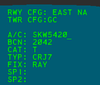
    <figcaption>Fig.  - Modifying a Data Block's fields in the Preview Area</figcaption>
</figure>

##### To modify a Data Block's fields:

1. Right-click the Data Block's aircraft Target
2. Use the mouse scroll wheel, the `↑` and `↓` keys, or `Enter` to navigate through the fields
3. Use `Backspace` to clear existing data and type in new value(s)
4. Press `Enter` after scratchpad 2 to save

> :warning: Editing an aircraft's Data Block fields (such as assigning an aircraft type to **TYP**) does not edit an aircraft's flight plan.

> :information_source: For the purposes of VATSIM, an aircraft's ID (**A/C**) cannot be edited. However, if an aircraft is not squawking its assigned beacon code, the aircraft's ID can be manually entered. Only the correct aircraft ID can be entered.

## Display Control Bar

<figure>
    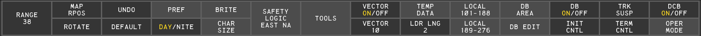
    <figcaption>Fig.  - The Main DCB menu</figcaption>
</figure>

The Display Control Bar (DCB) contains various settings and functions for ASDE-X in the form of buttons contained on a toolbar. By default, the DCB is placed at the top of the ASDE-X display.

The DCB contains multiple submenus. To return to the previous menu, left-click the **DONE** button, or press `Esc` or `Backspace`.

> :warning: If the window containing the ASDE-X display is not large enough to fit the DCB, the DCB is collapsed to a minimized state.

### Main Menu

The Main DCB menu (Figure ) contains the following buttons:

- **RANGE**: controls the Display Map's [range](#to-change-the-display-map39s-range). The display's current horizontal range is displayed in hundreds of feet.
- **MAP RPOS**: [repositions](#to-reposition-the-display-map) the Display Map
- **ROTATE**: controls the Display Map's [orientation](#to-change-the-display-map39s-orientation)
- **UNDO**: executes the [undo](#undo-function) function
- **DEFAULT**: restores the default display settings
- **PREF**: opens the [Pref Sets](#pref-sets-submenu) submenu. The current Pref Set's title is displayed.
- **DAY/NITE**: toggles the Display Map's [color scheme](#to-change-the-display-map39s-color-scheme)
- **BRITE**: opens the [Brightness](#brightness-submenu) submenu
- **CHAR SIZE**: opens the [Character Size](#character-size-submenu) submenu
- **SAFETY LOGIC**: opens the [Safety Logic](#safety-logic-submenu) submenu. The current safety logic [runway configuration](#runway-configurations) is displayed.
- **TOOLS**: opens the [Tools](#tools-submenu) submenu
- **VECTOR ON/OFF**: toggles display of Target [vector lines](#target-vector-lines)
- **VECTOR**: controls the length of Target [vector lines](#to-set-the-length-of-target-velocity-vector-lines)
- **TEMP DATA**: opens the [Temporary Data](#temporary-data-submenu) submenu
- **LDR LNG**: controls the [leader length](#to-set-the-length-of-all-data-block-leader-lines) of all Data Blocks
- **LOCAL**: not simulated
- **DB AREA**: opens the [Data Block Area](#data-block-area-submenu) submenu
- **DB ON/OFF**: toggles display of all [Data Blocks](#to-toggle-all-data-blocks)
- **INIT CNTL**: initiates the [initiate Track control](#initiating-control-of-a-coasted-or-suspended-track) function
- **TRK SUSP**: initiates the [Track suspend](#suspending-a-track) function
- **TERM CNTL**: initiates the [terminate control](#terminating-a-track) function
- **DCB ON/OFF**: toggles display of the DCB. When disconnected from the VATSIM network, the **DCB ON/OFF** button timeshares with a red **ASR OFF** and **MLAT OFF** error.
- **OPER MODE**: not simulated

#### Undo Function

The following functions can be reverted using the undo function:

- Brightness
- Character Size
- Coast/Suspend List On/Off
- Coast/Suspend List Reposition
- Cursor Speed
- Data Blocks On/Off
- DCB Reposition
- Default
- History Trails Length
- History Trails On/Off
- Leader Line Length
- Map Reposition
- Preview Area Reposition
- Range
- Rotate
- Vector Length
- Vector On/Off

> :keyboard: `F9` executes the undo function.

### Pref Sets Submenu

<figure>
    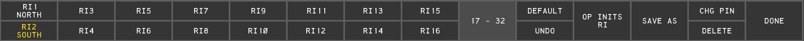
    <figcaption>Fig.  - The Pref Sets DCB submenu</figcaption>
</figure>

The Pref Sets DCB submenu contains 32 slots to store Pref Sets. The active Pref Set is indicated by a yellow label. To view additional pages of Pref Sets, left-click the **1-16** or **17-32** button.

The Pref Sets submenu also contains the following buttons:

- **DEFAULT**: restores the default display settings
- **UNDO**: executes the [undo](#undo-function) function
- **OP INITS** initiates the [change operator](#to-set-the-current-operating-initials) function
- **SAVE AS**: initiates the [save Pref Set](#to-save-a-pref-set) function
- **CHG PIN**: initiates the [change PIN](#to-change-a-pin) function
- **DELETE**: initiates the [delete Pef Set](#to-delete-a-pref-set) function

> :link: For more information on Pref Sets, please see the [Pref Sets](#pref-sets) section of the documentation.

### Brightness Submenu

<figure>
    
    <figcaption>Fig.  - The Brightness DCB submenu</figcaption>
</figure>

The Brightness DCB submenu contains the following buttons to control the brightness of various elements on the display:

- **HOLD BARS**: controls the brightness of the safety logic [hold bars](#hold-bars)
- **MVMENT AREA**: controls the brightness of the [Display Map](#display-map)
- **BAKGND**: controls the brightness of the display background
- **TRACK**: controls the brightness of [Track and Target](#targets) icons
- **DATA BLOCKS**: controls the brightness of [Data Blocks](#data-blocks)
- **LISTS**: controls the brightness of the [Preview Area](#preview-area), [Coast/Suspend List](#coastsuspend-list), and [Alert Message Box](#alert-message-box)
- **TEMP MAP AREAS**: controls the brightness of [Temporary Map Areas](#temporary-map-areas)
- **TEMP MAP TEXT**: controls the brightness of [Temporary Map Text](#temporary-map-text)
- **DCB**: controls the brightness of the DCB

##### To change a brightness setting:

1. Left-click the brightness setting button
2. Scroll to set the desired brightness
3. Left-click or press `Enter`

_or_

1. Left-click the brightness setting button
2. Type the desired brightness setting (1-99)
3. Press `Enter`

### Character Size Submenu

<figure>
    
    <figcaption>Fig.  - The Character Size DCB submenu</figcaption>
</figure>

The Character Size DCB submenu contains the following buttons to control the character size of various text elements on the display:

- **DATA BLOCK**: controls the character size of [Data Blocks](#data-blocks). Note that [Data Block Trait Areas](#data-block-trait-areas) can also change the character size of the Data Blocks for aircraft within the defined area.
- **DCB**: controls the character size of the DCB. Note that the DCB's character size is automatically decreased to fit smaller window sizes.
- **COAST SUSPEND**: controls the character size of the [Coast/Suspend List](#coastsuspend-list)
- **TEMP DATA**: controls the character size of [Temporary Map Text](#temporary-map-text)
- **Preview Area**: controls the character size of the [Preview Area](#preview-area)

##### To change a character size setting:

1. Left-click the character size setting button
2. Scroll to set the desired size
3. Left-click or press `Enter`

_or_

1. Left-click the character size setting button
2. Type the desired character size setting (1-6 or 1-3 for the DCB)
3. Press `Enter`

### Safety Logic Submenu

<figure>
    
    <figcaption>Fig.  - The Safety Logic DCB submenu</figcaption>
</figure>

The Safety Logic DCB submenu contains the following buttons:

- **CLOSED RWY**: opens the [Closed Runway](#closed-runway-submenu) submenu
- **RWY CONFIG**: opens the [Runway Configuration](#runway-configuration-submenu) submenu
- **TOWER CONFIG**: opens the [Tower Configuration](#tower-configuration-submenu) submenu
- **ARR ALERTS**: opens the [Arrival Alerts](#arrival-alerts-submenu) submenu
- **TRACK ALERT INHIB**: initiates the [inhibit Track alerts](#to-inhibit-or-enable-alerts-for-an-individual-target) function
- **ALL TRACKS ENABLE**: enables [alerts](#inhibiting-alerts) for all Tracks
- **ALERT REPOS**: initiates the Alert Message [reposition](#to-reposition-the-alert-message-box) function
- **VOL**: controls the [system volume](#to-change-the-system-volume)
- **VOL TEST**: plays the system volume test message

##### To change the system volume:

1. Left-click the **VOL** button
2. Scroll to set the desired volume setting
3. Left-click or press `Enter`

_or_

1. Left-click the **VOL** button
2. Type the desired volume setting (1-99)
3. Press `Enter`

### Closed Runway Submenu

<figure>
    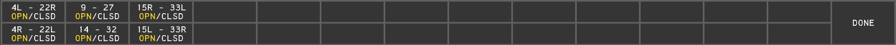
    <figcaption>Fig.  - The Closed Runway DCB submenu</figcaption>
</figure>

The Closed Runway DCB submenu contains toggle buttons to open and close each runway. The current state of a runway is indicated by a yellow label (**OPN** or **CLSD**).

> :link: For more information on closed runways, please see the [Safety Logic Closed Runways](#closed-runways) section of the documentation.

> :information_source: The Closed Runway submenu is only populated while connected to the VATSIM network.

### Runway Configuration Submenu

<figure>
    
    <figcaption>Fig.  - The Runway Configuration DCB submenu</figcaption>
</figure>

The Safety Logic Runway Configuration DCB submenu contains buttons for up to 60 safety logic runway configurations. The active configuration button is indicated by a yellow label. To view additional pages of configurations, left-click the **1-20**, **21-40**, or **41-60** buttons.

> :link: For more information on safety logic runway configurations, please see the [Safety Logic Runway Configurations](#runway-configurations) section of the documentation.

> :information_source: The Runway Configuration submenu is only populated while connected to the VATSIM network.

### Tower Configuration Submenu

<figure>
    
    <figcaption>Fig.  - The Tower Configuration DCB submenu</figcaption>
</figure>

The Safety Logic Tower Configuration DCB submenu contains toggle buttons to turn each tower configuration position on or off.

> :link: For more information on safety logic tower configuration positions, please see the [Safety Logic Tower Configuration Positions](#tower-configuration-positions) section of the documentation.

> :information_source: The Tower Configuration submenu is only populated while connected to the VATSIM network.

### Arrival Alerts Submenu

<figure>
    
    <figcaption>Fig.  - The Arrival Alerts DCB submenu</figcaption>
</figure>

The Safety Logic Arrival Alerts DCB submenu contains a toggle button to turn arrival alerts on or off for each tower configuration position.

> :link: For more information on safety logic tower configuration positions, please see the [Safety Logic Tower Configuration Positions](#tower-configuration-positions) section of the documentation.

> :information_source: The Arrival Alerts submenu is only populated while connected to the VATSIM network.

### Tools Submenu

<figure>
    
    <figcaption>Fig.  - The Tools DCB submenu</figcaption>
</figure>

The Tools DCB submenu contains the following buttons:

- **RANGE**: controls the Display Map's [range](#to-change-the-display-map39s-range). The current horizontal range is displayed in hundreds of feet.
- **MAP RPOS**: [repositions](#to-reposition-the-display-map) the Display Map
- **ROTATE**: controls the Display Map's [orientation](#to-change-the-display-map39s-orientation)
- **NEW WINDOW**: initiates the [new window](#to-add-a-new-secondary-window) function
- **RESIZE WINDOW**: initiates the [resize window](#to-resize-a-secondary-window) function
- **DELETE WINDOW**: initiates the [delete window](#to-delete-a-secondary-window) function
- **WINDOW RPOS**: initiates the [reposition window](#to-reposition-a-secondary-window) function
- **HISTORY ON/OFF**: toggles display of [Target history](#target-history) trails
- **HISTORY**: controls the number of data points displayed in a [Target's history](#to-set-the-number-of-displayed-history-data-points) trail
- **COAST ON/OFF**: toggles display of the [Coast/Suspend List](#coastsuspend-list)
- **COAST RPOS**: initiates the Coast/Suspend List [reposition](#to-reposition-the-coastsuspend-list) function
- **PREVIEW RPOS**: initiates the Preview Area [reposition](#to-reposition-the-preview-area) function
- **CSR SPD**: not simulated
- **CSR HOME ON/OFF**: not simulated
- **DCB TOP**: repositions the DCB to the top of the display
- **DCB LEFT**: repositions the DCB to the left of the display
- **DCB RIGHT**: repositions the DCB to the right of the display
- **DCB BOTTOM**: repositions the DCB to the bottom of the display
- **CHG PWD**: not simulated
- **PLAY BACK**: not simulated

### Temporary Data Submenu

<figure>
    
    <figcaption>Fig.  - The Temporary Data DCB submenu</figcaption>
</figure>

The Temporary Data DCB submenu contains the following buttons:

- **CLOSED RWY**: opens the [Closed Runway](#closed-runway-submenu) submenu
- **STORED GLOBAL TEMP DATA**: opens the [Stored Global Temporary Data](#stored-global-temporary-data-submenu) submenu
- **DEFINE CLOSED AREA**: initiates the [Define Closed Temporary Area](#to-define-a-temporary-map-area) function
- **DEFINE RESTR AREA**: initiates the [Define Restricted Temporary Area](#to-define-a-temporary-map-area) function
- **DEFINE TEXT**: initiates the define [Temporary Map Text Annotation](#to-define-temporary-map-text-annotations) function
- **SHOW HIDDEN DATA**: shows all [hidden](#to-hide-temporary-data) Temporary Data
- **HIDE DATA**: initiates the [hide Temporary Data](#to-hide-temporary-data) function
- **DELETE GLOBAL**: initiates the [delete global Temporary Data](#to-delete-temporary-data) function

### Stored Global Temporary Data Submenu

<figure>
    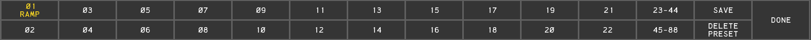
    <figcaption>Fig.  - The Stored Global Temporary Data DCB submenu</figcaption>
</figure>

The Stored Global Temporary Data DCB submenu contains 88 slots to store global Temporary Data Presets. Active Preset buttons are indicated by yellow labels. To view additional pages of Presets, left-click the **1-22**, **23-44**, **45-66**, etc. buttons.

> :link: For more information on Temporary Data Presets, please see the [Temporary Data](#to-save-a-temporary-data-to-a-preset) section of the documentation.

The Stored Global Temporary Data submenu also contains the following buttons:

- **SAVE**: initiates the [save Temporary Data Preset](#to-save-a-temporary-data-to-a-preset) function
- **DELETE PRESET**: initiates the [delete Temporary Data Preset](#to-delete-a-temporary-data-preset) function

### Data Block Area Submenu

<figure>
    
    <figcaption>Fig.  - The Data Block Area DCB submenu</figcaption>
</figure>

The Data Block Area DCB submenu contains the following buttons:

- **DEFINE TRAIT AREA**: initiates the [define Data Block Trait Area](#to-define-a-data-block-trait-area) function
- **DEFINE OFF AREA**: initiates the [define Data Block Off Area](#to-define-a-data-block-off-area) function
- **MODIFY TRAIT AREA**: initiates the [modify Data Block Trait Area](#to-modify-a-data-block-trait-area) function
- **DELETE ALL AREA**: initiates the [delete all Data Block Trait Areas](#to-delete-all-data-block-trait-areas) function
- **DELETE ONE AREA**: initiates the [delete one Data Block Trait Area](#to-delete-a-single-data-block-trait-area) function

> :link: For more information on Data Block Areas, please see the [Data Block Areas](#data-block-areas) section of the documentation.

### Data Block Edit Submenu

<figure>
    
    <figcaption>Fig.  - The Data Block Edit DCB submenu</figcaption>
</figure>

The Data Block Edit DCB submenu contains the following buttons to toggle fields displayed in [Data Blocks](#data-blocks)

- **FULL/PART**: toggles between full Data Blocks and partial Data Blocks. Partial Data Blocks only display the aircraft's ID or beacon code (field B or field C).
- **ALTITUDE**: toggles display of the aircraft's altitude (field D)
- **TYPE**: toggles display of the aircraft's type (field F)
- **SENSORS**: toggles display of the aircraft's sensor coverage (field E)
- **CAT**: toggles display of the aircraft's category (field G)
- **FIX**: toggles display of the aircraft's paired fix ID (field H)
- **VELOCITY**: toggles display of the aircraft's velocity (field I)
- **SCRATCH PAD**: toggles display of the aircraft's scratch pad(s) (fields J and K)

> :information_source: Settings in this submenu are only applied to Data Blocks for aircraft outside of [Data Block Trait Areas](#data-block-trait-areas).

> :information_source: The Sensor coverage field is automatically enabled for the Data Blocks of [coasted](#coasted-and-dropped-tracks) Tracks.

## Preview Area

<figure>
    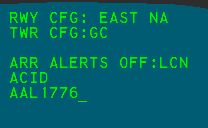
    <figcaption>Fig.  - The Preview Area</figcaption>
</figure>

The Preview Area displays system information and serves as the input and feedback area when executing functions. [Dot commands](/overview#dot-commands) can also be entered into the Preview Area. The Preview Area displays lines of text in the following order:

| Line | Description                 |
| ---- | --------------------------- |
| 1    | Active runway configuration |
| 2    | Tower configuration         |
| 3    | System response line        |
| 4    | Safety Logic status line 1  |
| 5    | Safety Logic status line 2  |
| 6    | Functional feedback line 1  |
| 7    | Functional feedback line 2  |

<figcaption>Table  - Preview Area lines </figcaption>

Safety Logic status line 1 displays a list of [tower configuration positions](#tower-configuration-positions) with [disabled arrival alerts](#to-temporarily-inhibit-or-enable-arrival-alerts-for-a-position39s-assigned-runways). Safety Logic status line 2 displays the message **TRK ALERT INHIB** when alerts are [inhibited](#to-inhibit-or-enable-alerts-for-an-individual-target) for one or more Tracks.

> :information_source: When disconnected from the VATSIM network, the message **CRITICAL FAULT START** is displayed in the Preview Area. When reconnected, this message is replaced with the **CRITICAL FAULT END** message.

The runways assigned to the enabled Safety Logic [tower configuration positions](#tower-configuration-positions) can be displayed in the Preview Area.

##### To display tower configuration runway assignments:

1. Press `F7` to initiate a [Multifunction command](#multifunction-commands)
2. Press `T`
3. Press `C`
4. Press `Enter`

> :keyboard: `Ctrl + Shift + C` displays the cursor's x, y position in feet from the air traffic control tower in the Preview Area.

#### To reposition the Preview Area:

1. Left-click the **PREVIEW RPOS** button on the [Tools](#tools-submenu) DCB submenu
2. Use the mouse to move the Preview Area to the desired position
3. Left-click

_or_

1. Press `F7` to initiate a Multifunction command
2. Press `P`
3. Use the mouse to move the Preview Area to the desired position
4. Left-click

## Coast/Suspend List

<figure>
    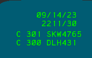
    <figcaption>Fig.  - The Coast/Suspend List</figcaption>
</figure>

The Coast/Suspend List contains a list of Tracks in the [coasted](#coasted-and-dropped-tracks), [dropped](#coasted-and-dropped-tracks), or [suspended](#suspending-a-track) states. The header of the Coast/Suspend List displays the current Zulu date and time in DD/MM/YY and HHMM/SS formats, respectively.

Entries in the Coast/Suspend List are grouped and displayed in the following order:

- Coasted Tracks
  - Indicated by a **C**
  - Assigned a unique three-digit ID
- Suspended Tracks
  - Indicated by a **S**
  - Assigned a unique single-letter ID
- Dropped Tracks
  - Indicated by a **D**
  - Assigned a unique three-digit ID

When there are more than five entries in the Coast/Suspend List, a down arrow appears on the right side of the bottom entry, indicating additional entries are in the list. Left-clicking the arrow advances to the next page of five entries and an up arrow appears on the right side of the top entry. Left-clicking the up arrow returns to the previous page. Left-clicking the Coast/Suspend List's header (date/time) expands the current page to fill the rest of the display's vertical space.

#### To reposition the Coast/Suspend List:

1. Left-click the **COAST RPOS** button on the [Tools](#tools-submenu) DCB submenu
2. Use the mouse to move the Coast/Suspend List to the desired position
3. Left-click

_or_

1. Press `F7` to initiate a [Multifunction command](#multifunction-commands)
2. Press `C`
3. Use the mouse to move the Coast/Suspend List to the desired position
4. Left-click

_or_

1. Middle-click the Coast/Suspend List's header (date/time)
2. Use the mouse to move the Coast/Suspend List to the desired position
3. Left-click

### Coasted and Dropped Tracks

When ASDE-X no longer detects a previously tracked aircraft Target (typically due to a pilot disconnecting from the network), the Track enters a coasted state and the aircraft's ID or beacon code is added to the Coast/Suspend List. If the flight plan associated with a disconnected aircraft lists the current ASDE-X facility as the aircraft's destination, the aircraft's Track instead enters a dropped state. Coasted and dropped Tracks remain in the Coast/Suspend List for 45 seconds, or until the Track is [re-associated](#to-initiate-control-of-a-coasted-track) with a Target.

Coasted Tracks display **CST** in field E of the Data Block, even if that field is disabled on the [Data Block Edit](#data-block-edit-submenu) DCB submenu or applicable [Data Block Trait Area](#data-block-trait-areas). Dropped Tracks do not display associated Targets.

### Suspending a Track

##### To suspend a Track:

1. Left-click the **TRK SUSP** button on the [Main](#main-menu) DCB menu
2. Left-click a Track

_or_

1. Press `F4`
2. Left-click a Track

The suspended Track's aircraft's ID or beacon code is added to the Coast/Suspend List. The suspended Track's letter ID is displayed on the suspended Target icon. Tracks remain suspended for one hour, or until [re-initiated](#to-initiate-control-of-a-suspended-track).

### Initiating Control of a Coasted or Suspended Track

##### To initiate control of a coasted Track:

1. Left-click the **INIT CNTL** button on the Main DCB menu
2. Type the three-digit identifier for the coasted Track from the Coast/Suspend List
3. Left-click the unknown Target

_or_

1. Press `F3`
2. Type the three-digit identifier for the coasted Track from the Coast/Suspend List
3. Left-click the unknown Target

##### To initiate control of a suspended Track:

1. Left-click the suspended Track

_or_

1. Left-click the entry in the Coast/Suspend List

_or_

1. Left-click the **INIT CNTL** button on the Main DCB menu
2. Type the letter identifier for the suspended Track from the Coast/Suspend List
3. Press `Enter`

_or_

1. Press `F3`
2. Type the letter identifier for the suspended Track from the Coast/Suspend List
3. Press `Enter`

> :warning: Initiating control of a coasted or suspended Track is different than [manually tagging](#manually-tagging-an-unknown-target) an unknown Target.

## Pref Sets

Pref Sets allow controllers to store up to 32 sets of display settings under their operating initials.

##### To set the current operator:

1. Left-click the **OP INITS** button on the [Pref Sets](#pref-sets-submenu) DCB submenu
2. Type the two letter operating initials, or three number controller ID
3. Press `Enter`

_or_

1. Press `F1`
2. Type the two letter operating initials, or three number controller ID
3. Press `Enter`

Each operator has a four-digit PIN that is used to save and delete Pref Sets.

> :information_source: The default PIN for every operator is `1234`.

##### To change a PIN:

1. Left-click the **CHG PIN** button on the Pref Sets DCB submenu
2. Enter the operating initials or controller ID
3. Enter the old PIN. If no PIN has been set, the default is `1234`.
4. Enter the new four-digit PIN
5. Confirm the new four-digit PIN
6. Press `Enter`

##### To save a Pref Set:

1. Left-click the **SAVE AS** button on the Pref Set DCB submenu
2. Enter the set ID. By default, the first available set ID is prefilled.
3. Enter a title for the Pref Set
4. Enter the current operator's PIN
5. Press `Enter`

##### To load a Pref Set:

1. Left-click the Pref Set's button on the Pref Set DCB submenu

_or_

1. Press `F1`
2. Enter the Pref Set's ID, such as `RI01`
3. Press `Enter`

##### To delete a Pref Set:

1. Left-click the **DELTE** button on the Pref Set DCB submenu
2. Enter the set ID, or left-click the set's button
3. Enter the current operator's PIN
4. Press `Enter`

## Safety Logic

<figure>
    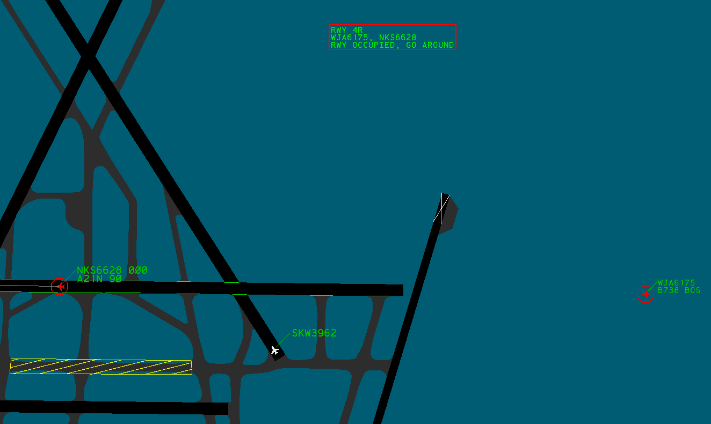
    <figcaption>Fig.  - An active Safety Logic Alert</figcaption>
</figure>

ASDE-X is equipped with a Safety Logic system that helps prevent collisions on the airport surface. The Safety Logic system alerts controllers when one of the following events is imminent:

- An aircraft landing on a closed runway
- An aircraft landing on an occupied runway
- Two aircraft landing on converging runways
- An aircraft landing on a runway converging with an aircraft departing from another runway
- An aircraft departing on a closed runway
- An aircraft departing on an occupied runway
- An aircraft taxiing onto a runway occupied by an arrival or departure
- An aircraft [landing](https://en.wikipedia.org/wiki/Air_Canada_Flight_759) on a configured taxiway

When an alert is generated, the following indications occur:

- A red octagon appears around each Target involved in the alert
- Each Target involved in the alert flashes between red and its normal color
- Full Data Blocks are displayed for each Target involved in the alert
- Partial Data Blocks are displayed for all other Targets
- The [Alert Message Box](#alert-message-box) appears with an alert description
- An audible alert is played

> :keyboard: `F12` silences the active audible alert

### Alert Message Box

<figure>
    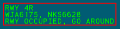
    <figcaption>Fig.  - The Alert Message Box</figcaption>
</figure>

The Alert Message Box contains descriptions for up to five concurrent alerts. If more than five alerts are occurring simultaneously, you should seek additional training.

An Alert description contains the following information:

| Line | Description                                                |
| ---- | ---------------------------------------------------------- |
| 1    | Runway or taxiway identifier(s)                            |
| 2    | Callsign(s)/beacon code(s)/unknown(s) for involved Targets |
| 3    | Alert description                                          |

<figcaption>Table  - Alert description lines </figcaption>

##### To reposition the Alert Message Box:

1. Left-click the **ALERT RPOS** button on the [Safety Logic](#safety-logic-submenu) DCB submenu
2. Use the mouse to move the Alert Message Box to the desired position
3. Left-click

### Closed Runways

<figure>
    
    <figcaption>Fig.  - A closed runway's threshold</figcaption>
</figure>

Runways can be closed to generate alerts for aircraft attempting to land or depart on a closed surface. Closed runways are depicted with white X's on both ends of the runway (Figure ).

##### To close a runway:

1. Left-click the appropriate button on the [Closed Runway](#closed-runway-submenu) DCB submenu

> :warning: Opening or closing a runway is a global function that affects all other ASDE-X controllers in the facility.

### Hold Bars

<figure>
    
    <figcaption>Fig.  - An occupied runway's hold bars</figcaption>
</figure>

When ASDE-X detects an aircraft landing or departing on a runway, hold bars are displayed at runway intersections. Hold bars are not displayed at the intersections of other active runways (determined by the active [runway configuration](#runway-configurations)), unless the configuration is configured for land and hold short operations (LAHSO).

### Runway Configurations

A Safety Logic runway configuration contains definitions for which runways are active and inactive, as well as land and hold short operation configurations. The active runway configuration determines which alerts are generated by the ASDE-X Safety Logic system and is displayed on the first line of the [Preview Area](#preview-area).

> :information_source: All ASDE-X facilities contain a **LIMITED** runway configuration which only generates alerts for arrivals or departures on closed runways.

##### To change the active runway configuration:

1. Left-click the appropriate button on the [Runway Configurations](#runway-configuration-submenu) DCB submenu

_or_

1. Press `F2`
2. Type the numeric runway configuration ID
3. Press `Enter`

> :warning: Setting a runway configuration is a global function that affects all other ASDE-X controllers in the facility.

### Tower Configuration Positions

A Safety Logic tower configuration position contains a list of runways assigned to that position. Only alerts on runways assigned to an active position are displayed. The active positions are displayed on the second line of the [Preview Area](#preview-area).

> :information_source: All ASDE-X facilities contain a default position that is always enabled, therefore alerts for runways assigned to the default position are always displayed (unless the **LIMITED** [runway configuration](#runway-configurations) is active).

##### To active or deactivate a tower position configuration:

1. Left-click the appropriate button on the [Tower Configuration](#tower-configuration-submenu) DCB submenu

> :information_source: Enabling or disabling a tower configuration position is a local function that does not affect other ASDE-X controllers in the facility.

### Inhibiting Alerts

ASDE-X provides a variety of ways to inhibit Safety Logic alerts.

##### To temporarily inhibit or enable arrival alerts for a position's assigned runways:

1. Left-click the appropriate button on the [Arrival Alerts](#arrival-alerts-submenu) DCB submenu

Positions with inhibited arrival alerts are displayed on the fourth line of the [Preview Area](#preview-area). Arrival alerts are inhibited for three minutes, until the [runway configuration](#runway-configurations) is changed, or the alerts are manually reenabled.

> :warning: Enabling or disabling arrival alerts for a tower configuration position is a global function that affects all other ASDE-X controllers in the facility.

All alerts involving an individual Target can also be inhibited.

<figure>
    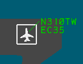
    <figcaption>Fig.  - A Target with alerts inhibited</figcaption>
</figure>

##### To inhibit or enable alerts for an individual Target:

1. Left-click the **TRACK ALERT INHIB** button on the [Safety Logic](#safety-logic-submenu) DCB submenu
2. Left-click the Target

_or_

1. Press `F12`
2. Left-click the Target

When alerts are inhibited for a Target, a square is drawn around the Target (Figure ).

When alerts are inhibited for one or more Tracks, the message **TRK ALERT INHIB** appears on the fifth line of the [Preview Area](#preview-area).

##### To reenable all individual Target alerts:

1. Left-click the **ALL TRACKS ENABLE** button on the [Safety Logic](#safety-logic-submenu) DCB submenu

> :information_source: Alerts can be disabled between two or more aircraft by inserting `MIL` in the applicable aircraft's [scratchpads](#to-edit-a-data-block39s-scratchpad). This is useful for military or other aircraft formations.

## Temporary Data

ASDE-X allows temporary polygons and text annotations to be defined on the Display Map. Temporary Data is shared across all ASDE-X displays and windows. Up to 88 Temporary Data objects can be stored.

> :warning: Editing Temporary Data is a global function that affects all other ASDE-X controllers in the facility.

### Temporary Map Areas

<figure>
    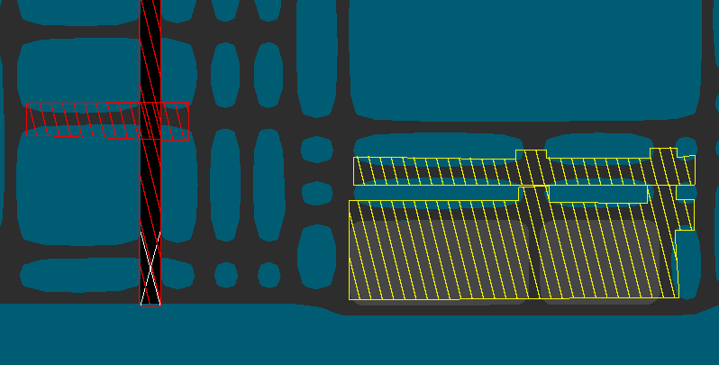
    <figcaption>Fig.  - Closed and Restricted Temporary Map Areas</figcaption>
</figure>

There are two types of Temporary Map Areas: closed areas and restricted areas (both depicted in Figure ). Closed areas are depicted as red polygons filled with red parallel lines. Restricted areas are depicted as yellow polygons filled with yellow parallel lines. Temporary Area polygons can have up to 20 sides and cannot be edited after creation.

##### To define a Temporary Map Area:

1. Left-click the **DEFINE CLOSED AREA** or **DEFINE RESTR AREA** button on the [Temporary Data](#temporary-data-submenu) DCB submenu to define a closed or restricted area, respectively
2. Left-click the Display Map to place polygon points in the desired locations
3. Middle-click to complete the polygon. The polygon is automatically completed after 20 points are placed.

### Temporary Map Text

<figure>
    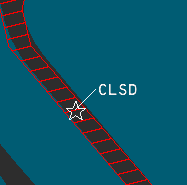
    <figcaption>Fig.  - Temporary Map Text Annotation</figcaption>
</figure>

Temporary Map Text Annotations are depicted as a star icon anchor and attached Data Block with one or two lines of text. Each line can contain up to 16 alphanumeric characters. Temporary Map Text Annotations cannot be edited or moved after creation. Temporary Map Text Data Blocks can be interacted with in many of the same ways as aircraft [Data Blocks](#data-blocks), such as [toggling display](#to-toggle-an-aircraft39s-data-block) by left-clicking the Target, changing the [leader line length](#to-set-the-length-of-all-data-block-leader-lines), and changing the Data Block [position](#to-set-the-position-of-a-single-data-block). Additionally, Temporary Text is affected by [Data Block Trait Areas](#data-block-trait-areas).

##### To define Temporary Map Text Annotations:

1. Left-click the **DEFINE TEXT** button on the Temporary Data DCB submenu
2. Type one or two lines of text
3. Press `Enter`
4. Left-click the desired location on the Display Map

### Managing Temporary Data

Temporary Data is visible to all controllers in the ASDE-X facility. Temporary Data can be hidden on a single ASDE-X display without hiding the data for other controllers.

##### To hide Temporary Data:

1. Left-click the **HIDE DATA** button on the Temporary Data DCB submenu
2. Left-click to select the desired Temporary Data to hide
3. Middle-click

##### To show hidden Temporary Data:

1. Left-click the **SHOW HIDDEN DATA** button on the Temporary Data DCB submenu

##### To delete Temporary Data:

1. Left-click the **DELETE GLOBAL** button on the Temporary Data DCB submenu
2. Left-click to select the desired Temporary Data to delete
3. Middle-click

> :warning: Deleting Temporary Data is a global function that affects all other ASDE-X controllers in the facility. Deleting Temporary Data is irreversible if the data is not saved in a [Preset](#to-save-a-temporary-data-to-a-preset).

> :information_source: If the deleted Temporary Data is stored in a Preset, the Preset is [deactivated](#to-activate-or-deactivate-a-temporary-data-preset) but not deleted.

##### To save a Temporary Data object to a Preset:

1. Left-click the **SAVE** button on the [Stored Global Temporary Data](#stored-global-temporary-data-submenu) DCB submenu
2. Left-click the desired Temporary Data object to save. Only one Temporary Data object can be saved to a Preset.
3. Type the desired set number. By default, the first available set number is prefilled.
4. Type a name for the Preset
5. Press `Enter`

##### To activate or deactivate a Temporary Data Preset:

1. Left-click the desired Preset button on the Stored Global Temporary Data DCB submenu

- If a Preset is inactive, the Preset is activated and the associated Temporary Data object is displayed for all controllers in the facility.

- If a Preset is active and the associated Temporary Data is [visible](#to-hide-temporary-data), the Preset is deactivated and the associated Temporary Data object is hidden for all controllers in the facility.

- If a Preset is active and the associated Temporary Data is [hidden](#to-hide-temporary-data), the associated Temporary Data object is displayed.

##### To delete a Temporary Data Preset:

1. Left-click the **DELETE PRESET** button on the Stored Global Temporary Data DCB submenu
2. Left-click the button of the desired Preset to delete
3. Press `2` to confirm
4. Press `Enter`

_or_

1. Left-click the **DELETE PRESET** button on the Stored Global Temporary Data DCB submenu
2. Type the numeric Preset ID of the desired Preset to delete
3. Pres `2` to confirm
4. Press `Enter`

> :warning: Deleting a Temporary Data Preset is a global function that affects all other ASDE-X controllers in the facility. Deleting a Temporary Data Preset is irreversible.

## Data Block Areas

<figure>
    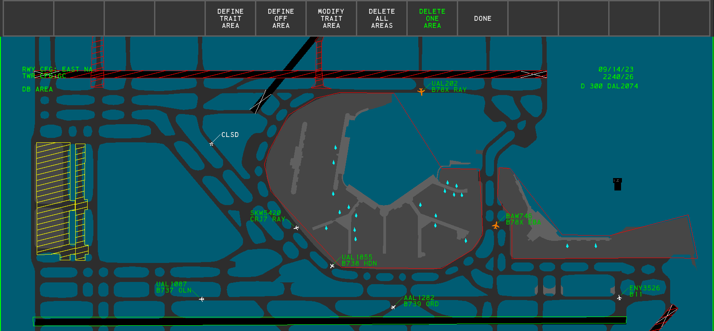
    <figcaption>Fig.  - Data Block Trait and Off Areas</figcaption>
</figure>

Data Block Areas are defined geographic areas that alter the Data Blocks of Targets within the Area. The Area's outlines are only displayed while inside the [Data Block Area](#data-block-area-submenu) DCB submenu (Figure ), but the Area are always active. There are two types of Data Block areas: [Data Block Off Areas](#data-block-off-areas) and [Data Block Trait Areas](#data-block-trait-areas). Each Data Block Area is a polygon with up to 20 sides. Data Block Area polygons cannot be edited after creation. Data Block Areas are defined independently per [window](#secondary-windows), with each window supporting up to 25 Data Block Areas. Data Block Areas may not overlap.

> :information_source: Data Block Areas are local and do not affect other ASDE-X controllers in the facility.

### Data Block Off Areas

When an aircraft enters a Data Block off Area, its Data Block is hidden until the aircraft exits the Area. The Data Block can still be [toggled](#to-toggle-an-aircraft39s-data-block) by left-clicking on the aircraft Target.

##### To define a Data Block Off Area:

1. Left-click the **DEFINE OFF AREA** on the Data Block Area DCB submenu
2. Left-click the Display Map to place polygon points in the desired locations
3. Middle-click to complete the polygon. The polygon is automatically completed after 20 points are placed.

Data Block Off Areas are displayed with red outlines when in the Data Block Area DCB submenu.

### Data Block Trait Areas

When an aircraft enters a Data Block Trait Area, its Data Block inherits the traits defined by the Area until the aircraft exits the Area. If a Data Block is [repositioned](#to-set-the-position-of-a-single-data-block) while its aircraft is within a Trait Area, the Data Block returns to the position previously set prior to entering the Trait Area once the aircraft exits the Area.

##### To define a Data Block Trait Area:

1. Left-click the **DEFINE TRAIT AREA** on the Data Block Area DCB submenu
2. Left-click the Display Map to place polygon points in the desired locations
3. Middle-click to complete the polygon. The polygon is automatically completed after 20 points are placed.
4. [Modify](#to-modify-a-data-block-trait-area) the Trait Area's traits
5. Left-click the **DONE** button

Data Block Trait Areas are displayed with green outlines when in the Data Block Area DCB submenu.

##### To modify a Data Block Trait Area:

1. Left-click the **MODIFY TRAIT AREA** button on the Data Block Area DCB submenu
2. Left-click in the Trait Area to modify
3. Modify the desired Data Block traits using the following buttons:
   - **FULL/PART**: toggles between full Data Blocks and partial Data Blocks. Partial Data Blocks only display the aircraft's ID or beacon code (field B or field C).
   - **ALTITUDE**: toggles display of the aircraft's altitude (field D)
   - **TYPE**: toggles display of the aircraft's type (field F)
   - **SENSORS**: toggles display of the aircraft's sensor coverage (field E)
   - **CAT**: toggles display of the aircraft's category (field G)
   - **FIX**: toggles display of the aircraft's paired fix ID (field H)
   - **VELOCITY**: toggles display of the aircraft's velocity (field I)
   - **SCRATCH PAD**: toggles display of the aircraft's scratch pad(s) (fields J and K)
   - **DB SIZE**: controls the [character size](#to-change-a-character-size-setting) of Data Blocks
   - **DB BRIGHT**: controls the [brightness](#to-change-a-brightness-setting) of Data Blocks
   - **VECTOR**: toggles display of [Target vector lines](#target-vector-lines)
   - **LDR LNG**: controls the [leader length](#to-set-the-length-of-all-data-block-leader-lines) of Data Blocks
   - **LDR DIR**: controls the [position](#to-set-the-position-of-all-data-blocks) of Data Blocks
4. Left-click the **DONE** button

##### To delete all Data Block Trait Areas:

1. Left-click the **DELETE ALL AREAS** button on the Data Block Area DCB submenu
2. Press `2` to confirm
3. Press `Enter`

##### To delete a single Data Block Trait Areas:

1. Left-click the **DELETE ONE AREA** button on the Data Block Area DCB submenu
2. Left-click in the desired Trait Area

> :warning: Deleting Data Block Trait Areas is irreversible

## Secondary Windows

<figure>
    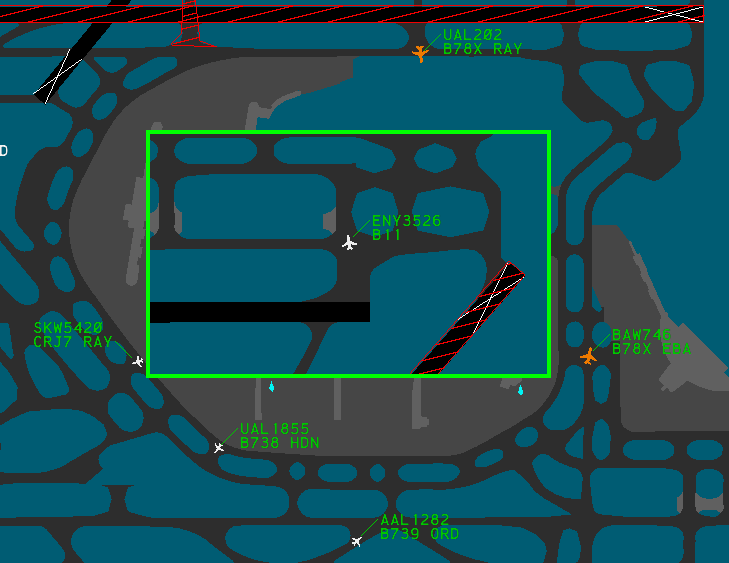
    <figcaption>Fig.  - An active Secondary Window</figcaption>
</figure>

The ASDE-X system can display up to four secondary windows with independent display settings, such as Display Map positioning, Data Block characteristics, and Data Block Trait Areas. Secondary windows are insets that are placed over the main window. Secondary windows cannot overlap, nor can they extend outside of the main window's display. These windows can be helpful for viewing traffic in congested areas of the airport, such as at the departure end of a runway or a ramp area.

> :warning: If the ASDE-X display is resized such that a secondary window is no longer contained within the display, or the secondary window would overlap another secondary window, the secondary window is hidden.

##### To add a new secondary window:

1. Left-click the **NEW WINDOW** button on the [Tools](#tools-submenu) DCB submenu
2. Left-click the main window's Display Map at the desired location for the first corner of the new window
3. Left-click the main window's Display Map at the desired location for the opposite corner of the new window

_or_

1. Press `F11`
2. Left-click the main window's Display Map at the desired location for the first corner of the new window
3. Left-click the main window's Display Map at the desired location for the opposite corner of the new window

Many display settings are unique to each window. The DCB always displays and edits the settings for the currently active window, indicated by a green border, unless the setting is global.

##### To change the active window:

1. Left-click in a window

_or_

1. Hold `Shift` and middle-click when in a DCB submenu

##### To reposition a secondary window:

1. Activate the secondary window
2. Left-click the **WINDOW RPOS** button on the Tools DCB submenu
3. Use the mouse to place the secondary window in the desired position
4. Left-click

_or_

1. Middle-click in the secondary window
2. Use the mouse to place the secondary window in the desired position
3. Left-click

##### To resize a secondary window:

1. Activate the secondary window
2. Left-click the **RESIZE WINDOW** button on the Tools DCB submenu
3. Left-click the desired side or corner of the secondary window border
4. Use the mouse to obtain the desired new size of the secondary window
5. Left-click

_or_

1. Hold `Shift` and middle-click in the secondary window
2. Left-click the desired side or corner of the secondary window border
3. Use the mouse to obtain the desired new size of the secondary window
4. Left-click

##### To delete a secondary window:

1. Left-click the **DELETE WINDOW** button on the Tools DCB submenu
2. Left-click in the secondary window

> :warning: Deleting a secondary window is irreversible and there is no confirmation prompt after left-clicking the window.

## Command Reference

### Implied Commands

| Implied Command                                                        | Function                                                                                                  |
| ---------------------------------------------------------------------- | --------------------------------------------------------------------------------------------------------- |
| `<1-9> Enter`                                                          | Sets the [position](#to-set-the-position-of-all-data-blocks) of all Data Blocks                           |
| ` <1-9>` then left-click a Target                                      | Sets the [leader line direction](#to-set-the-position-of-a-single-data-block) for the Target's Data Block |
| `/ <0-15> Enter`                                                       | Sets the [leader line length](#to-set-the-length-of-all-data-block-leader-lines) for all Data Blocks      |
| `<callsign>` then left-click a Target                                  | [Manually tags](#manually-tagging-an-unknown-target) the unknown Target                                   |
| Left-click a suspended Target or left-click a Coast/Suspend List entry | [Un-suspends](#to-initiate-control-of-a-suspended-track) the Target                                       |
| Left-click a Target                                                    | Toggles the [Data Block](#to-toggle-an-aircraft39s-data-block) for the Target                             |
| Right-click a Target                                                   | [Modifies](#modifying-data-block-fields) the Data Block fields for the Target                             |
| `Shift` middle-click a window, then left-click a window border         | Initiates the [resize window](#to-resize-a-secondary-window) function for the selected window             |
| Middle-click a window                                                  | Initiates the [reposition window](#to-reposition-a-secondary-window) function for the selected window     |
| `Shift` middle-click                                                   | Changes the [active window](#to-change-the-active-window) (when in a DCB submenu)                         |

<figcaption>Table  - Implied Commands </figcaption>

### Keyboard Commands

| Keyboard Shortcut  | Function                                                                                            |
| ------------------ | --------------------------------------------------------------------------------------------------- |
| `F2`               | Initiates the [set runway configuration](#to-change-the-active-runway-configuration) function       |
| `F3`               | Initiates the [initiate control](#initiating-control-of-a-coasted-or-suspended-track) function      |
| `F4`               | Initiates the [suspend Track](#suspending-a-track) function                                         |
| `F5`               | Initiates the [terminate Track](#terminating-a-track) function                                      |
| `F6`               | Toggles display of all [Data Blocks ](#to-toggle-all-data-blocks)                                   |
| `F7`               | Initiates a [Multifunction command](#multifunction-commands)                                        |
| `F8`               | Initiates the [map reposition](#to-reposition-the-display-map) function                             |
| `F9`               | Executes the [undo](#undo-function) function                                                        |
| `F10`              | Toggles the Display Map's [color scheme](#to-change-the-display-map39s-color-scheme)                |
| `F11`              | Initiates the [new window](#to-add-a-new-secondary-window) function                                 |
| `F12`              | Initiates the [Track alert inhibit](#to-inhibit-or-enable-alerts-for-an-individual-target) function |
| `F12`              | Silences the active aural [alert](#safety-logic)                                                    |
| `Ctrl + F6`        | Inserts `FP` into the [Preview Area](#preview-area) to recall a flight plan                         |
| `Ctrl + F9`        | Inserts `VT` into the Preview Area to set an aircraft's voice type                                  |
| `Ctrl + Home`      | Restores the default display settings                                                               |
| `Ctrl + Shift + C` | Displays the cursor's x, y position in feet from the air traffic control tower in the Preview Area  |

<figcaption>Table  - Keyboard commands </figcaption>

### Multifunction Commands

<figure>
    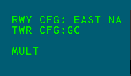
    <figcaption>Fig.  - A Multifunction command in the Preview Area</figcaption>
</figure>

Multifunction commands are initiated by pressing the m=Multifunction (`F7`) key.

| Multifunction Command                                         | Function                                                                                                    |
| ------------------------------------------------------------- | ----------------------------------------------------------------------------------------------------------- |
| `MULTIFUNC B` then left-click a Target                        | Temporarily displays the aircraft's [beacon code](#field-c-beacon-code)                                     |
| `MULTIFUNC C`                                                 | Initiates the Coast/Suspend List [reposition](#to-reposition-the-coastsuspend-list) function                |
| `MULTIFUNC H`, left-click a Target, then `<scratchpad> Enter` | Sets the aircraft's [scratchpad area](#to-edit-a-data-block39s-scratchpad) 2                                |
| `MULTIFUNC P`                                                 | Initiates the Preview Area [reposition](#to-reposition-the-preview-area) function                           |
| `MULTIFUNC TC`                                                | Displays the runways assigned to each active [tower configuration position](#tower-configuration-positions) |
| `MULTIFUNC V <number>`                                        | Sets the system [volume](#to-change-the-system-volume)                                                      |
| `MULTIFUNC VT`                                                | Plays the system test message                                                                               |
| `MULTIFUNC Y`, left-click a Target, then `<scratchpad> Enter` | Sets the aircraft's [scratchpad area](#to-edit-a-data-block39s-scratchpad) 1                                |

<figcaption>Table  - Multifunction Commands </figcaption>

## Settings

<figure>
    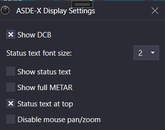
    <figcaption>Fig.  - ASDE-X display settings </figcaption>
</figure>

The ASDE-X Display Settings window is accessed through the controlling window's menu (hamburger icon on the left of the top toolbar) by selecting the **Display Settings** option. The ASDE-X display settings contain the following options:

- **Show DCB**: displays the [DCB](#display-control-bar)
- **Status text font size**: the Status Text font size
- **Show status text**: displays the Status Text
- **Show full METAR**: displays the full reported METAR in the Status Text. When disabled, only the reported wind and altimeter setting are displayed.
- **Status text at top**: displays the Status Text at the top of the display. When disabled, the Status Text is displayed at the bottom of the display.
- **Disable mouse pan/zoom**: disables panning and zooming with the mouse

> :link: For more information on the Status Text (an unrealistic addition to ASDE-X), please see the [Status Text](/tower-cab#status-text) section of the Tower Cab documentation.

> :keyboard: `Ctrl + D` opens the Display Settings window.
