# ERAM

<figure>
    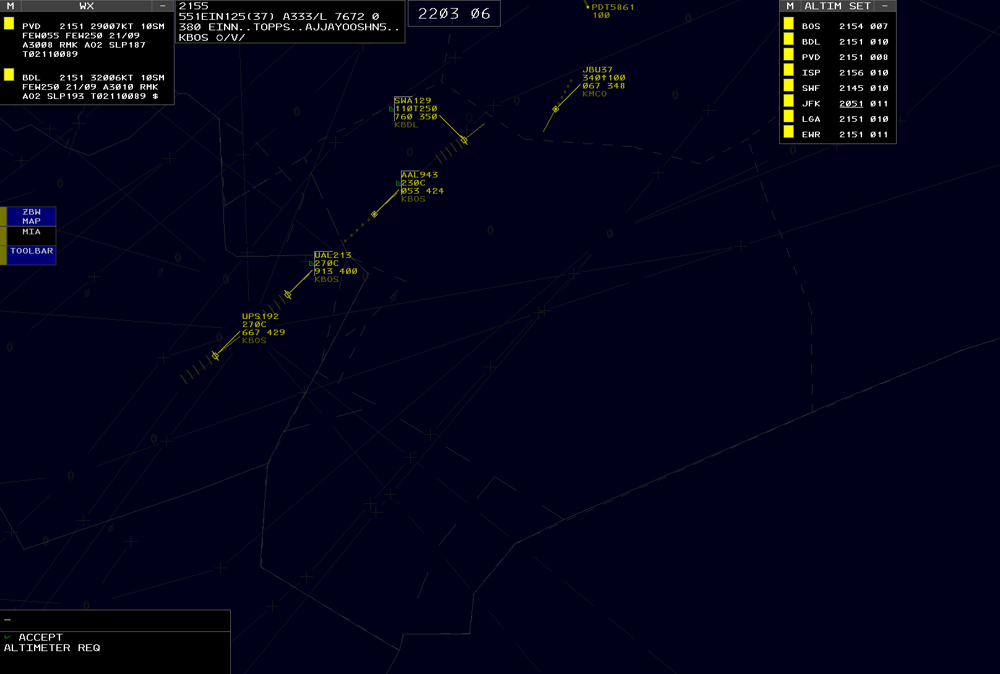
    <figcaption>Fig.  - An ERAM display</figcaption>
</figure>

En Route Automation Modernization (ERAM) is an en route radar system used by the 20 contiguous ARTCCs in the NAS. CRC's ERAM displays closely simulate the [real-world system](https://www.faa.gov/air_traffic/technology/eram) used by the FAA with appropriate unrealistic "VATSIMisms" added for top-down workflows. It is intended for use by all en route vNAS controllers, including as a replacement for MEARTS at ZAN, HCF, and ZSU. However, it is not usable as a replacement for ATOP at oceanic (non-radar) facilities including ZAK, ZWY, and ZAP.

## Contents

- [Views](#views)
- [GeoMaps](#geomaps)
- [Targets](#targets)
- [Tracks](#tracks)
- [Data Blocks](#data-blocks)
- [Flight Plans](#flight-plans)
- [Toolbars](#toolbars)
- [NEXRAD](#nexrad)
- [VATSIMisms](#vatsimisms)
- [Command Reference](#command-reference)
- [Settings](#settings)
- [List of Acronyms and Abbreviations](#list-of-acronyms-and-abbreviations)

## Views

ERAM has a variety of views that can be displayed or suppressed (hidden) from the main display.

##### Repositioning Views

A view can be repositioned by left or middle-clicking its reposition pick area, as detailed in the individual view's documentation. When repositioning a view, an outline of the view is displayed and can be moved to the desired position using the mouse. Left or middle-clicking selects the new location. Pressing `Esc` cancels the reposition.

##### Suppressing Views

Many views can be suppressed by left or middle-clicking the **-** or **x** button on the view's title bar, as detailed in the individual view documentation.

### Message Composition Area

<figure>
    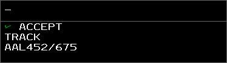
    <figcaption>Fig.  - The Message Composition Area</figcaption>
</figure>

The Message Composition Area (MCA) contains two text areas: the upper Preview Area where commands are entered, and the lower Feedback Area where command processing success and error messages are displayed.

Commands are typed directly into the MCA's Preview Area. Many commands also accept aircraft or display location parameters. These parameters are entered by left-clicking a Target, Track or location, and are represented by a downward-pointing triangle in the Preview Area. The MCA also supports [Dot commands](/overview#dot-commands).

Commands are executed by pressing `Enter`. Additionally, if the middle mouse button is used to select a Target or a display location, the selected item is added to the end of the command, and the command is immediately executed. In other words, selecting a Target or location with the middle mouse button is equivalent to selecting the Target or location with the left mouse button, followed by pressing `Enter`.

Some commands allow for logic check overrides which bypass certain command requirements, such as track ownership or handoff status. In most cases this is done by entering `/OK` before command parameters. For example, to amend a flight that is owned by another sector direct to a fix, the command `QU /OK ROBUC JBU123` could be entered. Note that logic check overrides do not override all logic checks. For example, flights owned by external ARTCCs cannot be edited, even with a logic check override included in the command.

> :keyboard: The arrow keys move the cursor around the Preview Area.

> :keyboard: `Ctrl` + `PgDn` and `Ctrl` + `PgUp` jumps the cursor to the end or the start of the Preview Area, respectively.

> :keyboard: `Ctrl` + `Enter` moves the cursor to the beginning of the next line in the Preview Area.

> :keyboard: `Ctrl + R` recalls the last command into the Preview Area.

> :keyboard: `Esc` clears the Preview and Feedback areas.

By default, the Preview Area is in overstrike mode (represented by an underscore cursor), meaning new characters overwrite the character at the cursor. The Preview Area can also be placed into insertion mode (represented by an underscore cursor with two additional vertical lines), meaning new characters are entered to the left of the cursor. Pressing `Insert` toggles between the two modes.

The MCA cannot be suppressed, but can be [repositioned](#repositioning-views) by left-clicking anywhere within its boundaries. Middle-clicking anywhere with the MCA's boundaries opens the MCA menu for configuring the MCA.

<figure>
    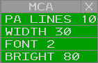
    <figcaption>Fig.  - The Message Composition Area menu</figcaption>
</figure>

The MCA menu contains the following options:

- **PA LINES**: adjusts the maximum number of displayed Preview Area lines
- **WIDTH**: adjusts the number of characters on each line in the MCA
- **FONT**: adjusts the MCA's font size
- **BRIGHT**: adjusts the MCA's brightness

> :link: For a full list of ERAM commands, please see the [Command Reference](#command-reference) section of the documentation.

### Response Area

<figure>
    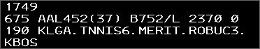
    <figcaption>Fig.  - The Response Area</figcaption>
</figure>

The Response Area (RA) displays text outputted by commands. For example, using the [`QF`](#qf-command) command outputs flight plan details in the RA (Figure ).

The RA cannot be suppressed, but can be repositioned by left-clicking anywhere within its boundaries. Middle-clicking anywhere with the RA's boundaries opens the RA menu for configuring the RA.

<figure>
    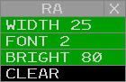
    <figcaption>Fig.  - The Response Area menu</figcaption>
</figure>

The RA menu contains the following options:

- **WIDTH**: adjusts the number of characters on each line in the RA
- **FONT**: adjusts the RA's font size
- **BRIGHT**: adjusts the RA's brightness
- **CLEAR**: clears the RA

> :keyboard: `Ctrl + Del` clears the Response Area.

### Time View

<figure>
    
    <figcaption>Fig.  - The Time View</figcaption>
</figure>

The Time View displays the current Zulu time in HHMM SS format. The view cannot be suppressed, but can be repositioned by left-clicking anywhere within its boundaries. Middle-clicking anywhere with the Time View's boundaries opens the Time View menu for configuring the Time View.

<figure>
    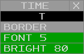
    <figcaption>Fig.  - The Time View menu</figcaption>
</figure>

The Time View menu contains the following options:

- **O/T**: toggles the Time View between the opaque (O) and semi-transparent (T) modes
- **BORDER**: toggles display of the Time View's border
- **FONT**: adjusts the Time View's font size
- **BRIGHT**: adjusts the Time View's brightness

### Beacon Code View

<figure>
    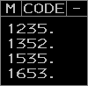
    <figcaption>Fig.  - The Beacon Code View</figcaption>
</figure>

The Beacon Code View contains a list of the currently tracked Targets's beacon codes. Beacon codes that were manually added with the `QB` command are displayed with a period.

The Beacon Code View can be displayed or suppressed from the [**VIEWS**](#views) Toolbar menu by left or middle-clicking the **CODE** button. The view can be repositioned by left or middle-clicking the title, and suppressed by left or middle-clicking the suppression button (**-**). Left or middle-clicking the menu button (**M**) displays the Beacon Code View menu for configuring the Beacon Code View.

<figure>
    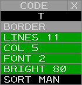
    <figcaption>Fig.  - The Beacon Code View menu</figcaption>
</figure>

The Beacon Code View menu contains the following options:

- **O/T**: togglesthe Beacon Code View between the opaque (O) and semi-transparent (T) modes
- **BORDER**: toggles display of the Beacon Code View's border
- **LINES**: adjusts the maximum number of displayed lines
- **COL**: adjusts the maximum number of displayed columns
- **FONT**: adjusts the Beacon Code View's font size
- **BRIGHT**: adjusts the Beacon Code View's brightness
- **SORT MAN**: toggles manual sort mode. When in manual sort mode, manually assigned beacon codes are displayed first.

##### QB Command

The `QB` command is used to add or remove beacon codes to/from the Beacon Code View:

> :keyboard: `QB <code1> <code2> ...`

### Check List View

<figure>
    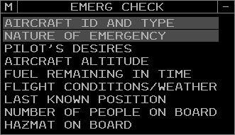
    <figcaption>Fig.  - The Check List View</figcaption>
</figure>

The Check List View contains a list of data associated with the selected check list. Check list data can be selected or deselected by left or middle-clicking the item.

The position relief and emergency Check List View can be displayed or suppressed from the [**CHECK LISTS**](#check-lists-toolbar-menu) Toolbar menu by left or middle-clicking the **POS CHECK** or **EMERG CHECK** buttons, respectively. Only one check list can be visible at a time. The view can be repositioned by left or middle-clicking the title, and suppressed by left or middle-clicking the suppression button (**-**). Left or middle-clicking the menu button (**M**) displays the Check List View menu for configuring the Check List View.

<figure>
    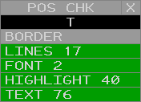
    <figcaption>Fig.  - The Check List View menu</figcaption>
</figure>

The Check List View menu contains the following options:

- **O/T**: toggles the Check List View between the opaque (O) and semi-transparent (T) modes
- **BORDER**: toggles display of the Check List View's border
- **LINES**: adjusts the maximum number of displayed lines
- **FONT**: adjusts the Check List View's font size
- **HIGHLIGHT**: adjusts the Check List View's highlight brightness
- **TEXT**: adjusts the Check List View's text brightness

### Altimeter Settings View

<figure>
    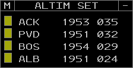
    <figcaption>Fig.  - The Altimeter Settings View</figcaption>
</figure>

The Altimeter Settings View contains a configurable list of altimeter settings. Each entry in the list displays the following fields:

- **Station ID**: the reporting station's ID
- **Observation time**: the observation's Zulu time. The observation time is underlined when it becomes "stale" (more than 65 minutes old). If the observation time is greater than 120 minutes, the observation is considered too old to use and the characters **-M-** are displayed in lieu of the altimeter setting.
- **Altimeter setting**: the altimeter setting in inHg (with the first digit and decimal point removed). If the altimeter setting is below standard (29.92 inHg), the setting is underlined. If the station's report is missing, the characters **-M-** are displayed.

Left or middle-clicking an altimeter setting opens a popup to delete the altimeter setting from the view.

Left or middle-clicking the menu button (**M**) displays the Altimeter Settings View menu for configuring the Altimeter Settings Report View.

<figure>
    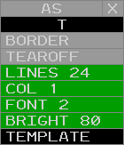
    <figcaption>Fig.  - The Altimeter Settings View menu</figcaption>
</figure>

The Altimeter Settings View menu contains the following options:

- **O/T**: toggles the Altimeter Settings View between the opaque (O) and semi-transparent (T) modes
- **BORDER**: toggles display of the Altimeter Settings View's border
- **TEAROFF**: toggles display of tear-off pick areas
- **LINES**: adjusts the maximum number of displayed lines
- **COL**: adjusts the maximum number of displayed columns
- **FONT**: adjusts the Weather Station Report View's font size
- **BRIGHT**: adjusts the Weather Station Report View's text brightness
- **TEMPLATE**: not simulated

##### AR Command

The `AR` command is used to add or remove stations from the Altimeter Settings View:

> :keyboard: `AR <station ID>`

##### QD Command

The `QD` command can also be used to add or remove stations from the Altimeter Settings View:

> :keyboard: `QD <station ID>`

The Altimeter Settings View can be displayed or suppressed from the **VIEWS** Toolbar menu by left or middle-clicking the **ALTIM SET** button. The view can be repositioned by left or middle-clicking the title, and suppressed by left or middle-clicking the suppression button (**-**).

### Continuous Range Readout View

<figure>
    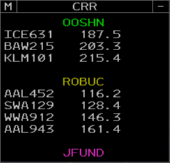
    <figcaption>Fig.  - The Continuous Range Readout View</figcaption>
</figure>

The Continuous Range Readout View contains a list of CRR groups and the aircraft added to each group. Each group is identified by its assigned label, and aircraft are listed with their straight-line distance to the group's location in nautical miles.

Left-clicking a group's label begins an `LF` command to add or remove aircraft from the group as described below. Middle-clicking a group's label opens a popup to either delete all aircraft from the group, or delete the group if no aircraft have been added.

Left or middle-clicking an aircraft opens a popup to delete the aircraft from the group.

Left or middle-clicking the menu button (**M**) displays the Continuous Range Readout View menu for configuring the Continuous Range Readout View.

<figure>
    
    <figcaption>Fig.  - The Continuous Range Readout View menu</figcaption>
</figure>

The Continuous Range Readout View menu contains the following options:

- **O/T**: toggles the Continuous Range Readout View between the opaque (O) and semi-transparent (T) modes
- **BORDER**: toggles display of the Continuous Range Readout View's border
- **LINES**: adjusts the maximum number of displayed lines
- **FONT**: adjusts the Continuous Range Readout View's font size
- **BRIGHT**: adjusts the Continuous Range Readout View's brightness
- **LIST**: toggles the Continuous Range Readout View between the list and panel modes (Figure 1)
- **COLOR**: adjusts the brightness of the selected CRR color
- **CRR Color Selection**: changes the currently selected CRR color
- **CRR Group Labels**: left or middle-clicking a group assigns the selected CRR color to the group

<figure>
    
    <figcaption>Fig.  - The Continuous Range Readout View in panel mode</figcaption>
</figure>

Left-clicking a group's label begins an `LF` command to add or remove aircraft from the group as described below.

Left-clicking a CRR fix on the situation display (toggled from the **ATC TOOLS** Toolbar menu) similarly begins an `LF` command if the Preview Area is empty.

##### LF Command

The `LF` command is used to create CRR groups:

> :keyboard: `LF <location> <label>`

The location parameter can either be entered by left-clicking a location, or by entering a fix, FRD, or lat/long coordinates, prefaced by `//`. For example, `//BOS`, `//ROBUC`, `//BOS090010`, and `//4220N/7110W` are all valid locations.

The group's label must be between one and five alphanumeric characters. A group label may be omitted when the location is a fix, such as `//BOS` or `//ROBUC`, in which case the fix's name is used as the group's label.

The selected CRR color in the CRR View menu is assigned to the new group.

The `LF` command may also be used to add aircraft to a newly created group:

> :keyboard: `LF <location> <label> <aircraft>`

Aircraft may be entered by left-clicking tracks, or by entering aircraft IDs or CIDs separated by slashes, for example `123/JBU9164/523`. Up to four aircraft may be entered. All aircraft must have an FDB.

The `LF` command may also be used to add or remove aircraft from CRR groups:

> :keyboard: `LF <label> <aircraft>`

Aircraft are entered as above.

### Weather Station Report View

<figure>
    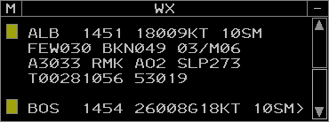
    <figcaption>Fig.  - The Weather Station Report View</figcaption>
</figure>

The Weather Station Report View contains a configurable list of weather station reports. Each entry in the list displays the following fields:

- **Station ID**: the reporting station's ID
- **Observation time**: the observation's Zulu time. The observation time is underlined when it becomes "stale" (more than 65 minutes old). If the observation time is greater than 120 minutes, the observation is considered too old to use and the characters **-M-** are displayed in lieu of the weather report.
- **Weather report**: the latest weather report (METAR) from the station. If the station's report is missing, the characters **-M-** are displayed. If the report continues on the next page, the character **>** is displayed at the end of the last line.

Left or middle-clicking a weather report opens a popup to delete the weather report from the view.

Left or middle-clicking the menu button (**M**) displays the Weather Station Report View menu for configuring the Weather Station Report View.

<figure>
    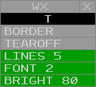
    <figcaption>Fig.  - The Weather Station Report View menu</figcaption>
</figure>

The Weather Station Report View menu contains the following options:

- **O/T**: toggles the Weather Station Report View between the opaque (O) and semi-transparent (T) modes
- **BORDER**: toggles display of the Weather Station Report View's border
- **TEAROFF**: toggles display of tear-off pick areas
- **LINES**: adjusts the maximum number of displayed lines
- **FONT**: adjusts the Weather Station Report View's font size
- **BRIGHT**: adjusts the Weather Station Report View's text brightness

##### WR Command

The `WR` command is used to add or remove stations from the Weather Station Report View:

> :keyboard: `WR <station ID>`

The `WR` command can also be used to display the station's weather report in the [Response Area](#response-area) without adding or removing the station from the Weather Station Report View:

> :keyboard: `WR R <station ID>`

The Weather Station Report View can be displayed or suppressed from the **VIEWS** Toolbar menu by left or middle-clicking the **WX REPORT** button. The view can be repositioned by left or middle-clicking the title, and suppressed by left or middle-clicking the suppression button (**-**).

## GeoMaps

GeoMaps are collections of display elements, such as lines, text, and symbols that form the background of an ERAM display. These elements are organized into Filters that group common elements, such as NAVAID location symbols or lines that form a map. A Filter can be individually toggled to display or hide the elements assigned to it. Only one GeoMap can be displayed at a time.

##### MR Command

The `MR` command is used to set the displayed GeoMap:

> :keyboard: `MR <GeoMap>`

The `MR` command can also be used to display a list of the available GeoMaps in the [Response Area](#response-area):

> :keyboard: `MR`

A GeoMap Filter is toggled by left or middle-clicking the appropriate filter button in the [GeoMap](#geomap-toolbar) Toolbar menu.

> :information_source: Some GeoMap elements may not be assigned to a Filter and will always be visible.

> :information_source: Some GeoMap elements may only be visible in [Top-Down mode](#top-down-mode).

The brightness of GeoMap elements is controlled from the [**MAP BRIGHT**](#map-brightness-toolbar-menu) Toolbar menu. Note that the Brightness Control Groups (BCGs) do not necessarily directly correspond to GeoMap Filters.

> :information_source: When disconnected from the VATSIM network, the message **NO RADAR DATA** is displayed in the center of the display.

#### Repositioning the GeoMap

The GeoMap is repositioned by holding down the right mouse button and dragging the map to the desired position. The map's range is changed by using the mouse scroll wheel to zoom in or out from the display's center, or by holding `Alt` and using the mouse scroll wheel to zoom in or out from the cursor's position. The display cannot be rotated and is always aligned with true north up.

## Targets

In ERAM, a Target represents a radar return that may or may not be correlated with a flight plan. There are eight types of radar Targets displayed in ERAM:

| Name                 | Symbol                                                       | Description                                                                                                |
| -------------------- | ------------------------------------------------------------ | ---------------------------------------------------------------------------------------------------------- |
| Uncorrelated Primary |  | An aircraft whose transponder is in the off/standby mode                                                   |
| Correlated Primary   |    | An aircraft whose transponder is in the off/standby mode and has been manually correlated to a flight plan |
| Code 1200 Beacon     |                  | An aircraft below the conflict alert floor squawking VFR (1200)                                            |
| Identing Beacon      |                | An aircraft squawking ident                                                                                |
| Uncorrelated Beacon  |  | An aircraft below the conflict alert floor squawking a beacon code that is not correlated to a flight plan |
| Mode C Intruder      |                  | An aircraft above the conflict alert floor squawking a beacon code that is not correlated to a flight plan |
| Correlated Beacon    |    | An aircraft squawking a beacon code that is correlated to a flight plan                                    |
| Reduced Separation   |   | An aircraft in a reduced separation area squawking a beacon code that is correlated to a flight plan       |

<figcaption>Table  - Targets </figcaption>

### Target History

<figure>
    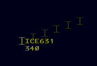
    <figcaption>Fig.  - A Target with a history trail</figcaption>
</figure>

The number of displayed Target history data points is controlled by the **HISTORY** button on the [**RADAR FILTER**](#radar-filter-toolbar-menu) Toolbar menu. Each history point displays the Target's symbol from when it was at that location.

### Conflict Alert Processing

ERAM continuously monitors all target movement and attempts to predict potential loss of separation between pairs of targets within the surveillance area. This is known as the Short-Term Conflict Alert (STCA) system. Targets that are currently in conflict alert status will have flashing data blocks.

Alerts are only generated if one of the two targets is owned by a controller in your ERAM facility. ERAM performs a conflict detection pass every 5 seconds and generates new alerts or removes alerts that are no longer detected.

For each pair of targets, ERAM predicts the 3D trajectory of the aircraft four minutes into the future, using the target's current ground track, ground speed, and vertical speed. If at any point during those four minutes, the two targets are predicted to be within minimum separation distance of each other (laterally or vertically) then an alert is generated. The lateral minimum is five nautical miles, or three nautical miles if the targets are both within reduced separation airspace, which is anywhere at or below FL230. The vertical minimum is 1,000 feet.

ERAM takes the data block altitude (hard altitude or interim altitude) into account when detecting conflicts. For example, if target A is at FL370 and descending, and target B is level at FL330, if target A has a data block altitude of FL350, this situation will not generate a conflict alert even if target A is showing a descent rate that will allow it to descend below FL340 within four minutes. Essentially, ERAM assumes that the pilot will be levelling off at FL350 and therefore will not get within 1,000 feet of target B, vertically.

Similarly, ERAM takes the data block altitude into account even for aircraft that are currently in level flight. For example, if target A is level at FL350, and target B is level at FL340, a conflict alert will still be generated if target A has a data block altitude that is lower than FL350, or if target B has a data block altitude that is higher than FL340. Essentially, ERAM assumes that a target in level flight might start climbing or descending at any time, which would cause an immediate loss of vertical separation in this example.

## Tracks

In ERAM, a Track represents data pertaining to a flight plan. A Track is usually, though not always, associated with a Target. There are four types of Tracks displayed in ERAM:

| Name                           | Position Symbol                                | Description                                                                |
| ------------------------------ | ---------------------------------------------- | -------------------------------------------------------------------------- |
| Flight Plan Aided (Flat) Track |    | A Track associated with a Target following a flight plan route             |
| Free Track                     |    | A Track associated with a Target that is not following a flight plan route |
| Coast Track                    |   | A Track that is not associated with a Target                               |
| Frozen Track                   |  | A Track that has been frozen in a location                                 |

<figcaption>Table  - Tracks and Position Symbols </figcaption>

### Starting Track

##### QT Command

The `QT` command is used to start a Track for a specified aircraft ID at a specified location:

> :keyboard: `QT <location> <ACID>`

If the location is near the aircraft's Target and the aircraft's flight plan has been activated with a [`DM`](#dm-command) command, the created Track will associate with the Target. However, Tracks do not need to be created near a Target, nor does the specified aircraft ID have to match an existing flight plan.

Refer to the [VATSIMisms](#vatsimisms) section for some additional (unrealistic) ways to start track on an aircraft.

### Dropping a Track

##### QX Command

The `QX` command is used to drop a Track:

> :keyboard: `QX <FLID>`

### Handoffs

Handoffs are initiated by an [Implied command](#implied-commands) with the receiving sector's ID:

> :keyboard: `<sector ID> <FLID>`

> :information_source: Sector IDs can be found in the [Controller List](/overview#controller-list).

Pending handoffs are accepted or recalled by an Implied command with the aircraft's FLID:

> :keyboard: `<FLID>`

> :mantelpiece_clock: Unlike legacy clients, handoffs cannot be rejected.

A handoff of a Track owned by another sector can be "forced" by using `/OK`. This allows a Track to be "stolen" from another sector.

> :keyboard: `/OK <FLID>`

### Point Outs

##### QP Command

The `QP` command is used to initiate a point out to the specified sector:

> :keyboard: `QP <sector ID> <FLID>`

The `QP` command is also used to acknowledge a pending point out:

> :keyboard: `QP A <FLID>`

After a point out is initiated, an aircraft's FDB cannot be changed to an [LDB](#limited-data-blocks) with the standard [`<FLID>`](#changing-data-block-types) Implied command, even if the point out has been accepted and cleared. The `QP` command must be used to change the FDB to an LDB:

> :keyboard: `QP <FLID>`

> :mantelpiece_clock: Unlike legacy clients, point outs can only be initiated to other vNAS ERAM sectors.

<figure>
    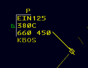
    <figcaption>Fig.  - An FDB with a pending point out</figcaption>
</figure>

When a point out is initiated, the initiating sector's [FDB](#full-data-blocks) displays a yellow **P** indicator on [line 0](#fdb-line-0). When the point out is acknowledged, the **P** indicator changes to a white **A** indicator. Left or middle-clicking the **A** indicator removes it from the FDB.

<figure>
    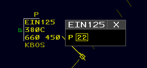
    <figcaption>Fig.  - A point out menu with a pending point out</figcaption>
</figure>

Left or middle-clicking the **P** indicator displays a pop-up menu with all sectors receiving the point out. Sectors that have not acknowledged the point out are in yellow and enclosed by a yellow box. When a sector acknowledges the point out, the sector changes to white and the box is removed. Left or middle-clicking an acknowledged sector in the menu removes it from the display.

<figure>
    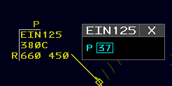
    <figcaption>Fig.  - A point out menu with an unacknowledged point out</figcaption>
</figure>

When a point out is initiated, the receiving sector displays an FDB with a yellow **P** indicator on line 0. Left or middle-clicking the **P** indicator displays a pop-up menu with all sectors initiating the point out. Sectors that have initiated the point out are in cyan enclosed by a cyan box. Left or middle-clicking a sector acknowledges the point out. Sectors that are acknowledged change to white and the box is removed. Acknowledgement of all sectors from the pop-up removes the yellow **P** from the FDB.

The point out pop-up menu can be [repositioned](#repositioning-views) by left or middle-clicking the title, and closed by left or middle-clicking the close button (**X**).

### Freezing a Track

<figure>
    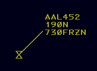
    <figcaption>Fig.  - A frozen Track</figcaption>
</figure>

##### QH Command

The `QH` command is used to freeze a Track in a specified location:

> :keyboard: `QH F <location> <FLID>`

A frozen Track is moved to and remains at the specified location and will not coast. A frozen Track's Data Block displays **FRZN** in [Field E](#fdb-line-3).

A Track is unfrozen by [starting track](#starting-track) on the frozen Track.

### Track Range Commands

##### LA Command

The `LA` command is used to display the distance and magnetic bearing between two points on the display:

> :keyboard: `LA <location 1> <location 2>`

If a Track is entered as the first parameter, the `LA` command displays the Track's ground speed and flying time to the second location parameter in addition to the distance and magnetic bearing:

> :keyboard: `LA <track> <location>`

If a speed is entered as a third parameter, prefixed with a forward slash, the `LA` command uses the specified speed to calculate the flying time:

> :keyboard: `LA [<location 1> | <track>] <location 2> /<speed>`

If the speed is prefixed with `T/`, the bearing will be given in degrees true, rather than magnetic:

> :keyboard: `LA [<location 1> | <track>] <location 2> T/<speed>`

The third parameter can also be `T` by itself, without a speed. The bearing will be given in degrees true, rather than magnetic, and no flying time will be displayed.

> :keyboard: `LA [<location 1> | <track>] <location 2> T`

##### LB Command

The `LB` command is used to display the distance and magnetic bearing between a fix and a location:

> :keyboard: `LB <fix> <location>`

If a Track is entered as the second parameter, the `LB` command displays the Track's ground speed and flying time to the specified fix in addition to the distance and magnetic bearing:

> :keyboard: `LB <fix> <track>`

If a speed is added to the first parameter, the `LB` command displays the Track's flying time to the specified fix at the specified speed in addition to the distance and magnetic bearing:

> :keyboard: `LB <fix>/<speed> <track>`

##### LC Command

The `LC` command is used to display the speed adjustment necessary to position an aircraft over a fix at a specified time:

> :keyboard: `LC <fix>/<time> <track>`

## Data Blocks

### Limited Data Blocks

Limited Data Blocks (LDBs) have no track position symbol, leader line, or velocity vector. An LDB may only be [positioned](#positioning-data-blocks) to the left or right of its Target.

#### Unpaired LDBs

<figure>
    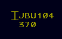
    <figcaption>Fig.  - An unpaired LDB</figcaption>
</figure>

An unpaired LDB displays its Target's beacon code and altitude of hundreds of feet MSL. If the Target is within the ARTCC's ADS-B AOI, the Target's aircraft ID can be displayed in place of its beacon code by activating the **BCAST FLID** option in the [**DB FIELDS**](#data-block-fields-toolbar-menu) Toolbar menu or converting the LDB to an [E-LDB](#enhanced-ldbs).

#### Paired LDBs

<figure>
    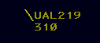
    <figcaption>Fig.  - A paired LDB</figcaption>
</figure>

A paired LDB display its Track's aircraft ID and altitude in hundreds of feet MSL.

#### Enhanced LDBs

<figure>
    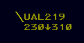
    <figcaption>Fig.  - An enhanced LDB</figcaption>
</figure>

An LDB can be converted to or from an Enhanced LDB (E-LDB) by left or middle-clicking the altitude field. If the **BCAST FLID** option is inactive, an unpaired E-LDB displays its Target's aircraft ID in place of its beacon code. Both paired and unpaired E-LDBs display the same altitude information as the [second line](#fdb-line-2) of an [FDB](#full-data-blocks). Left or middle-clicking the second line of an E-LDB returns it to its non-enhanced format.

### Full Data Blocks

<figure>
    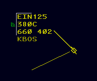
    <figcaption>Fig.  - An FDB</figcaption>
</figure>

Full Data Blocks (FDBs) have a [track position symbol](#tracks), [leader line](#leader-lines), and [velocity vector lines](#velocity-vector-lines). An FDB may be [positioned](#positioning-data-blocks) at any of the eight positions adjacent to its Target as listed in Table 4.

<figure>
    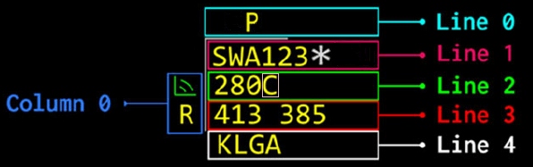
    <figcaption>Fig.  - FDB fields</figcaption>
</figure>

FDBs contain five lines and one column of data. Line 0 and column 0 appear outside of the Portal Fence. The Portal Fence is only displayed when there is data in line 0 or column 0, and can be suppressed by deactivating the **PORTAL FENCE** option in the **DB FIELDS** Toolbar menu.

#### FDB Column 0

FDB column 0 displays the following items:

<figure>
    
    <figcaption>Fig.  - VCI</figcaption>
</figure>

- **Visual Communications Indicator (VCI)**: a symbol indicating the aircraft has checked in on frequency. The VCI is toggled by left or middle-clicking the symbol's location, or by the `//` [Implied command](#implied-commands):

  > :keyboard: `//<FLID>` or `// <FLID>`

- **Not Your Control Indicator**: an **R** indicating the Track is owned by another sector

#### FDB Line 0

FDB line 0 displays the following item:

- **Point Out Indicator**: a **P** indicating a point out to/from another sector has been initiated, or an **A** indicating a point out has been acknowledged by another sector. For more information on point outs, please see the [point outs](#point-outs) section of the documentation.

#### FDB Line 1

FDB line 1 contains the following fields:

- **Field A**: the aircraft's ID. Left-clicking Field A toggles [Dwell Emphasis](#dwell-emphasis) lock. Middle-clicking Field A executes the [`QF`](#qf-command) command.
- **SatComm Indicator (\*)**: indicates the aircraft has SatComm capabilities.

#### FDB Line 2

FDB line 2 contains the following fields:

- **Field B**: the aircraft's assigned altitude
- **Field B character 4**: one of the following characters describing the contents of field B:

  | Character | Fields B and C Example | Description                                                                                                  |
  | :-------: | :--------------------: | ------------------------------------------------------------------------------------------------------------ |
  |   **C**   |        **300C**        | The aircraft has reached its assigned altitude of FL300                                                      |
  |   **T**   |      **100T253**       | The aircraft has an interim altitude of 10,000 feet and is currently at FL253                                |
  |   **L**   |      **100L253**       | The aircraft has a local interim altitude of 10,000 feet and is currently at FL253                           |
  |   **P**   |      **100P253**       | The aircraft has a procedure altitude of 10,000 feet and is currently at FL253                               |
  |   **↑**   |      **300↑253**       | The aircraft is climbing to its assigned altitude of FL300 and is currently at FL253                         |
  |   **↓**   |      **230↓253**       | The aircraft is descending to its assigned altitude of FL230 and is currently at FL253                       |
  |   **+**   |      **230+253**       | The aircraft has climbed through its assigned altitude of FL230 and is currently at FL253                    |
  |   **-**   |      **230-212**       | The aircraft has descended below its assigned altitude of FL230 and is currently at FL212                    |
  |   **X**   |      **230XXXX**       | The aircraft's assigned altitude is FL230, but no Mode C altitude is reported                                |
  |   **A**   |        **230A**        | The aircraft's controller entered reported altitude (CERA) matches the aircraft's assigned altitude of FL230 |
  |   **#**   |      **230#210**       | The aircraft's CERA of FL210 does not match the aircraft's assigned altitude of FL230                        |
  |   **/**   |      **VFR/055**       | The aircraft's altitude is VFR and it is currently at 5,500 feet                                             |
  |   **/**   |      **OTP/218**       | The aircraft's altitude is VFR on-top (OTP) and it is currently at FL218                                     |
  |   **B**   |      **200B353**       | The aircraft has a block altitude starting at FL200 and is currently outside the block altitude at FL353     |
  |   **B**   |      **200B250**       | The aircraft has a block altitude between FL200 and FL250 and is currently within the block altitude         |
  |   **B**   |      **200B193**       | The aircraft has a block altitude starting at FL200 and is currently outside the block altitude at FL193     |
  |   **N**   |        **230N**        | The aircraft has an assigned altitude of FL230, but no Target is correlated with the Track                   |

<figcaption>Table  - Field B character 4 values </figcaption>

- **Non-RVSM Indicator:** a coral box that circumscribes the last character in field B indicating the aircraft is projected to enter RVSM airspace and is not RVSM equipped.

<figure>
    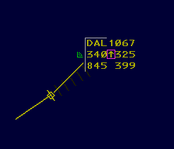
    <figcaption>Fig.  - An FDB with a non-RVSM indicator</figcaption>
</figure>

- **Field C**: the aircraft's reported altitude, or **XXX** if no Mode C altitude is reported. Note that field C is hidden when an aircraft has reached and is maintaining its assigned altitude (**C** displayed in field B character 4).

#### FDB Line 3

FDB line 3 contains the following fields:

- **Field D**: the aircraft's CID
- **Field E**: the aircraft's single-character destination airport ID (when configured) and ground speed, or one of the following items:

  | Data     | Description                                                                             |
  | -------- | --------------------------------------------------------------------------------------- |
  | **HIJK** | The aircraft is squawking hijack (7500)                                                 |
  | **RDOF** | The aircraft is squawking radio communications failure (7600)                           |
  | **EMRG** | The aircraft is squawking emergency (7700)                                              |
  | **ADIZ** | The aircraft is squawking Air Defense Identification Zone penetration (1276)            |
  | **LLNK** | The aircraft is squawking UAS lost link (7400)                                          |
  | **AFIO** | The aircraft is squawking DOD interceptor aircraft on active air-defense mission (7777) |
  | **Hxxx** | The Track is being [handed off](#handoffs) to sector xxx                                |
  | **HUNK** | The Track is being handed off to an unknown sector                                      |
  | **Oxxx** | A handoff has been accepted by sector xxx                                               |
  | **OUNK** | A handoff has been accepted by an unknown sector                                        |
  | **Kxxx** | A handoff has been accepted by sector xxx with `/OK`                                    |
  | **CST**  | The Track is in coast status                                                            |
  | **####** | The beacon code received, if different from the assigned code                           |
  | **NONE** | No beacon code is received, if the track has an assigned beacon code                    |
  | **FRZN** | The data block is unpaired from the Target and [frozen](#freezing-a-track)              |

<figcaption>Table  - Field E values </figcaption>

#### FDB Line 4

FDB line 4 contains field F which may contain the following items:

- **Destination**: the aircraft's destination. Destinations are displayed by activating the **DEST** button in the **DB FIELDS** Toolbar menu.
- **Type**: the aircraft's type. Aircraft types are displayed by activating the **TYPE** button in the **DB FIELDS** Toolbar menu, or by holding `F10`.
- **Heading**: the aircraft's assigned heading
- **Speed**: the aircraft's assigned speed
- **Free text**: free text

When a heading, speed, or free text value is defined, the heading/speed/free text (HSF) indicator (↴) is displayed at the end of line 2. Left or middle-clicking the HSF indicator toggles line 4 between displaying destination or type data and HSF data.

##### QS Command

The QS Command is used to enter HSF data as follows. Note that the clear weather symbol (ⵔ︎) is entered with the `` ` `` key.

| Command               | Description                 |
| --------------------- | --------------------------- |
| `QS ⵔ︎<text> <FLID>`  | Sets free text              |
| `QS <heading> <FLID>` | Sets heading                |
| `QS /<speed> <FLID>`  | Sets speed                  |
| `QS */ <FLID>`        | Deletes heading             |
| `QS /* <FLID>`        | Deletes speed               |
| `QS * <FLID>`         | Deletes all HSF data        |
| `QS <FLID>`           | Toggles display of HSF data |

<figcaption>Table  - The <code>QS</code> command </figcaption>

#### Leader Lines

The length of all FDB leader lines can be set using the **FDB LDR** button on the **DB FIELDS** Toolbar menu. The leader length of an individual FDB can be set by the `/` Implied command with the desired leader length:

> :keyboard: `/<0-3> <FLID>`

#### Velocity Vector Lines

Velocity vector line length is controlled from the **VECTOR** button on the [Master Toolbar](#master-toolbar). Velocity vector lines can be set to extend 0 (hidden), 1, 2, 4, or 8 minutes.

> :keyboard: `PgUp` and `PgDn` increases and decreases the length of velocity vector lines, respectively.

When a velocity vector line extends outside of the display's bounds, the velocity vector line and leader line are displayed with dashes.

> :mantelpiece_clock: Unlike legacy clients, velocity vector line length is synced between all controllers on a sector.

#### Distance Reference Indicators

<figure>
    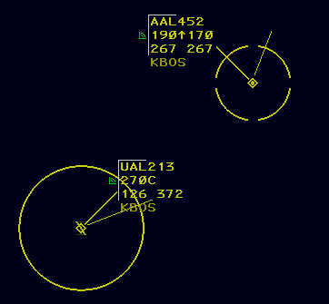
    <figcaption>Fig.  - A standard and reduced separation DRI</figcaption>
</figure>

Distance Reference Indicators (DRIs), also commonly referred to as halos, are circles displayed around Targets to help maintain proper aircraft separation. The standard DRI is 5nm in radius, while a reduced separation DRI is 3nm in radius and is indicated by four gaps in the circle. Reduced separation DRIs may only be displayed on Targets eligible for reduced separation.

##### QP Command

The QP command is used to toggle standard DRIs:

> :keyboard: `QP J <FLID>`

The QP command is also used to toggle reduced separation DRIs for eligible Targets:

> :keyboard: `QP T <FLID>`

#### Altitude Menu

<figure>
    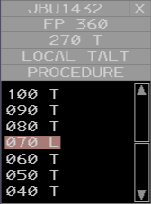
    <figcaption>Fig.  - An Altitude Menu</figcaption>
</figure>

An FDB's Altitude Menu is displayed by left or middle-clicking Field B or Field C (line 2) of an FDB. From top to bottom, the Altitude Menu consists of the following areas:

##### Flight Plan Assigned Altitude Pick Area

When an aircraft is assigned an interim altitude, local interim altitude, or procedure altitude, the Flight Plan Assigned pick area is displayed with the aircraft's flight plan assigned altitude. Left or middle-clicking the Flight Plan Assigned pick area clears the interim altitude, local interim altitude, and/or procedure altitude assigned to the flight.

##### Interim Altitude Pick Area

When an aircraft is assigned both an interim altitude and a local interim altitude, the Interim Altitude pick area is displayed with the aircraft's interim altitude. Left or middle-clicking the Interim Altitude pick area clears the local interim altitude.

##### Local Interim Altitude Pick Area

Left or middle-clicking the Local Interim Altitude pick area (`LOCAL TALT`) toggles assignment of a local interim altitude upon selection of an Assigned Altitude.

##### Procedure Altitude Pick Area

Left or middle-clicking the Procedure Altitude pick area (`PROCEDURE`) toggles assignment of a procedure altitude upon selection of an Assigned Altitude.

##### Assigned Altitude Pick Areas

Seven Assigned Altitude pick areas are displayed per page in the Altitude Menu. Pages of Assigned Altitudes can be scrolled using the scroll up and down pick areas. The current altitude value is displayed with a coral shading. Left or middle-clicking an Assigned Altitude assigns the altitude to the flight plan. If either the Local Interim Altitude or Procedure Altitude pick area are active, the altitude is assigned to the appropriate altitude type.

> :information_source: Assigned Altitudes in non-RVSM airspace are displayed in gray if the aircraft is not RVSM equipped.

##### Interim Altitude Pick Areas

When neither the Local Interim pick area nor the Procedure pick area is active, an Interim Altitude pick area is displayed to the right of each Assigned Altitude pick area. Interim Altitude pick areas display a `T`, except for the current altitude which displays an `L` if the current altitude is a local interim altitude, or a `P` if the current altitude is a procedure altitude. Left or middle-clicking an Interim Altitude pick area assigns the associated altitude as the flight's interim altitude.

#### Heading Menu

<figure>
    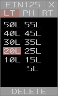
    <figcaption>Fig.  - A Heading Menu</figcaption>
</figure>

An FDB's Heading Menu is displayed by left or middle-clicking Field D (CID) or the fourth line assigned heading of an FDB. From top to bottom, left to right, the Heading Menu consists of the following areas:

##### Left Turn Pick Area

Left or middle-clicking the Left Turn (`LT`) pick area toggles display of left turn heading values.

##### Present Heading Pick Area

Left or middle-clicking the Present Heading (`PH`) pick area assigns present heading (PH) to the aircraft's heading.

##### Right Turn Pick Area

Left or middle-clicking the Right Turn (`RT`) pick area toggles display of right turn heading values.

##### Heading Value Pick Areas

Up to 14 Heading Value pick areas are displayed per page in the Heading Menu. Pages of Heading Values can be scrolled using the scroll up and down pick areas. If a heading is assigned, the current heading value is displayed with a coral shading. Left or middle-clicking a Heading Value assigns the heading to the aircraft.

##### Delete Heading Pick Area

Left or middle-clicking the Delete Heading pick area clears the assigned heading.

#### Speed Menu

<figure>
    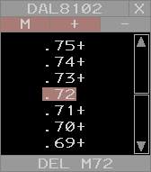
    <figcaption>Fig.  - A Speed Menu</figcaption>
</figure>

An FDB's Speed Menu is displayed by left or middle-clicking Field E (ground speed) or the fourth line assigned speed of an FDB. From top to bottom, left to right, the Speed Menu consists of the following areas:

##### Knots/Mach Pick Area

Left or middle-clicking the Knots/Mach pick area toggles the displayed speeds between knots (`KT`) and mach (`M`).

##### + and - Pick Area

Left or middle-clicking the `+` and `-` pick areas toggles "greater than" or "less than" speed assignments, respectively.

##### Speed Value Pick Areas

Seven Speed Value pick areas are displayed per page in the Speed Menu. Pages of Speed Values can be scrolled using the scroll up and down pick areas. If a speed is assigned, the current speed value is displayed with a coral shading. Left or middle-clicking a Speed Value assigns the speed to the aircraft. If either the + or - pick areas are active, the speed is assigned with a + or -.

##### Delete Speed Pick Area

Left or middle-clicking the Delete Speed pick area clears the assigned speed.

#### Free Form Text Box Menu

<figure>
    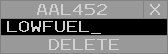
    <figcaption>Fig.  - A Free Form Text Box Menu</figcaption>
</figure>

An FDB's Free Form Text Box Menu is displayed by left or middle-clicking free form text in the fourth line of an FDB. From top to bottom, the Free Form Text Box Menu consists of the following areas:

##### Free Form Text Box Input Area

The aircraft's free form text can be edited in the Free Form Text Box Input Area. Pressing `Enter` saves the inputted text to the aircraft's fourth line free form text.

##### Delete FDB Fourth Line Pick Area

Left or middle-clicking the Delete FDB Fourth Line pick area clears the aircraft's fourth line data.

> :information_source: The Free Form Text Box Menu cannot be opened if the aircraft does not have any assigned fourth line free form text.

### Range Data Blocks

<figure>
    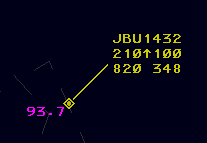
    <figcaption>Fig.  - An RDB</figcaption>
</figure>

Range Data Blocks (RDBs) display the aircraft's straight-line distance to a CRR group location in nautical miles. The are only displayed in addition to an FDB. For more information on CRR groups, please see the [LF command](#lf-command) section of the documentation.

> :keyboard: `Ctrl + Shift + O` cycles the offset between the RDB and the FDB's leader line.

### Conflict Data Blocks

<figure>
    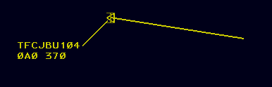
    <figcaption>Fig.  - A CDB</figcaption>
</figure>

When a tracked flight is in conflict with a Mode C intruder, the system displays a Conflict Data BLock (CDB) for the Mode C intruder. A CDB displays a Track position symbol, [leader line](#leader-lines), and [velocity vector lines](#velocity-vector-lines) and is automatically positioned relative its Target based on the Target's velocity direction.

The first line of a CDB contains **TFC** followed by the Target's reported beacon code or ADS-B aircraft ID, if known. The second line of a CDB contains an intruder track number and reported altitude. If the intruder is climbing or descending, a **↑** or **↓** is respectively displayed between the intruder track number and reported altitude. CDBs blink between bright and dim and cannot be suppressed.

### Changing Data Block Types

By default, aircraft tracked by other sectors are displayed as paired LDBs. The data block can be cycled between an LDB and an FDB by an Implied command with the aircraft's FLID:

> :keyboard: `<FLID>`

> :information_source: To cycle between an LDB and an E-LDB, left or middle-click the altitude field.

> :warning: After a [point out](#point-outs) is initiated, an aircraft's FDB cannot be minimized with the standard `FLID` Implied command, even if the point out has been accepted and cleared. To minimize the FDB, the `QP` command must be used:

> :keyboard: `QP <FLID>`

### Positioning Data Blocks

A Data Block can be positioned relative to its Target or Track by an Implied command with one of the positions listed in table 1:

> :keyboard: `<1-9> <FLID>`

| Input | Data Block Position |
| ----- | ------------------- |
| 1     | SW                  |
| 2     | S                   |
| 3     | SE                  |
| 4     | W                   |
| 5     | Default             |
| 6     | E                   |
| 7     | NW                  |
| 8     | N                   |
| 9     | NE                  |

<figcaption>Table  - Data Block positions </figcaption>

The Data Block position and [leader line length](#leader-lines) Implied command can be combined into a single command:

> :keyboard: `<1-9>/<0-3> <FLID>`

### Dwell Emphasis

<figure>
    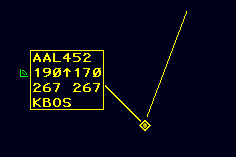
    <figcaption>Fig.  - A Track with Dwell Emphasis</figcaption>
</figure>

A Data Block is temporarily displayed with Dwell Emphasis when the cursor is above the Data Block or the Data Block's Track symbol. Dwell Emphasis lock is toggled by left-clicking [field A](#fdb-line-1).

### Quick Look

Quick Look displays FDBs for all aircraft tracked by a specified sector.

##### QL Command

The `QL` command is used to toggle Quick Look for specified sectors:

> :keyboard: `QL <sector ID 1> <sector ID 2> ...`

If no sector IDs are specified, Quick Look is disabled for all sectors:

> :keyboard: `QL`

## Flight Plans

##### QF Command

<figure>
    
    <figcaption>Fig.  - A <code>QF</code> command response</figcaption>
</figure>

The `QF` command displays a readout of the flight plan's contents in the [Response Area](#response-area):

> :keyboard: `QF <FLID>`

The flight plan readout contains the following elements:

- The Zulu time
- The aircraft's CID
- The aircraft's ID
- The track's owning sector ID (in parentheses)
- The aircraft's type and equipment suffix
- The aircraft's assigned beacon code
- The aircraft's filed cruise speed
- The aircraft's assigned altitude
- The aircraft's route
- The aircraft's flight plan remarks

##### SR Command

The `SR` command opens the flight plan in the [Flight Plan Editor](/overview#flight-plan-editor):

> :keyboard: `SR <FLID>`

##### DM Command

The `DM` command activates an aircraft's flight plan. An aircraft's flight plan must be activated prior to a starting a track:

> :keyboard: `DM <ACID>`

##### VP Command

The `VP` command creates a VFR flight plan for a Track with no active flight plan:

> :keyboard: `VP <aircraft type> <route> <FLID>`

##### QB Command

The `QB` command assigns a specified beacon code to an aircraft, or will automatically generate a beacon code if no code is specified:

> :keyboard: `QB <code> <ACID>`

> :keyboard: `QB <ACID>`

The `QB` command also assigns an equipment suffix to an aircraft:

> :keyboard: `QB <equipment> <FLID>`

The `QB` command also assigns a voice type to an aircraft:

> :keyboard: `QB [/v | /r | /t] <FLID>`

> :mantelpiece_clock: Unlike legacy clients, `QB V`, `QB R`, and `QB T` no longer assign a voice type to an aircraft. Instead, the voice type parameter must be prefixed with a `/`.

### Altitudes

ERAM manages multiple types of altitudes for each track.

##### QZ Command

The `QZ` command is used to set a Track's assigned (flight plan) altitude:

> :keyboard: `QZ <altitude> <FLID>`

The `QZ` command is also used to set a VFR or VFR on-top (OTP) altitude:

> :keyboard: `QZ VFR <FLID>` or `QZ VFR/<altitude> <FLID>` or `QZ OTP <FLID>`

The `QZ` command is also used to set block altitudes:

> :keyboard: `QZ <floor>B<ceiling>`

##### QQ Command

The `QQ` command is used to set a Track's interim altitude:

> :keyboard: `QQ <altitude> <FLID>`

Prefacing the altitude parameter with an `R` sets both the Track's interim altitude and the controller entered reported altitude:

> :keyboard: `QQ R<altitude> <FLID>`

Prefacing the altitude parameter with an `L` sets the Track's local interim altitude (which is not transferred between ARTCCs):

> :keyboard: `QQ L<altitude> <FLID>`

Prefacing the altitude parameter with a `P` sets the Track's procedure altitude. Note that a Track cannot have both an interim and a procedure altitude assigned simultaneously. Setting one altitude after the other has already been set replaces the existing altitude.

> :keyboard: `QQ P<altitude> <FLID>`

The `QQ` command is also used to clear a Track's interim or procedure altitude:

> :keyboard: `QQ <FLID>`

Finally, the `QQ` command is also used to clear a Track's local interim altitude:

> :keyboard: `QQ L <FLID>`

> :warning: Instead of `/OK`, `/TT` or `///` is used in the `QQ` command to override logic checks: `QQ /TT P150 JBU123`

> :information_source: Multiple FLIDs may be specified in one `QQ` command: `QQ 110 JBU123/429/AAL924`

##### QR Command

The `QR` command is used to set a controller entered reported altitude (CERA):

> :keyboard: `QR <altitude> <FLID>`

> :link: For more information on how altitudes are displayed in Data Blocks, please see the [Data Blocks](#data-blocks) section of the documentation.

### Routing

##### QU Command

<figure>
    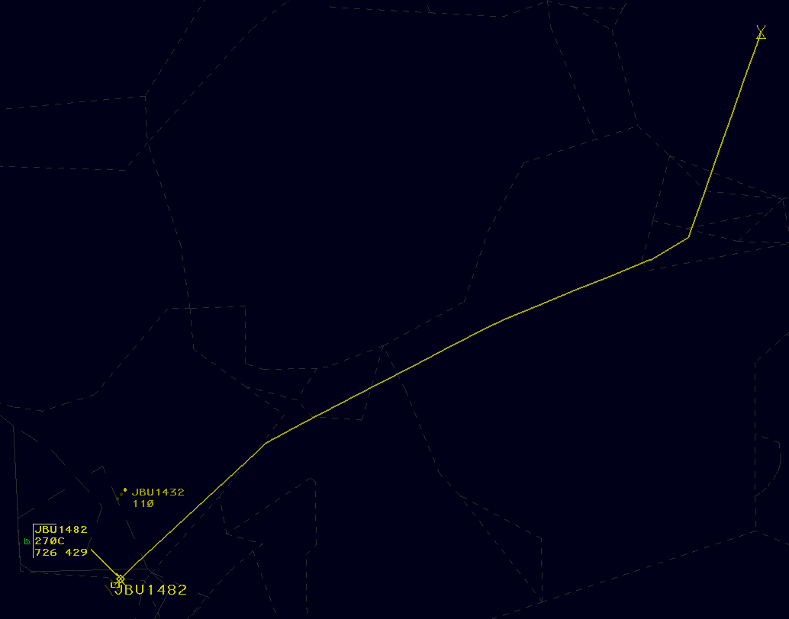
    <figcaption>Fig.  - A route display</figcaption>
</figure>

The `QU` command is used to request display of an aircraft's route up to the specified number of minutes:

> :keyboard: `QU <minutes> <FLID>`

Omitting the number of minutes displays a default route length of 20 minutes. To display the maximum available length of the route, enter `/M` in place of the number of minutes. When a route display line extends to the aircraft's destination, the destination is marked with an underlined X.

Route display lines are automatically removed 30 seconds after the last route line was added. The `QU` command is also used to clear the display of an aircraft's route line:

> :keyboard: `QU <FLID>`

Omitting the FLID and entering only `QU` clears all route lines.

> :information_source: Multiple FLIDs may be specified in one `QU` command: `QU 30 JBU123/429/AAL924`

> :mantelpiece_clock: Unlike legacy clients, route displays are displayed to all controllers logged in to the same sector.

The QU command is also used to amend an aircraft's route direct to one or more specified fix or location:

> :keyboard: `QU [<fix> | <location>] <FLID>`

This removes all fixes in the aircraft's flight plan prior to the specified fix(es), inserts a fix radial distance (FRD) representing the aircraft's present position, and adds any additional fixes specified in the command. For example, consider a flight on the route `BOS V1 JFK`. Entering the command `QU GDM BOSOX 123` amends the route to `<FRD> GDM BOSOX V1 JFK`, where `BOSOX` is a fix on `V1`.

> :information_source: Logic checks may be overridden with `/OK`: `QU /OK PROVI JBU123`

> :information_source: Locations can be entered as left-clicked display locations. This makes it easy to draw a path around weather when rerouting an aircraft.

##### AM Command

The `AM` command is used to amend portions of a flight plan. It is used as follows:

| Command                       | Field Number | Description                                                                                                    | Example                       |
| ----------------------------- | ------------ | -------------------------------------------------------------------------------------------------------------- | ----------------------------- |
| `AM <FLID>`                   |              | Requests flight plan readout                                                                                   |                               |
| `AM <FLID> TYP <type>`        | 3            | Amends the aircraft's type                                                                                     | `AM AAL123 TYP B737/L`        |
| `AM <FLID> BCN <code>`        | 4            | Assigns a discrete beacon code                                                                                 | `AM AAL123 BCN 1301`          |
| `AM <FLID> SPD <speed>`       | 5            | Amends the aircraft's filed cruise speed                                                                       | `AM AAL123 SPD 450`           |
| `AM <FLID> ALT <altitude>`    | 8            | Amends the aircraft's assigned altitude                                                                        | `AM AAL123 ALT 300`           |
| `AM <FLID> RMK ++<remarks>++` | 11           | Amends the aircraft's flight plan remarks. The double plus signs are only needed if the remarks contain spaces | `AM AAL123 RMK ++NEW PILOT++` |
| `AM <FLID> RMK `              | 11           | Clears the aircraft's flight plan remarks                                                                      | `AM AAL123 RMK`               |

<figcaption>Table  - <code>AM</code> command </figcaption>

> :information_source: The Field Number may be used in place of the field name, such as `AM <FLID> 3 B737/L`.

The `AM` command is also used to amend an aircraft's route, departure, and destination (field 10) using the following `RTE` syntax . Note that `↑` and `↓` are entered with the `[` and `]` keys, respectively.

###### Example AM command usage:

- Initial route in each example: `KBOS SSOXS SEY PARCH3 KJFK`

| Command                                | Description                                                                            | Resulting Route                           |
| -------------------------------------- | -------------------------------------------------------------------------------------- | ----------------------------------------- |
| `AM AAL123 RTE LOGAN4.SSOXS`           | Replaces the beginning the route                                                       | `KBOS LOGAN4 SSOXS BUZRD SEY PARCH3 KJFK` |
| `AM AAL123 RTE SSOXS.BUZRD.SEY`        | Replaces the route between `SSOXS` and `SEY`                                           | `KBOS SSOXS BUZRD SEY PARCH3 KJFK`        |
| `AM AAL123 RTE SEY.ROBER2`             | Replaces the end of the route                                                          | `KBOS SSOXS BUZRD SEY ROBER2 KJFK`        |
| `AM AAL123 RTE LOGAN4.BOSOX.JFK`       | Replaces the entire route                                                              | `KBOS LOGAN4 BOSOX JFK KJFK`              |
| `AM AAL123 RTE KBED↑`                  | Changes the departure airport. The departure airport must be the only element entered. | `KBED SSOXS SEY PARCH3 KJFK`              |
| `AM AAL123 RTE SEY.VALRE.HAARP3.KLGA↓` | Changes the destination airport                                                        | `KBOS SSOXS SEY VALRE HAARP3 KLGA`        |

<figcaption>Table  - <code>AM RTE</code> command </figcaption>

## Toolbars

### Toolbar Buttons

#### Menu Buttons

|                      Closed Menu Button                       |                       Open Menu Button                        |
| :-----------------------------------------------------------: | :-----------------------------------------------------------: |
| 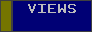 |  |

<figcaption>Table  - A Menu Button </figcaption>

A Menu Button opens or closes its Toolbar menu when it is left or middle-clicked.

#### Toggle Buttons

|                  Deactivated Toggle Button                   |                   Activated Toggle Button                   |
| :----------------------------------------------------------: | :---------------------------------------------------------: |
| 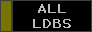 |  |

<figcaption>Table  - A Toggle Button </figcaption>

A Toggle Button toggles a view or feature when it is left or middle-clicked.

#### Increment/Decrement Buttons

<figure>
    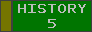
    <figcaption>Fig.  - An Increment/Decrement Button</figcaption>
</figure>

An Increment/Decrement Button increments a feature when it is middle-clicked, and decrements the feature when it is left-clicked.

#### Command Buttons

|                      Deactivated Command Button                       |                      Activated Command Button                       |
| :-------------------------------------------------------------------: | :-----------------------------------------------------------------: |
|  |  |

<figcaption>Table  - A Command Button </figcaption>

A Command Button executes a command when it is left or middle-clicked.

#### Tear-offs

Many Toolbar buttons support being "torn-off" from their toolbar. A torn-off button can be placed anywhere on the ERAM display and remains visible when its Toolbar is suppressed. A button is torn-off by left or middle-clicking the gold tear-off bar on the left side of the button. Only one tear-off can be made of each button. A torn-off button can be [repositioned](#repositioning-views) similarly to a view by left or middle-clicking its gold tear-off bar. To delete a tear-off, left or middle-click the **DELETE TEAROFF** button on the Master Toolbar, then left-click to select or deselect tear-offs. Middle click to confirm deletion of selected tear-offs.

### Master Toolbar

The ERAM Master Toolbar contains buttons for controlling various ERAM system settings and functions. Some Toolbar buttons toggle the display of additional toolbars. The Master Toolbar is displayed by left or middle-clicking the **MASTER TOOLBAR** button in the [Toolbar Control Menu](#toolbar-control-menu). The Toolbar Control Menu's tear-off button is always displayed.

### Toolbar Control Menu

<figure>
    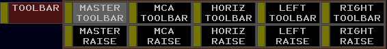
    <figcaption>Fig.  - The Toolbar Control menu</figcaption>
</figure>

The Toolbar Control menu contains the following buttons:

- **MASTER TOOLBAR**: toggles display of the Master Toolbar
- **MCA TOOLBAR**: not simulated
- **HORIZ TOOLBAR**: not simulated
- **LEFT TOOLBAR**: not simulated
- **RIGHT TOOLBAR**: not simulated
- **MASTER RAISE/LOWER**: raises or lowers the Master Toolbar above/below other display views
- **MCA RAISE**: not simulated
- **HORIZ RAISE**: not simulated
- **LEFT RAISE**: not simulated
- **RIGHT RAISE**: not simulated

### Master Toolbar Menu

<figure>
    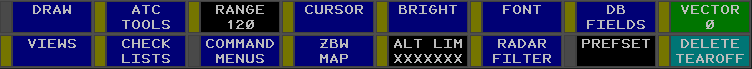
    <figcaption>Fig.  - The Master Toolbar menu</figcaption>
</figure>

The Master Toolbar menu contains the following buttons:

- **DRAW**: not simulated
- **ATC TOOLS**: opens the [ATC Tools](#atc-tools-toolbar-menu) Toolbar menu
- **RANGE**: controls the range of the display. The display's vertical range in hundreds of NMs is displayed.
- **CURSOR**: opens the [Cursor](#cursor-toolbar-menu) Toolbar menu
- **BRIGHT**: opens the [Brightness](#brightness-toolbar-menu) Toolbar menu
- **FONT**: opens the [Font](#font-toolbar-menu) Toolbar menu
- **DB FIELDS**: opens the [Data Block Fields](#data-block-fields-toolbar-menu) Toolbar menu
- **VECTOR**: controls the length of data block velocity vectors
- **VIEWS**: opens the [Views](#views-toolbar-menu) Toolbar menu
- **CHECK LISTS**: opens the [Check Lists](#check-lists-toolbar-menu) Toolbar menu
- **COMMAND MENUS**: not simulated
- **GeoMap**: opens the [GeoMap](#geomap-toolbar-menu) Toolbar menu. The current GeoMap's name is displayed.
- **ALT LIM**: toggles display of the altitude limits view. The current altitude limit is displayed, or **XXXXXXX** if the Target and LDB altitudes are different.
- **RADAR FILTER**: opens the [Radar Filter](#radar-data-toolbar-menu) Toolbar menu
- **PREFSET**: not simulated
- **DELETE TEAROFF**: initiates the [delete tear-off](#tear-offs) function

### Views Toolbar Menu

<figure>
    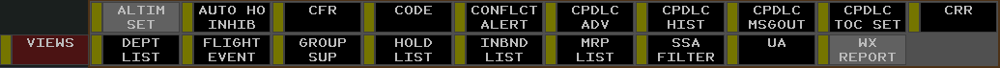
    <figcaption>Fig.  - The Views Toolbar menu</figcaption>
</figure>

The Views Toolbar menu contains the following buttons:

- **ALTIM SET**: toggles display of the [Altimeter Settings View](#altimeter-settings-view)
- **AUTO HO INHIB**: not simulated
- **CFR**: not simulated
- **CODE**: toggles display of the [Beacon Code View](#beacon-code-view)
- **CONFLCT ALERT**: not simulated
- **CPDLC ADV**: not simulated
- **CPDLC HIST**: not simulated
- **CPDLC MSGOUT**: not simulated
- **CPDLC TOC SET**: not simulated
- **CRR**: toggles display of the [Continuous Range Readout View](#continuous-range-readout-view)
- **DEPT LIST**: not simulated
- **FLIGHT EVENT**: not simulated
- **GROUP SUP**: not simulated
- **HOLD LIST**: not simulated
- **INBND LIST**: not simulated
- **MRP LIST**: not simulated
- **SSA FILTER**: not simulated
- **UA**: not simulated
- **WX REPORT**: toggles display of the [Weather Station Report View](#weather-station-report-view)

### ATC Tools Toolbar Menu

<figure>
    
    <figcaption>Fig.  - The ATC Tools Toolbar menu</figcaption>
</figure>

The ATC tools Toolbar menu contains the following buttons:

- **CRR FIX**: displays CRR fixes
- **SPEED ADVSRY**: not simulated
- **WX**: opens the [Weather](#weather-toolbar) Toolbar menu

### Weather Toolbar Menu

<figure>
    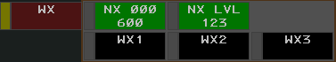
    <figcaption>Fig.  - The Weather Toolbar Menu</figcaption>
</figure>

The weather Toolbar menu contains the following buttons:

- **NX Altitudes**: not simulated
- **NX LVL**: controls the displayed [NEXRAD](#nexrad) precipitation levels
- **WX1**: not simulated
- **WX2**: not simulated
- **WX3**: not simulated

### Check Lists Toolbar Menu

<figure>
    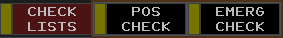
    <figcaption>Fig.  - The Check Lists Toolbar menu</figcaption>
</figure>

The Check Lists Toolbar menu contains the following buttons:

- **POS CHECK**: toggles display of the position relief [Check List View](#check-list-view)
- **EMERG CHECK**: toggles display of the emergency Check List View

### Cursor Toolbar Menu

<figure>
    
    <figcaption>Fig.  - The Cursor Toolbar menu</figcaption>
</figure>

The Cursor Toolbar menu contains the following buttons:

- **SPEED**: not simulated
- **SIZE**: controls the size of the cursor
- **VOLUME**: not simulated

### GeoMap Toolbar Menu

<figure>
    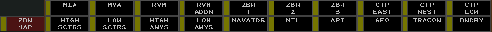
    <figcaption>Fig.  - An example GeoMap Toolbar menu</figcaption>
</figure>

The GeoMap Toolbar menus contains a Toggle Button for each [GeoMap](#geomaps) Filter. Holding `Alt` displays an unrealistic set of an additional 20 Filters.

### Brightness Toolbar Menu

The Brightness Toolbar menu contains the following buttons:

- **MAP BRIGHT**: opens the [Map Brightness](#map-brightness-toolbar-menu) Toolbar menu
- **CPDLC**: not simulated
- **BCKGRD**: controls the brightness of the display's background
- **CURSOR**: controls the brightness of the cursor
- **TEXT**: controls the brightness of text
- **PR TGTR**: controls the brightness of paired [Targets](#targets)
- **UNP TGT**: controls the brightness of unpaired Targets
- **PR HIST**: controls the brightness of paired [Target history](#target-history) data points
- **UNP HIST**: controls the brightness of unpaired Target history data points
- **LDB**: controls the brightness of [LDBs](#limited-data-blocks)
- **SLDB**: adjusts the brightness of [selected](#beacon-code-view) LDBs
- **WX**: not simulated
- **NEXRAD**: controls the brightness of [NEXRAD](#nexrad) weather
- **BCKLGHT**: controls the brightness of the display's backlight
- **BUTTON**: controls the brightness of buttons
- **BORDER**: controls the brightness of borders
- **TOOLBAR**: controls the brightness of the Toolbar
- **TB BRDR**: controls the brightness of the Toolbar's border
- **AB BRDR**: not simulated
- **FDB**: controls the brightness of [FDBs](#full-data-blocks)
- **PORTAL**: adjusts the brightness of elements outside of an FDB's Portal Fence
- **SATCOMM**: not simulated
- **ON-FREQ**: controls the brightness of on-frequency indicators ([VCI](#fdb-column-0)s)
- **LINE 4**: adjusts the brightness of FDB [fourth-line](#fdb-line-4) data
- **DWELL**: adjusts the brightness of [Dwelled](#dwell-emphasis) Data Blocks and Track symbols
- **FENCE**: controls the brightness of FDB Portal Fences
- **DBFEL**: not simulated
- **OUTAGE**: not simulated

### Map Brightness Toolbar Menu

<figure>
    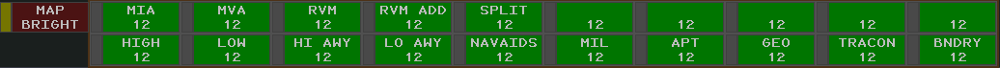
    <figcaption>Fig.  - An example Map Brightness Toolbar menu</figcaption>
</figure>

The Map Brightness Toolbar menu contains an Increment/Decrement Button to control the brightness of each GeoMap Brightness Control Group (BCG). Holding `Alt` displays an unrealistic set of an additional 20 BCGs.

### Font Toolbar Menu

<figure>
    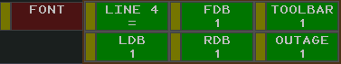
    <figcaption>Fig.  - The Font Toolbar menu</figcaption>
</figure>

The Font Toolbar menu contains the following Increment/Decrement Buttons:

- **LINE 4**: adjusts the font size of FDB fourth-line data relative to the FDB font size
- **FDB**: controls font size of FDBs
- **TOOLBAR**: not simulated
- **LDB**: controls font size of LDBs
- **RDB**: controls the font size of RDBs
- **OUTAGE**: not simulated

### Radar Filter Toolbar Menu

<figure>
    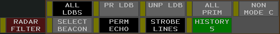
    <figcaption>Fig.  - The Radar Filter Toolbar menu</figcaption>
</figure>

The Radar Filter Toolbar menu contains the following Toggle Buttons:

- **ALL LDBS**: toggles display of all LDBs
- **PR LDB**: toggles display of paired LDBs
- **UNP LDB**: toggles display of unpaired LDBs
- **ALL PRIM**: toggles display of all primary Targets
- **NON MODE C**: toggles display of non-Mode C Targets
- **SELECT BEACON**: toggles display of Targets for aircraft squawking a code in the [Beacon Code View](#beacon-code-view)
- **PERM ECHO**: not simulated
- **STROBE LINES**: not simulated
- **HISTORY**: controls the number of displayed Target history data points

### Data Block Fields Toolbar Menu

<figure>
    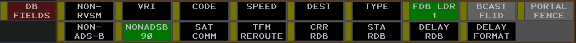
    <figcaption>Fig.  - The Data Block Fields Toolbar menu</figcaption>
</figure>

The Data Block Fields Toolbar menu contains the following buttons:

- **NON-RVSM**: toggles display of non-RVSM indicator in FDBs and enhanced LDBs. Always active.
- **VRI**: not simulated
- **CODE**: temporarily displays aircraft's beacon code or special purpose code text
- **SPEED**: temporarily displays aircraft's ground speed in FDB (inhibits other time-shared fields)
- **DEST**: toggles display of the aircraft's destination in the FDB fourth-line
- **TYPE**: toggles display of the aircraft's type in the FDB fourth-line
- **FDB LDR**: controls the length of FDB [leader lines](#leader-lines)
- **BCAST FLID**: toggles display of an aircraft's broadcasted (ADS-B) FLID
- **PORTAL FENCE**: toggles display of portal fences in FDBs
- **NON-ADS-B**: not simulated
- **NONADSB**: not simulated
- **SAT COMM**: toggles display of SatComm indicators in FDBs
- **TFM REROUTE**: not simulated
- **CRR RDB**: toggles display of CRR distance in RDBs
- **STA RDB**: not simulated
- **DELAY RDB**: not simulated
- **DELAY FORMAT**: not simulated

### Altitude Limits Filter Menu

The Altitude Limits Filters Menu allows filters to be defined for both Targets and LDBs. By default, the filters are combined into one filter, labeled **ALTITUDE LIMITS**. Left or middle-clicking in the combined filter box splits the filter into two filters: one for Targets and one for LDBs.

Left or middle-clicking a text box clears the current input and displays a cursor. A new altitude limit can be entered directly into the textbox, separating the top and lower altitudes, expressed in hundreds of feet, with a `B`. For example, entering `100B230` creates a filter between 10,000 feet and FL230. Pressing `Enter` sets the new filter.

##### QD Command

Altitude limits may also be set using the `QD` command

> :keyboard: `QD <lower limit>B<upper limit>`

## NEXRAD

<figure>
    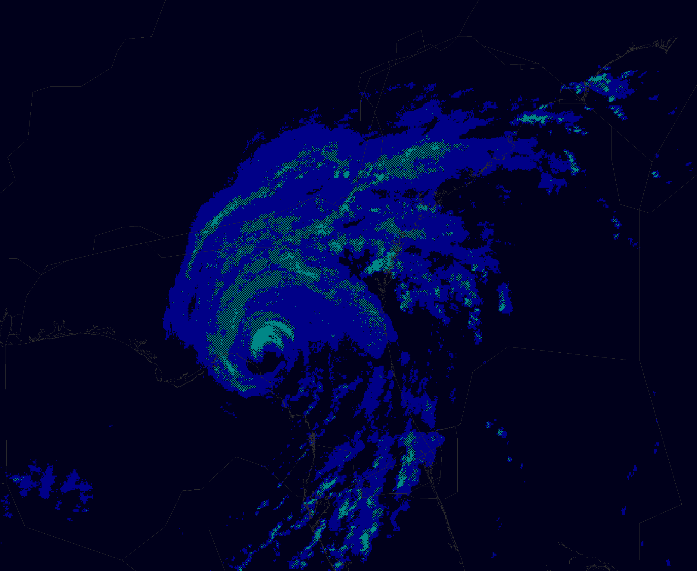
    <figcaption>Fig.  - Hurricane Idalia depicted in NEXRAD</figcaption>
</figure>

Next Generation Weather Radar (NEXRAD) displays areas of moderate, heavy, and extreme precipitation on the ERAM display. Precipitation levels are depicted as follows:

|                   Moderate Precipitation                    |                   Heavy Precipitation                    |                   Extreme Precipitation                    |
| :---------------------------------------------------------: | :------------------------------------------------------: | :--------------------------------------------------------: |
| 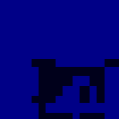</img> | </img> | </img> |
|                         Solid blue                          |                 Checkered cyan and black                 |                         Solid cyan                         |

<figcaption>Table  - NEXRAD precipitation levels </figcaption>

To remove lower levels of precipitation from display, left-click the **NX LVL** button in the [**WX**](#weather-toolbar-menu) Toolbar menu. Middle-click the button to show lower levels of precipitation. Precipitation levels are shown as follows:

| NX LVL setting | Displayed Precipitation      |
| -------------- | ---------------------------- |
| OFF            | None                         |
| 3              | Extreme                      |
| 23             | Heavy and Extreme            |
| 123            | Moderate, Heavy, and Extreme |

<figcaption>Table  - NEXRAD level settings </figcaption>

## VATSIMisms

While unrealistic, the following additions are included in CRC's ERAM to aid in controlling on VATSIM.

### Autotrack

vNAS supports the ability to automatically begin tracking aircraft upon departure from a customizable list of airports. When an aircraft departs an airport on the autotrack list, a [`DM`](#dm-command) command is automatically executed, followed by a [`QT`](#qt-command) command.

To add an airport to the autotrack list, enter the `.autotrack <airport ID>` command in either the MCA or messages window. To remove an airport from the autotrack list, enter the `.autotrack -<airport ID>` command. Multiple airports can be specified at once, for example `.autotrack BOS -BTV` will add `BOS` and remove `BTV` from the autotrack list. To clear the autotrack list, enter the `.autotrack none` command. You can enter either the FAA ID or the ICAO ID for each airport and the autotrack function will work regardless of which ID the pilot filed as their departure airport.

### Single-Click Track

While unrealistic, a Track may also be started by holding `Ctrl + Shift` and left or middle-clicking a Target.

### Display De-cluttering

Pressing `Ctrl + Shift + D` cycles through various levels of display de-cluttering, which hides views from the ERAM display.

### Scope Markers

While unrealistic, CRC's ERAM supports the following [Dot commands](/overview#dot-commands) to show or hide scope reference markers:

| Command                                                    | Description                                      | BCG(s)                | Font Size |
| ---------------------------------------------------------- | ------------------------------------------------ | --------------------- | --------- |
| `.showasrsites`                                            | Toggles display of ASR site locations and ranges |                       |           |
| `.fc <airport ID> <runway>`                                | Toggles display of a runway's center line        | Map Group 1           |           |
| `.nocenterlines`                                           | Hides all runway center lines                    |                       |           |
| `.ff <fix>` or `.marker <fix>` or `.markers <fix1> <fix2>` | Toggles display of a fix or NAVAID's location    | Text / Paired Targets | LDB       |
| `.nomarkers`                                               | Removes all fix markers                          |                       |           |
| `.find <fix>`                                              | Temporarily displays a fix or NAVAID's location  | Paired Targets        |           |

<figcaption>Table  - Scope markers commands </figcaption>

### Top-Down Mode

For the purposes of VATSIM, ERAM Top-Down mode (TDM) can be toggled with `Ctrl + T`. In Top-Down mode, TDM-only [GeoMap](#geomaps) elements (such as airport diagrams) and Ground Targets are displayed. There are two types of Ground Targets displayed in Top-Down mode:

| Aircraft                                                             | Heavy Aircraft                                                             |
| -------------------------------------------------------------------- | -------------------------------------------------------------------------- |
|  |  |

<figcaption>Table  - Ground Targets </figcaption>

A Ground Target's Data Block always displays the aircraft's ID on the first line, and aircraft type on the second. If the aircraft is squawking a beacon code, that beacon code appears on the second line. If the beacon code correlates with a flight plan, the aircraft's destination is displayed instead of the beacon code.

<figure>
    
    <figcaption>Fig.  - A Ground Target and Data Block with a correlated flight plan</figcaption>
</figure>

> :warning: Note that the Ground Target symbol depicted and the aircraft type displayed in an aircraft's Data Block are derived from the aircraft type specified by the pilot on connection, not the aircraft type in the corresponding flight plan (though the two should normally correspond).

> :warning: Unlike ASDE-X, Boeing 757s are not depicted by the heavy aircraft icon.

Ground Target Data Blocks are repositioned by simply left-clicking and dragging to a desired position. While in TDM, Data Blocks may also be [positioned](#positioning-data-blocks) and [leader line](#leader-lines) lengths may be set similarly to standard Data Blocks.

## Command Reference

### Implied Commands

Implied commands can be executed with or without the `QN` or `QZ` command preface.

| Command                   | Description                                                                                          | Supports `/OK` | Supports multiple FLIDs |
| ------------------------- | ---------------------------------------------------------------------------------------------------- | -------------- | ----------------------- |
| `<FLID>`                  | Changes an unowned Data Block between an [LDB](#limited-data-blocks) and an [FDB](#full-data-blocks) |                |                         |
| `<FLID>`                  | Accepts or recalls a pending [handoff](#handoffs)                                                    | Yes            |                         |
| `//<FLID>` or `// <FLID>` | Toggles a Track's [VCI](#fdb-column-0)                                                               |                |                         |
| `<1-9> <FLID>`            | [Positions](#positioning-data-blocks) a Data Block                                                   |                |                         |
| `/<0-3> <FLID>`           | Sets Data Block's [leader line](#leader-lines) length                                                |                |                         |
| `<1-9>/<0-3> <FLID>`      | Positions a Data Block and sets its leader line length                                               |                |                         |

<figcaption>Table  - Implied commands </figcaption>

### ERAM Commands

The following commands are typed into the [MCA](#message-composition-area-mca) and executed by pressing `Enter` or middle-clicking to select a track or location (if supported by the command).

| Command                                        | Description                                                                                                            | Supports `/OK`          | Supports multiple FLIDs |
| ---------------------------------------------- | ---------------------------------------------------------------------------------------------------------------------- | ----------------------- | ----------------------- |
| `AM` (see [link](#am-command) for full syntax) | [Amends](#am-command) a flight plan                                                                                    |                         |                         |
| `AR <station ID>`                              | [Toggles](#ar-command) display of an [altimeter setting](#altimeter-settings-view)                                     |                         |                         |
| `DM <ACID>`                                    | [Activates](#dm-command) an aircraft's flight plan                                                                     |                         |                         |
| `LA`(see [link](#la-command) for full syntax)  | [Displays](#la-command) range/bearing between two locations                                                            |                         |                         |
| `LB` (see [link](#lb-command) for full syntax) | [Displays](#lb-command) range/bearing between fix and location                                                         |                         |                         |
| `LC`(see [link](#lc-command) for full syntax)  | [Displays](#lc-command) speed adjustment to position the track over the fix at the specified time                      |                         |                         |
| `LF` (see [link](#lf-command) for full syntax) | [Creates](#lf-command) a CRR group, or adds or removes aircraft to/from a CRR group                                    |                         | Yes                     |
| `MR`                                           | [Displays](#mr-command) the list of available [GeoMaps](#geomaps) in the [Response Area](#response-area)               |                         |                         |
| `MR <GeoMap>`                                  | [Switches](#mr-command) to the specified GeoMap                                                                        |                         |                         |
| `QB <ACID>`                                    | [Requests](#qb-command-1) a beacon code                                                                                |                         |                         |
| `QB <code> <ACID>`                             | [Assigns](#qb-command-1) a beacon code                                                                                 |                         |                         |
| `QB <code1> <code2> ...`                       | [Adds/removes](#qb-command) beacon codes from the [Beacon Code View](#beacon-code-view)                                |                         |                         |
| `QB <equipment> <FLID>`                        | [Assigns](#qb-command-1) an equipment suffix                                                                           |                         |                         |
| `QB [/v\|/r\|/t] <FLID>`                       | [Assigns](#qb-command-1) a voice type                                                                                  |                         |                         |
| `QD <station ID>`                              | [Toggles](#qd-command) display of an [altimeter setting](#altimeter-settings-view)                                     |                         |                         |
| `QD <lower limit>B<upper limit>`               | [Sets](#qd-command-1) altitude limits                                                                                  |                         |                         |
| `QF`                                           | [Displays](#qf-command) flight plan readout in the Response Area                                                       |                         |                         |
| `QH F <location> <FLID>`                       | [Freezes](#freezing-a-track) a Track                                                                                   |                         |                         |
| `QN` or `QZ`                                   | Executes an [Implied command](#implied-commands). Entering `QN` or `QZ` is not required to execute an Implied command. |                         |                         |
| `QP <sector> <FLID>`                           | [Initiates](#qp-command) a [point out](#point-outs)                                                                    |                         |                         |
| `QP A <sector> <FLID>`                         | [Acknowledges](#qp-command) a point out                                                                                |                         |                         |
| `QP <FLID>`                                    | [Changes](#qp-command) an FDB to an LDB after a point out                                                              |                         |                         |
| `QP J <FLID>`                                  | [Toggles](#qp-command-1) display of a standard [DRI](#distance-reference-indicators)                                   |                         |                         |
| `QP T <FLID>`                                  | [Toggles](#qp-command-1) display of a reduced separation DRI for an eligible Track                                     |                         |                         |
| `QQ (R\|P\|L)<altitude> <FLID>`                | [Sets](#qq-command) an interim altitude, local interim altitude, or procedure altitude                                 | Yes, use `///` or `/TT` | Yes                     |
| `QR <altitude> <FLID>`                         | [Sets](#qr-command) a controller entered reported altitude                                                             |
| `QS` (see [link](#qs-command) for full syntax) | [Edits](#qs-command) FDB HSF fourth line data                                                                          |                         |                         |
| `QT <location> <ACID>`                         | [Starts](#qt-command) a track                                                                                          |                         |                         |
| `QU <minutes> <FLID>`                          | [Displays](#qu-command) a route                                                                                        | Yes                     |                         |
| `QU <fix> <FLID>`                              | [Amends](#qu-command) a route direct to a fix                                                                          |                         |                         |
| `QX <FLID>`                                    | [Drops](#qx-command) a Track                                                                                           | Yes                     |                         |
| `QZ <altitude> <FLID>`                         | [Sets](#qz-command) an assigned altitude                                                                               |                         |                         |
| `RF <FLID> <facility>`                         | Forces a flight plan transfer to the specified facility                                                                |                         |                         |
| `VP <aircraft type> <route> <FLID>`            | [Creates](#vp-command) a VFR flight plan                                                                               |                         |                         |
| `WR <station ID>`                              | Toggles display of a [weather station report](#weather-station-report-view)                                            |                         |                         |
| `WR R <station ID>`                            | Displays the most recent report from the weather station in the Response Area                                          |                         |                         |

<figcaption>Table  - ERAM commands </figcaption>

### Keyboard Shortcuts

| Keyboard Shortcut | Function                                           |
| ----------------- | -------------------------------------------------- |
| `` ` ``           | Inserts a clear weather symbol (ⵔ︎)                |
| `~`               | Inserts an overcast weather symbol (⊕︎)            |
| `[`               | Inserts an up arrow (↑)                            |
| `]`               | Inserts a down arrow (↓)                           |
| `F1`              | Initiates a `QF` command                           |
| `Shift + F1`      | Initiates a `DM` command                           |
| `F2`              | Initiates a `QP` command                           |
| `Shift + F2`      | Initiates a `QD` command                           |
| `F3`              | Initiates a `QT` command                           |
| `F4`              | Initiates a `QX` command                           |
| `F5`              | Initiates a `QZ` command                           |
| `F6`              | Initiates a `QU` command                           |
| `F7`              | Initiates a `QL` command                           |
| `Shift + F7`      | Initiates a `WR` command                           |
| `F8`              | Initiates a `QQ` command                           |
| `Shift + F8`      | Initiates a `QR` command                           |
| `F9`              | Initiates a `QB` command                           |
| `Ctrl + R`        | Recalls the last command in the MCA's Preview Area |
| `Ctrl + T`        | Toggles [Top-Down](#top-down-mode) mode            |
| `Ctrl + Del`      | Clears the Response Area                           |
| `Ctrl Shift + B`  | Resets the default brightness settings             |
| `Ctrl Shift + O`  | Cycles the [RDB](#range-data-blocks) offset        |

<figcaption>Table  - Keyboard shortcuts </figcaption>

## Settings

<figure>
    
    <figcaption>Fig.  - ERAM display settings </figcaption>
</figure>

The ERAM Display Settings window is accessed through the controlling window's menu (hamburger icon on the left of the top toolbar) by selecting the **Display Settings** option. The ERAM display settings contain the following options:

- **Top-down mode**: enables Top-Down mode
- **Disable mouse pan/zoom**: disables panning and zooming with the mouse

> :keyboard: `Ctrl + D` opens the Display Settings window.

## List of Acronyms and Abbreviations

| Term        | Definition                                                              |
| ----------- | ----------------------------------------------------------------------- |
| ACID or AID | Aircraft ID, such as "N123AB"                                           |
| ADS-B       | Automatic Dependent Surveillance-Broadcast                              |
| AOI         | Area of Interest                                                        |
| CDB         | Conflict Data Block                                                     |
| CERA        | Controller Entered Reported Altitude                                    |
| CID         | Computer ID. A three character ID assigned to a flight plan by ERAM.    |
| CRR         | Continuous Range Readout                                                |
| E-LDB       | Enhanced-Limited Data Block                                             |
| FDB         | Full Data Block                                                         |
| FLID        | Flight ID. Aircraft IDs, assigned beacon codes, and CIDs are all FLIDs. |
| HSF         | Heading/Speed/Free Form Text                                            |
| LDB         | Limited Data Block                                                      |
| OTP         | VFR On-Top                                                              |
| RDB         | Range Data Block                                                        |
| RVSM        | Reduced Vertical Separation Minima                                      |
| VCI         | Visual Communications Indicator                                         |
| VFR         | Visual Flight Rules                                                     |

<figcaption>Table  - ERAM acronyms and abbreviations </figcaption>
