# CRC STARS Reference — captured 2026-06-29

Source: https://docs.virtualnas.net/crc/stars/

This is a verbatim conversion of the current vNAS CRC STARS documentation
(superseding the older capture in [crc-stars-reference.md](crc-stars-reference.md)).
The old file is kept for diff reference.

---

# STARS

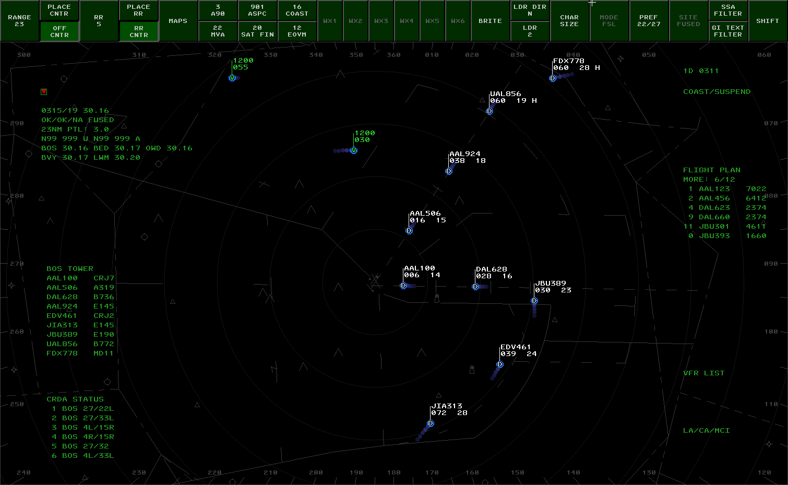Fig. 1 - A STARS display

Standard Terminal Automation Replacement System (STARS) is the terminal approach radar system used within FAA and DoD TRACONs, RAPCONs, and Radar Towers. CRC's STARS displays closely simulate the [real-world system](<https://www.faa.gov/air_traffic/technology/tamr>) used by the FAA with appropriate unrealistic "VATSIMisms" added for top-down workflows.

## Contents

  * Display Control Bar (DCB)
  * System Status Area (SSA)
  * Preview Area
  * System Lists
  * Video Maps
  * Compass Rose
  * Tracking Aircraft
  * Handoffs
  * Point Outs
  * Consolidation
  * Coordination
  * Data Blocks
  * Quick Look
  * Creating or Amending Flight Plans
  * Forcing Track Association
  * Short Term Conflict Alerts (STCA)
  * Special Purpose Codes
  * Predicted Track Lines (PTLs)
  * TPA J-Rings and Cones
  * ATPA (Automatic Terminal Proximity Alert)
  * Setting ATIS ID and General Information Text
  * Converging Runway Display Aid (CRDA)
  * Secondary STARS Displays
  * NEXRAD
  * VATSIMisms
  * Display Settings
  * Differences From vSTARS
  * Command Reference


## Important Terms and Concepts

##### TCP

TCP stands for **Terminal Control Position**. It is what identifies a position that a controller can work within a STARS facility. TCPs are used for directing a handoff or a point out to another controller. A TCP is comprised of a subset and a sector ID. The subset is a single digit. The sector ID is most commonly a single letter, but it can also be a single digit. For example, the Initial Departure position at A90 (Boston Consolidated TRACON) has a TCP of **1D**. This TCP is in subset "1", with a sector ID of "D".

##### Handoff ID or Handoff Number

The term "handoff ID" refers to the string of characters that you enter when initiating a handoff to another controller. The term "handoff number" more specifically refers to the number used as the prefix for initiating a handoff to another STARS facility. Refer to the section on Handing Off a Target for more details on the different types of handoff IDs.

##### Track

A track is simply the name given to a piece of data in the STARS computer that represents a flight. There are multiple types of tracks, discussed below.

##### Associated Track

An associated track is one that is associated with a flight plan. The most common way that a track becomes associated with a flight plan is by the pilot squawking the beacon code that is assigned to their flight plan. (Unlike the real STARS system, the track will only auto-associate if the pilot's callsign matches the aircraft ID on the flight plan.)

Tracks can also be associated manually by the controller.

##### Correlated Track

A correlated track is the most common type of track. It is one where the track is supported by a series of radar and/or ADS-B hits coming from an actual aircraft. The track is said to be "correlated" with radar/ADS-B surveillance data.

##### Coasting Track

A coasting track is an associated track that was previously correlated with surveillance data but is no longer. The aircraft may have descended below radar coverage, or, in the case of VATSIM, the pilot may have disconnected. Coasting tracks move along the last-known ground track at the ground speed last calculated from surveillance data. They move to the Coast/Suspend list after a period of time. A coasting track will automatically become re-correlated with an uncorrelated track that is squawking the beacon code assigned to the flight plan associated with the coasting track.

##### Unsupported Data Block

An unsupported data block is an associated track that was created by the controller and placed on the scope at a selected location. It is not correlated with any surveillance data. It is distinct from a coasting track because it remains fixed in place because it does not have a ground track or ground speed to use to predict its location. The controller that created the unsupported data block has track control for the flight.

## Display Control Bar (DCB)

The button bar across the top is known as the Display Control Bar, or DCB. The DCB is where you can control the appearance of the scope, targets, and data blocks. The DCB consists of the Main DCB, the Aux DCB, and several submenus. You can switch between the Main and Aux DCBs by clicking the **SHIFT** button at the far right on each DCB.

Many of the DCB buttons are toggle buttons, which have either an on or off state. In the screenshot below, the **OFF CNTR** button is toggled on. You can see that it appears to be pressed in, and has a lighter green color.

Many of the DCB buttons allow you to choose from a range of values. These are referred to as "Spinner" buttons. An example is the **RANGE** button in the screenshot below. To use a Spinner button, click on it with the mouse. It will appear to be pressed in, and it will take on a lighter green color. You can then use your mouse wheel to adjust the value. Your mouse cursor will be "trapped" within the boundaries of the button while you are making the adjustment. To accept the new value, click the button again. The button will revert to its original appearance, and the mouse cursor will no longer be confined to the button area.

Some of the DCB buttons open submenus containing additional buttons. While a submenu is open, your mouse cursor will be confined within the boundaries of the submenu. When you are finished making selections in the submenu, click the **DONE** button or press `Esc` to return to the main DCB.

### Main Menu

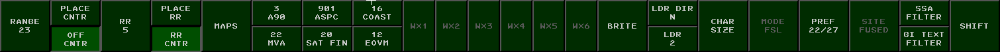Fig. 2 - DCB Main Menu

Table 1 - DCB Main Menu Button | Description  
---|---  
**RANGE** | Use this spinner button to adjust the zoom level of the scope.  
**PLACE CNTR** | Click this button, then click anywhere on the scope to recenter the scope at the clicked location.  
**OFF CNTR** | This button will be pressed whenever the scope has been panned away from the center point defined in the facility configuration. Click the button to re-center the scope at the facility-defined center point.  
**RR #** | Use this spinner button to adjust the spacing between the range rings. The value is expressed in nautical miles.  
**PLACE RR** | Click this button, then click anywhere on the scope to recenter the range rings.  
**RR CNTR** | This button will be pressed whenever the range rings have been placed somewhere other than the default scope center point. Click this button to re-center the range rings.  
**MAPS** | This button opens the MAPS submenu.  
**MAP TOGGLES** | The next 6 buttons allow you to toggle video maps 1 through 6 on and off. The button shows the map ID plus the "Short Name" from the video map.  
**WX#** | These buttons allow you to toggle the Weather Overlays.  
**BRITE** | This button opens the BRITE submenu.  
**LDR DIR** | This spinner button allows you to set the default data block leader line direction.  
**LDR** | This spinner button allows you to set the default leader line length.  
**CHAR SIZE** | This button opens the CHAR SIZE submenu.  
**MODE** | This button is disabled as CRC STARS only supports the FSL (Full Service Level) mode.  
**PREF** | This button opens the PREF submenu.  
**SITE** | This button is disabled as CRC STARS only supports FUSION mode. In the real system, this submenu is used to select a radar site for single-site mode.  
**SSA FILTER** | This button opens the SSA FILTER submenu.  
**GI TEXT FILTER** | This button opens the GI TEXT FILTER submenu.  
**SHIFT** | Displays the Aux DCB Menu.  
  
### Aux Menu

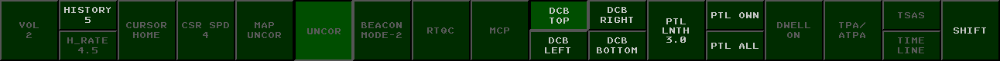Fig. 3 - DCB Aux Menu

Table 2 - DCB Aux Menu Button | Description  
---|---  
**VOL** | Volume in CRC STARS is adjusted using the normal Windows volume controls. As such, this button is disabled.  
**HISTORY** | This spinner button allows you to set the length of the track history trail.  
**DCB TOP** | This button places the DCB across the top of the display.  
**DCB LEFT** | This button places the DCB along the left side of the display.  
**DCB RIGHT** | This button places the DCB along the right side of the display.  
**DCB BOTTOM** | This button places the DCB across the bottom of the display.  
**PTL LNTH** | This spinner button allows you to set the length of each track's PTL (Predicted Track Line.)  
**PTL OWN** | This button toggles the display of PTLs for tracks that you own.  
**PTL ALL** | This button toggles the display of PTLs for all tracks, including those owned by other positions.  
**TPA/ATPA** | This button opens the TPA ATPA submenu  
**SHIFT** | Returns to the Main DCB Menu.  
  
All other buttons on the Aux Menu are disabled as their functionality is not yet implemented in CRC STARS.

### MAPS Submenu

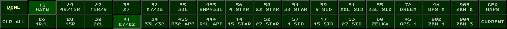Fig. 4 - DCB MAPS Submenu

Table 3 - DCB MAPS Submenu Button | Description  
---|---  
**DONE** | Returns to the Main DCB Menu.  
**CLR ALL** | Turns off the display of all Video Maps  
**MAP TOGGLES** | The middle 30 buttons on the MAPS submenu allow you to toggle individual maps on and off.  
**GEO MAPS** | This button toggles the display of a list of all available video maps.  
**CURRENT** | This button toggles the display of a list of video maps that are currently being displayed.  
  
### BRITE Submenu

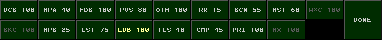Fig. 5 - DCB BRITE Submenu

Table 4 - DCB BRITE Submenu Button | Description  
---|---  
**DCB** | Sets the brightness for the DCB.  
**BKC** | Sets the background contrast. This setting is not implemented in CRC STARS.  
**MPA** | Sets the brightness for video maps in group A.  
**MPB** | Sets the brightness for video maps in group B.  
**FDB** | Sets the brightness for Full Data Blocks and the preview area.  
**LST** | Sets the brightness for on-screen lists and the SSA.  
**POS** | Sets the brightness for position symbols for tracks with Full Data Blocks.  
**LDB** | Sets the brightness for Limited and Partial Data Blocks.  
**OTH** | Sets the brightness for position symbols for tracks without Full Data Blocks.  
**TLS** | Sets the brightness for tools such as Predicted Track Lines, Minimum Separation Lines and Range-Bearing Lines.  
**RR** | Sets the brightness of the range rings.  
**CMP** | Sets the brightness of the compass rose.  
**BCN** | Sets the brightness for beacon symbols.  
**PRI** | Sets the brightness of primary target symbols.  
**HST** | Sets the brightness of track history trails.  
**WX** | Sets the brightness of weather overlays. (Shows AVL when data is Available for that level)  
**WXC** | Sets the weather contrast.  
**DONE** | Returns to the Main DCB Menu.  
  
### CHAR SIZE Submenu

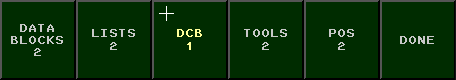Fig. 6 - DCB CHAR SIZE Submenu

Table 5 - DCB CHAR SIZE Submenu Button | Description  
---|---  
**DATA BLOCKS** | Set the character size for data blocks.  
**LISTS** | Sets the character size for on-screen lists.  
**DCB** | Sets the character size for DCB button labels.  
**TOOLS** | Sets the character size for text used in tools such as Minimum Separation lines and Range/Bearing Lines.  
**POS** | Sets the character size of track position symbols.  
**DONE** | Returns to the Main DCB Menu.  
  
### PREF Submenu

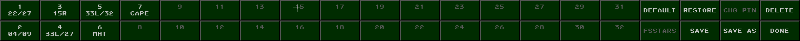Fig. 7 - DCB PREF Submenu

Table 6 - DCB PREF Submenu Button | Description  
---|---  
**NAMED PREF SETS** | The first 32 buttons on the PREF submenu allow you to activate previously-saved preference sets. The currently-active preference set will show as a pressed button.  
**DEFAULT** | Pressing this button sets all preference items to their default values.  
**RESTORE** | Restores the preference settings that were in effect when you first entered the **PREF** submenu.  
**SAVE** | Saves any changes to the current preference set.  
**SAVE AS** | Prompts the user to enter a preference set name. The new preference set will be saved in the first available slot.  
**DELETE** | Deletes the current preference set.  
**DONE** | Returns to the Main DCB Menu.  
  
A preference set consists of the following settings:

  * DCB location
  * Display center
  * Display range
  * Range ring spacing
  * Range rings center point
  * Default leader line direction
  * Default leader line length
  * History trail length
  * PTL length
  * **PTL OWN** and **PTL ALL** toggle settings
  * Visible lists
  * Visible SSA fields, including GI Text lines
  * Visible video maps
  * Brightness settings
  * Character size settings
  * List locations
  * List sizes


### SSA FILTER Submenu

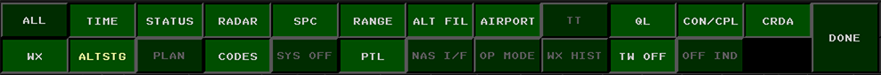Fig. 8 - DCB SSA FILTER Submenu

The buttons on the **SSA FILTER** submenu allow you to select which pieces of information are displayed in the System Status Area. The options are:

Table 7 - DCB SSA FILTER Submenu Button | Description  
---|---  
**ALL** | Enables all lines in the SSA.  
**TIME** | Displays the current time.  
**ALTSTG** | Displays the system altimeter setting. On VATSIM, this comes from the METAR for the primary airport.  
**STATUS** | Displays system network status. On VATSIM, this shows either "NA/NA/NA" in red when disconnected, or "OK/OK/NA" in green when connected.  
**RADAR** | Displays the currently-selected radar mode. In CRC STARS, this is always "FUSED" to indicate fusion mode with 1 second updates.  
**CODES** | Displays any active beacon code selection blocks.  
**SPC** | Displays any active Special Purpose Codes, such as "EM", "RF", etc.  
**RANGE** | Displays the current zoom range.  
**PTL** | Displays the length of Predicted Track Lines.  
**ALT FIL** | Displays the current altitude filters.  
**AIRPORT** | Displays weather information for the airports listed in the current facility configuration.  
**QL** | Displays which positions you currently have Quicklooked.  
**TW OFF** | Displays which functions are disabled at the terminal, such as MSAW or CRDA.  
**CON/CPL** | Displays consolidation information.  
**CRDA** | Displays any active CRDA Runway Pair Configurations. (RPCs)  
**DONE** | Returns to the Main DCB Menu.  
  
### GI TEXT FILTER Submenu

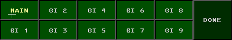Fig. 9 - DCB GI TEXT FILTER Submenu

The operator can define up to 10 lines of "General Information" to be displayed in the SSA. The **GI TEXT FILTER** submenu allows the user to toggle these lines on and off. See Setting ATIS ID and General Information Text for more details.

### TPA ATPA Submenu

The buttons on the **TPA ATPA Submenu** allow you to select which pieces of information are displayed from the TPA/ATPA system.

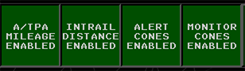Fig. 10 - TPA/ATPA Submenu

Button | Description  
---|---  
**A/TPA Mileage** | Displays mileage in the A/TPA Cone  
**Intrail Distance** | Displays intrail distance in the datablock  
**Alert Cones** | Displays alert cones at this TCP  
**Monitor Cones** | Displays monitor cones at this TCP  
  
## System Status Area (SSA)

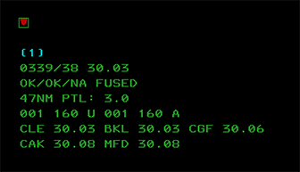Fig. 11 - System Status Area (SSA)

The SSA displays a number of different fields of information. Individual fields can be toggled on/off using the **SSA FILTER** DCB submenu. A typical SSA is shown in the screenshot above.

The inverted red triangle is simply to allow the user to determine at a glance whether or not the system is currently capable of displaying red (emergency-related) data. If this triangle does not appear, the system requires servicing.

The next line contains NEXRAD weather status information. Available levels of weather will be shown here. Selected levels will be surrounded by parens. (1)

The next line consists of the current time in HHMM/SS, followed by the system altimeter. This altimeter reading comes from the VATSIM METAR for your primary airport. The primary airport is the one assigned to tower list #1 in the facility configuration.

The next line contains the network status. It will display "OK/OK/NA" in green while connected, and "NA/NA/NA" in red while disconnected. This is followed by the name of the currently radar mode, which in CRC STARS is always "FUSED".

The next line contains the current range setting for the scope, followed by the length of the Predicted Track Lines. (PTLs.)

The next line contains the current altitude filters. The filters for unassociated tracks (those with no associated flight plan) are displayed first, followed by the altitude filters for associated tracks. The filter values are expressed in hundreds of feet. In this example, the altitude filters for both associated and unassociated tracks are set with a floor of 100 feet MSL, and a ceiling of 16,000 feet MSL. Tracks outside of these filter limits will have no data block. A value of "N99" indicates 0 or less.

The next three lines in this example provide weather information (wind and altimeter) for any airports listed in the current facility configuration for inclusion in the SSA. The real STARS system does not display wind information here, but it is included for VATSIM purposes to make it easier for an approach controller that is also providing tower services. For greater realism, the display of wind data can be disabled in the Display Settings Window.

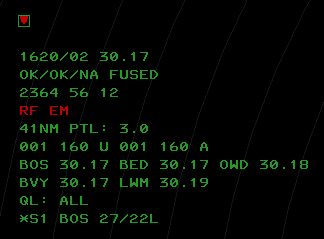Fig. 12 - SSA Example #2

The SSA shown above includes some additional lines that may appear during a session:

The line containing "2364 56 12" indicates the currently-selected beacon codes and beacon code blocks. Tracks that have a squawk code matching one of these codes or code blocks are rendered with a different position symbol. A 4 digit code indicates a single unique code, and a 2-digit code indicates a code block. Any track with a squawk code starting with these 2 digits is considered "beacon code selected".

The red "RF EM" line displays any currently-active SPCs. (Special Purpose Codes.) If a target is squawking one of the SPCs, the associated 2-character identifier will appear here.

The "QL: ALL" line indicates that the user currently has all positions "quicklooked". Tracks owned by a quicklooked controller will show as Full Data Blocks. (FDBs.) The user can also quicklook specific controllers. The sector ID for such controllers will be displayed in this line.

The last line indicates that the BOS 27/22L CRDA Runway Pair Configuration is currently enabled in "Stagger" mode. (Refer to the CRDA section for more details.)

## Preview Area

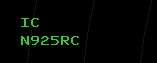Fig. 13 - Preview Area

The Preview Area is where textual commands are entered, and where the responses to various system commands are displayed. By default, the preview area is just below the SSA, but it can be repositioned by the user. (See the Command Reference for details.)

## System Lists

CRC STARS maintains several lists of information. The user can specify the location and size of these lists, and these settings are stored as part of a preference set. Refer to the Command Reference for details on setting the location and size of each list.

### Sign-On List

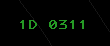Fig. 14 - Sign-On List

The sign on list displays the TCP (Terminal Control Position) that you are currently signed into, if any, and the zulu time that you signed in.

### Flight Plan List

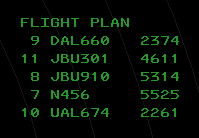Fig. 15 - Flight Plan List

Also known as the "TAB" list, the flight plan list displays tracks that have a flight plan indicating a departure from one of the airports listed in the current facility configuration. The list displays the aircraft ID (callsign) and beacon code. The list is sorted by aircraft ID. Once the flight is acquired on radar, its entry is removed from the list.

### Tower Lists

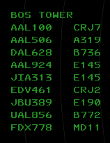Fig. 16 - Tower List

Tower lists display tracks that have a flight plan indicating an arrival at one of the airports listed in the facility configuration. There can be up to 3 tower lists, and they can be positioned independently. The list displays the aircraft ID and aircraft type, and is sorted by distance from the airport.

### Coast/Suspend List

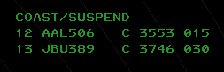Fig. 17 - Coast/Suspend List

The COAST/SUSPEND list shows any track that is owned by the current user and has been coasting (returned no radar data) for 30 seconds. Tracks remain on this list for 5 minutes or until the user drops track control. The list displays the flight ID, a "C" to indicate the target is coasting, the beacon code, and the current user's sector TCP.

### VFR List

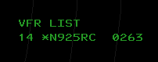Fig. 18 - VFR List

The VFR list displays all VFR flight plans that have not yet been associated with a radar track.

### LA/CA/MCI List

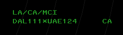Fig. 19 - LA/CA/MCI List

The LA/CA/MCI list displays tracks in MSAW (Low-Altitude) alert status (not yet implemented in CRC STARS), Conflict Alert status, or Mode C Intruder status. The example above shows a conflict alert between DAL111 and UAE124. If one of the targets in a conflict pair is unassociated, it will be displayed as MCI instead of CA, and its reported beacon code will be shown in place of the callsign.

### CRDA Status List

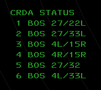Fig. 20 - CRDA Status List

The CRDA STATUS list shows all available CRDA Runway Pair Configurations (RPCs) and indicates whether or not each one is active, and if so, in which mode. (See the CRDA section for details.) If an RPC is active, its index number in the list will be preceded by an "S" for Stagger mode, or a "T" for Tie mode. Active RPCs will also show the current sector ID after the runway pair.

### Video Map Lists

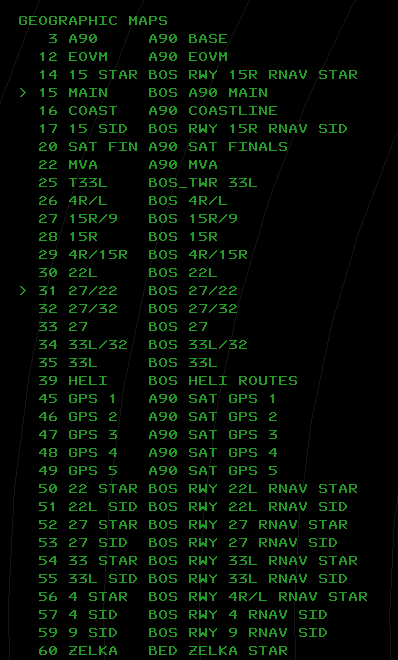Fig. 21 - Geographic Maps List

There are two Video Map Lists currently implemented in CRC STARS. The first, shown above, is a list of all available geographic maps. It can be toggled by pressing the **GEO MAPS** button in the DCB MAPS Submenu. This list shows all geographic video maps that are available for display, including the map ID, the short name, and the map title. The greater-than symbol (>) will appear to the left of a map ID if that map is currently selected for display.

The second list is the same as the first, yet it only shows the maps that are currently selected for display. This list can be toggled by pressing the **CURRENT** button in the DCB MAPS Submenu.

## Video Maps

Video maps are geojson files containing drawing instructions for CRC STARS to render the map on screen. These maps are automatically downloaded from the vNAS data server when you install an ARTCC. Video maps are organized into two groups, A and B. The brightness of each group can be set independently using the BRITE DCB submenu. Video maps can be selected for display by pressing the appropriate button on the DCB Main Menu or the DCB MAPS Submenu. The list of maps that are available in the DCB is determined by the TCP that the display is configured for. You can also select a video map for display using the keyboard and the map ID. Refer to the Command Reference for details.

## Compass Rose

The numbers and hash marks around the outer edge of the scope are known as the Compass Rose. The Compass Rose is helpful for determining magnetic headings when providing vectors to aircraft. The Compass Rose can be turned off by setting its brightness to the minimum level.

## Tracking Aircraft

To take ownership of a track, press the **INIT CNTL** key (`F3`), enter the aircraft ID (callsign) and then slew (click on) the track. The track's data block will turn white and the position symbol will change to your own. The track must be associated (must have a flight plan and an assigned squawk code, and must be squawking that code) in order for this command to work.

To drop track on a target, press the **TERM CNTL** key (`F4`) and then slew the track. You can also press `F4`, followed by the aircraft's callsign or beacon code, followed by `Enter`. The track's data block will revert to green and the position symbol will change back to an asterisk (or other symbol depending on various factors.)

Refer to the VATSIMisms section for some additional (unrealistic) ways to start track on an aircraft.

## Handoffs

### Handing Off a Target

To hand off a target to another controller, enter the appropriate handoff ID for the receiving controller and slew the track. The data block will change to indicate the pending handoff. When the receiving controller accepts the handoff, the target's position symbol will show that of the receiving controller, and the data block will be shown in blinking white for 5 seconds. You can click on the track to stop the blinking, and then click again to display the data block in green. Click a third time to change the FDB to a PDB.

The handoff ID depends on if the receiving controller is within your facility or not. For an intra-facility handoff, enter the TCP (subset and sector ID). If the receiving controller is in the same subset as you, then only the sector ID is required.

For an inter-facility handoff to the host ARTCC (such as A90 handing off to ZBW), enter "C" plus the two digit sector ID. If there is only one position open within the host ARTCC, you can omit the sector ID.

For an inter-facility handoff to a non-host ARTCC (such as N90 handing off to ZBW), enter the NAS ID of the receiving ARTCC (e.g. "B" for ZBW) plus the two digit sector ID. If there is only one position open within the receiving ARTCC, you can omit the sector ID.

If you are working a position in a TRACON that hands off to ZOB (who's NAS ID is "C") but ZOB is not your host ARTCC (such as the SYR TRACON) then you must use the NAS ID for handoffs to your host ARTCC. (E.g. SYR would use B to handoff to ZBW, since "C" would be used to handoff to ZOB.)

For inter-facility handoffs to another STARS facility, you must prefix the handoff ID with the delta (triangle) symbol, which is bound to the ``` key. The handoff ID in this case is the handoff number assigned to the receiving TRACON, followed by the TCP.

### Accepting a Handoff

When a controller is handing off a target to you, its data block will change accordingly. (Refer to the Data Blocks section for more details.) To accept the handoff, simply slew the track. The position symbol will change to yours, and the data block will turn white.

### Redirecting a Handoff

STARS supports the ability to redirect an incoming handoff to a different controller. To do so, enter the handoff ID (just as you would when initiating a handoff) and slew the track.

## Point Outs

To point out a track to another controller, enter the controller's TCP (such as `1D`), followed by an asterisk, then slew the track. If the recipient's TCP is within the same subset as yours, you can enter only the sector ID, such as `D`, followed by an asterisk.

Point outs can only be sent to other controllers within the same STARS system as you.

On the receiving controller's screen, a full data block will appear in blinking yellow with the `PO` indicator after the callsign as shown here:

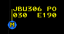Fig. 22 - Incoming Pointout

On the sending controller's screen, the `PO` indicator is shown after the callsign along with the TCP of the receiving controller, as shown here:

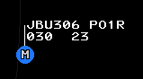Fig. 23 - Outgoing Pointout

### Accepting a Point Out

To accept the point out, the receiving controller can simply slew the track. This stops the blinking and removes the `PO` indicator. The track's data block will continue to be shown in the yellow color. The data block can be returned to the normal green color by clicking on the target.

After the receiving controller accepts the pointout, on the sending controller's screen, the receiving TCP is removed from the data block and the `PO` indicator blinks for 5 seconds and then is removed.

### Rejecting a Point Out

The receiving controller can reject a point out by entering `UN` and clicking the target. This will return the data block to the normal green color and stop the flashing. On the sender's screen, the data block will show a flashing `UN` indicator until the target is clicked, as shown here:

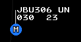Fig. 24 - Rejected Pointout

### Accepting a Point Out as a Handoff

If the receiving controller needs to take control of the track, they can convert the point out to a handoff and accept the handoff by entering `**` and clicking on the target. The track will now be owned by the receiving controller and the sending controller will see the data block flash white for 5 seconds, as when a regular handoff is accepted.

## Consolidation

Consolidation allows a TCP to take control responsibility for one or more additional TCPs and their associated airspace.

Facility Engineers define the TCP hierarchy which can be automatically applied whenever a position is activated, if automatic consolidation is enabled. For a facility in automatic mode, controllers automatically receive the relevant TCPs for their activated position, as configured by the facility engineer. For a facility with automatic mode disabled, a position activating or deactivating only sends or receives the TCP configured for that position, provided it is not manually consolidated at another position.

For the following examples, please assume automatic consolidation is enabled with the following hierarchy:

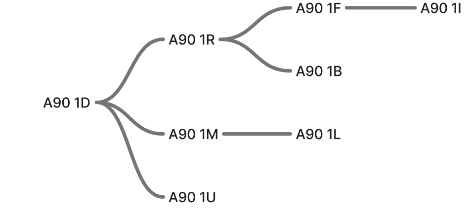Fig. 25 - TCP Hierarchy

If position 1D is activated, it will open with all the child TCPs consolidated to its position, and its SSA will display `1D CON: 1D 1*` indicating that it is responsible for itself and all the TCPs in subset 1 that have been defined to be its children.

Later, if a controller opens the 1R position, the SSA at 1D will display `1D CON: 1D 1L 1M 1U`, indicating that control of 1R and all of its children has been released, yet 1D still controls 1L, 1M, and 1U.

For positions that consolidate multiple subsets into one TCP, such as a combined TRACON area, it is possible to see multiple subsets listed in the SSA, for example, `6G CON: 6G 1* 2* 3* 4* 5* 6*`. In this case, 6G controls all TCPs that are defined as its children in subsets 1 through 6.

Consolidations affect handoffs, pointouts, and coordination list eligibility.

There are two different types of consolidation, basic and full.

### Basic Consolidation

Basic Consolidation transfers TCP control of all future tracks to a different TCP, but does not transfer current ownership of existing tracks. Any handoffs that are sent to the TCP being consolidated away from will go to the newly receiving TCP. The SSA at the TCP being consolidated away from will display `1D CON: *1D` with the * preceding the TCP indicating a basic consolidation. This indication will remain until all tracks are no longer under its TCP control.

### Full Consolidation

Full consolidation transfers TCP control of all future AND current tracks to the receiving TCP. This happens instantaneously, and there is no confirmation or acceptance required by the receiving TCP.

### Displaying Active Consolidations

To display all TCPs that are currently consolidated to other TCPs in the preview area, enter `<MULTI FUNC>D+<ENTER>.`

TCPs that are only consolidated to themselves will not display.

Refer to the Command Reference for further details.

## Coordination (Rundown Lists)

The Coordination List, also referred to as the “Rundown List,” shows coordination message information for departing flights prior to their radar track association. Flights are removed from coordination lists upon their acquisition by radar. A coordination list provides a means where a tower controller typically can convey the sequence and related data of pending departures to the sector controller (also called the departure controller) who will be handling the flight.

The tower controllers are referred to as the “senders” of coordination messages, while the sector controller(s) are referred to as the “receiver(s).” The senders and associated receivers constitute a coordination “channel.” Multiple coordination channels may be adapted to support multiple tower facilities or multiple senders within a single tower facility.

Sector controllers may be adapted as receivers to multiple coordination channels to allow them to merge pending flights from various departure airports. A single tower can be adapted as a sender on more than one coordination channel to permit segregation of traffic for different sectors.

All coordination lists associated to a given channel share a single adapted list title. The title typically identifies the sending tower facility. The title at the receiver’s position will also indicate when auto−acknowledge is enabled.

The entry of a flight in a coordination list is called a coordination message. A coordination message can be in any one of the following states:

  * **Unsent:** Displayed in steady green at sender (tower) position.

  * **Unacknowledged:** Displayed at sender and receiver positions in blinking green to indicate receiver acknowledgement is needed.

  * **Acknowledged:** Displayed at sender and receiver positions in steady green and includes the plus symbol (+).

  * **Recalled:** At the receiver’s position, displayed in blinking green with “RECALL” in the text area for an adapted interval before the entire message is removed from the list. At the sender’s position, displayed with steady green and with “RECALL” in the text area for an adapted interval, and then displayed as Unsent. If there was text associated with the message, the text is displayed after the adapted interval.

  * **Departure Expiration Warning:** Displayed at sender and receiver positions with a blinking yellow color to indicate that the corresponding flight has not yet departed and the acknowledgement of the flight’s coordination message is about to expire (will become Unacknowledged).

  * **Void Unacknowledged:** Displayed at sender and receiver positions with a blinking green color and an expired time stamp to indicate that the corresponding flight has not yet departed and the acknowledgement of the flight’s coordination message has expired, rendering the message as Unacknowledged. Receiver acknowledgement is needed.


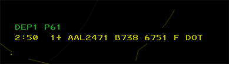Fig. 26 - Coordination List (Tower View)

Each entry in the list will display the time remaining until release expiration (if released), the position in the sequence, a released indicator (+), the aircraft callsign, the aircraft type, the assigned beacon code, the weight class, scratchpad assigned, if any, and any message text entered.

Refer to the Command Reference for details.

## Data Blocks

STARS displays track data blocks in one of three formats, described below.

### Limited Data Blocks (LDBs)

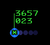Fig. 27 - Limited Data Block (LDB)

LDBs are shown for any unassociated track. A track is unassociated if it is not paired with a flight plan. All unassociated tracks are unowned tracks. (No position has track control.)

The LDB displays beacon code and altitude by default. Ground speed can also be displayed temporarily by clicking on the target:

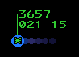Fig. 28 - LDB with Ground Speed

LDBs have an asterisk as the position symbol if a beacon code is being received from the target. If the beacon code is 1200, the position symbol will be a V. If the received beacon code matches a code or group in your beacon code select list, the position symbol will be a square.

### Partial Data Blocks (PDBs)

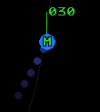Fig. 29 - Partial Data Block (PDB)

Partial data blocks are shown for any associated track that is owned by a position other than your own. They show the same information as shown on line 2 of a Full Data Block, with the exception of ground speed, if the Facility Engineer has configured the STARS system to suppress the display of ground speed in PDBs.

### Full Data Blocks (FDBs)

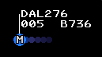Fig. 30 - Full Data Block (FDB)

Full data blocks are shown for any associated track that meets any of the following criteria:

  * You have track control
  * The track is being handed off to you
  * The track has been pointed out to you
  * You have handed off the track to another controller and the handoff has been accepted
  * You have manually forced an FDB by clicking on a target that is displaying a PDB
  * You have enabled beacon code readout with the `F1` key and the track is associated
  * The track is squawking a Special Purpose Code
  * You have enabled Quick Look for the TCP that owns the track
  * The track is an overflight and you have enabled forced FDBs for overflights


FDBs contain the aircraft callsign in line 1, and line two displays several data fields that alternate or "time-share". On the left side of line two is shown the received Mode C altitude, time-sharing with scratchpad #1 and scratchpad #2. This field can also show the receiving sector ID when a track is being handed off to another facility. On the right side of line two is shown the ground speed, time-sharing with the aircraft type code and optionally the requested altitude.

In the middle of line two is shown a single character indicating the recipient of a handoff.

Line three can display the reported beacon code and the assigned beacon code, if the target is not squawking the assigned code.

### Changing Data Block Type

A PDB can be changed to an FDB by clicking on the target. An FDB can be changed to a PDB by clicking on the target, as long as the track is not owned by you.

### Positioning Data Blocks

A Data Block can be positioned relative to its Track by an Implied command with one of the positions listed in Table 8:

`<1-9><SLEW>`

Table 8 - Data Block positions  Input | Data Block Position  
---|---  
1 | SW  
2 | S  
3 | SE  
4 | W  
5 | Default  
6 | E  
7 | NW  
8 | N  
9 | NE  
  
### Highlighting a Data Block

Data blocks can be highlighted in cyan by middle-clicking on the target. A highlighted FDB is shown here:

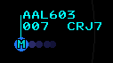Fig. 31 - Highlighted Data Block

### Category Indicator (Facilities w/o CWT)

One of the following codes may be displayed after the ground speed to indicate wake turbulence category and/or if the flight plan matches an RNAV route:

Table 9 - Category Indicator Indicator | Description | Is RNAV?  
---|---|---  
(blank) | Non-heavy | No  
R | Non-heavy | Yes  
H | Heavy | No  
B | Heavy | Yes  
J | Super (A380) | No  
M | Super (A380) | Yes  
F | B757 | No  
L | B757 | Yes  
  
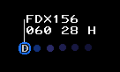Fig. 32 - A heavy aircraft

### Category Indicator (Facilities with CWT)

One of the following codes may be displayed after the ground speed to indicate wake turbulence category:

Indicator | Description  
---|---  
A | Super  
B | Upper Heavy  
C | Lower Heavy  
D | Non-Pairwise Heavy  
E | B757  
F | Upper Large  
G | Lower Large  
H | Upper Small > 15,400 lbs  
I | Lower Small < 15,400 lbs  
  
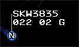Fig. 33 - an aircraft with a CWT category of G - Lower Large

### Unsupported Data Blocks

An unsupported data block represents a track that is not currently supported by radar data, and never was supported by radar data previously. The controller can create an unsupported data block by entering the aircraft ID and clicking on the scope. A VFR flight plan will be created and the data block will be shown with a blank altitude field and zero ground speed, as shown here:

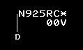Fig. 34 - An Unsupported Data Block

### More Data Block Examples

Table 10 - Data Block examples Example | Description  
---|---  
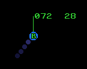 | This is a partial data block (PDB), showing the altitude and ground speed. The altitude is displayed in hundreds of feet MSL, and the ground speed is displayed in tens of knots. Some facilities have the ground speed suppressed in PDBs. The altitude field will time share with scratchpads and the owning sector ID for an inbound inter-facility handoff or a recently-accepted outbound inter-facility handoff.  
 | This is a full data block. (FDB) The white color indicates that it is owned by you, or you were the previous owner. The second line of the data block alternates between displaying altitude and ground speed, and destination airport (or scratchpad) and aircraft type. The altitude field will also time share with the owning sector ID for an inbound inter-facility handoff or a recently-accepted outbound inter-facility handoff.  
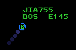 | This FDB is owned by another controller and is therefore shown in green.  
 | The cyan color indicates a track that has been highlighted. (Middle-click to toggle the highlight color.)  
 | This is a primary-only track. The aircraft does not have their transponder turned on. There is no data block and the position symbol is a diamond.  
 | This is an unassociated track showing a limited data block (LDB).  
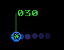 | This is an unassociated track showing a limited data block (LDB) and the facility has beacon codes inhibited in LDBs. Only the mode C altitude is shown.  
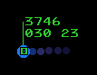 | The square position symbol depicted here indicates that this track is squawking a code that belongs to a beacon code group that the user has selected.  
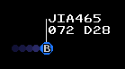 | This track is being handed off. The position symbol indicates that it is owned by sector B, and the D on line 2 indicates that it is being handed off to sector D. The data block will be blinking at the receiving sector.  
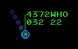 | This track just departed one of the airports listed in the facility configuration, but the STARS system cannot auto-acquire the track because no controller has autotrack enabled for the airport and the beacon code was not assigned by a controller. If the beacon code was assigned by a controller, the track would auto-acquire and be owned by that controller. The "WHO" indicator blinks.  
 | This track is owned by you and has been pointed out to TCP **1R**.  
 | This track has been pointed out to you. The data block blinks until you accept or reject the point out.  
 | This track was pointed out but the receiving controller rejected the pointout. The data block blinks until clicked.  
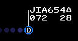 | The triangle after the aircraft ID indicates that conflict alerts have been inhibited for this track.  
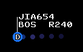 | This data block is showing the pilot's requested (filed) altitude. The requested altitude is prefixed with an "R".  
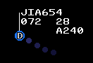 | An altitude prefixed with an "A" on the third line of the data block indicates an assigned (temporary) altitude.  
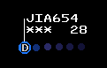 | For this track, the user has inhibited the display of the Mode C reported altitude.  
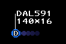 | The asterisk following the altitude field indicates that this is a pilot-reported altitude.  
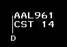 | This track is coasting, meaning radar data is no longer being received.  
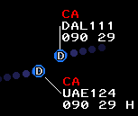 | These tracks are in Conflict Alert (CA) status.  
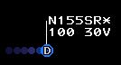 | A VFR track, indicated by the "V" following the ground speed. VFR tracks are automatically MSAW-inhibited, as indicated by the asterisk after the aircraft ID.  
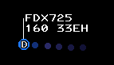 | The "E" following the ground speed indicates that this track is an overflight. (Not arriving to or departing from an airport that is controlled by this STARS facility.)  
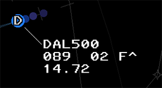 | This track is displaying an ATPA distance to the track ahead, has a CWT category of F, and is on an RNAV route, as indicated by the caret (^).  
  
## Quick Look

Quick Look displays FDBs for all aircraft tracked by a specified TCP. You can only enable quick look for TCPs within your facility.

##### QL Command

Press the `MULTIFUNC` key (`F7`) followed by Q, then a space, followed by the TCP. The TCP consists of the subset number and the sector letter or number. You can omit the subset number if the TCP is in the same subset as your TCP. To display the track in Owned color, add a `+` to the end of the command.

`<MULTI FUNC>Q 1R`

`<MULTI FUNC>Q R`

`<MULTI FUNC>Q 2D+`

If no TCPs are specified, Quick Look is disabled for all TCPs:

`<MULTI FUNC>Q`

`<MULTI FUNC>Q +`

To enable Quick Look for all TCPs:

`<MULTI FUNC>Q ALL`

`<MULTI FUNC>Q ALL+`

### Beacon Code Readout ("Beaconator")

This function provides a momentary readout of the beacon code in the data block for all beacon tracks. (Tracks with a received beacon code.) To activate the beacon code readout, press and hold `F1`. While the readout is active, the beacon code will be displayed in all unassociated and associated tracks (replacing the callsign). At the same time, Partial Data Blocks will be forced to display Full Data Blocks. Unassociated and associated tracks with no data blocks (outside the altitude filter) will be forced to display Limited Data Blocks and Full Data Blocks, respectively.

## Creating or Amending Flight Plans

### VFR Flight Plans

The command to create or amend a VFR flight plan consists of the `<F9>` key followed by the fields shown below, separated by `<SPACE>`. The fields must be entered in the order shown:

Table 11 - VFR flight plan command Field | Description  
---|---  
`<AID>` | (Required) The aircraft ID (callsign.)  
`<AIRPORT ID>*` | (Optional) The departure airport ID, followed by an asterisk.  
`<AIRPORT ID>` | (Required) The destination airport ID. If entering the departure airport ID, do not press `<SPACE>` after the asterisk.  
`<TYPE>/<EQUIPMENT>` | (Required) The aircraft type code. The equipment suffix is optional.  
`<###>` | (Optional) The requested altitude.  
  
For example:

`<F9>N925RC BOS*BTV C172/G 065`

Note that the `<F9>` key is optional.

### Abbreviated Flight Plans

The command to create an abbreviated flight plan consists of the `<FLT DATA>` key (which is mapped to `F6`) followed by the aircraft callsign, followed by zero or more optional fields separated by spaces. The optional fields can be specified in any order. If none are specified, an empty VFR flight plan will be created and a squawk code will be issued. The optional fields are:

Table 12 - Abbreviated flight plan command Field | Description  
---|---  
Beacon Code | Specify as 4 digits.  
Scratchpad 1 | Specify as the delta (triangle) symbol (backtick) followed by up to three alphanumeric characters. Four characters are allowed if so configured by the facility engineer. The plus sign, period, asterisk, forward slash, and delta symbol may also be used.  
Scratchpad 2 | Specify as a plus sign followed by up to three alphanumeric characters. Four characters are allowed if so configured by the facility engineer. The plus sign, period, asterisk, forward slash, and delta symbol may also be used.  
Aircraft Type | Specify as 4 alphanumeric characters. Must start with a letter. Optionally add a forward slash and the single-character equipment code.  
Requested Altitude | Specify as three digits in hundreds of feet.  
Flight Rules Indicator | For VFR, enter a period followed by the letter V. For VFR On top, enter a period followed by the letter P. For IFR, enter a period followed by the letter E. Flight rules default to VFR if not specified.  
  
For example, to create a VFR flight plan for N925RC, a Cessna 182, with squawk code 4304, cruising at 6,500 feet, with a scratchpad value of "VFF", issue the following command:

`N925RC 4304 +VFF C182 065`

Note that the `<FLT DATA>` key is optional.

## Forcing Track Association

CRC STARS supports the ability to force an unassociated track (one that is showing a limited data block) to associate to a flight plan already in the system. This is done by entering the aircraft's callsign, followed by an optional 4 digit beacon code, then clicking on the unassociated track. This will cause the track to become associated with its flight plan and you will automatically have track control for the target.

## Short Term Conflict Alerts (STCA)

CRC STARS includes a basic conflict detection system. It works by predicting the location and altitude of each associated track that is owned by your facility, 5 seconds into the future. It compares this predicted location against that of all other tracks, and if the current separation or predicted separation is less than 3 NM and 1,000 ft vertically, and the separation is not increasing, then the two tracks are considered to be in conflict.

When a track is in conflict, it will display "CA" in blinking red in the top line of the data block, and an alert tone will sound continuously until the alert is acknowledged.

To acknowledge an alert, click on either of the two tracks. The tone will be silenced and the CA text will be displayed in solid red.

Note that conflict alerts are suppressed for tracks that are near the final approach course for a runway at an airport that is included in the internal airports list for the STARS facility. This only applies to airports that are large enough to have an ICAO ID. This suppression zone is 4 NM wide, starting at the runway threshold and extending out 30 NM along the runway extended center line. Vertically, the suppression zone starts at field elevation and extends up to 1,500 feet above the glideslope.

## Special Purpose Codes

A number of Special Purpose Codes (SPCs) are recognized by the system. These are beacon codes that carry special meaning when the pilot enters the code into the aircraft's transponder. These codes and their meanings are as follows:

Table 13 - Special purpose codes Code | ID | Meaning  
---|---|---  
7500 | HJ | Hijack  
7600 | RF | Radio Failure  
7700 | EM | Emergency  
7777 | MI | Military Intercept  
7400 | LL | Lost Link  
  
If a target squawks any of these codes, the associated two-character identifier will be displayed in the first line of the data block. The identifier will also be displayed in the SSA, and a tone will sound. To acknowledge the SPC and silence the tone, slew the track. These codes can also be manually assigned to a track. (See the Command Reference for details.)

There are also a number of SPCs that do not correspond to a beacon code, and thus can only be assigned to a track manually by the controller. They are as follows:

Table 14 - Additional special purpose codes ID | Meaning  
---|---  
OD | Opposite Direction Operations  
ME | Medical Emergency  
MF | Minimum Fuel  
LN | Medevac  
  
## Predicted Track Lines (PTLs)

Using the buttons on the DCB Aux Menu, you can enable predicted track lines for tracks that you own or for all tracks. The PTL shows where the track will be after a configured number of minutes have passed, based on the aircraft's current ground track and ground speed.

Fig. 35 - A Track Displaying a PTL

## TPA J-Rings and Cones

CRC STARS supports the ability to display Terminal Proximity Alert (TPA) J-Rings or Cones. These are graphical tools which assist the controller with maintaining minimum separation between targets.

Fig. 36 - TPA J-Rings

TPA J-Rings (pictured above) are rendered as a circle centered on the target. The controller specifies the radius in nautical miles when activating the J-Ring.

Fig. 37 - TPA Cones

TPA Cones (pictured above) are rendered as a cone projecting out from the target location along the target's calculated ground track. The controller specifies the length of the cone in nautical miles when activating the cone.

The display of the J-Ring radius or Cone length can be inhibited using keyboard commands.

Refer to the Command Reference for details on activating TPA graphics.

## ATPA (Automatic Terminal Proximity Alert)

### Overview

Similar to the “TPA Ring” and “TPA Cone,” Automated TPAs are a variable length cone and distance readout associated with an eligible track inside of a defined airspace volume. Whereas the TPA Rings and Cones are fixed, ATPA graphics are automatically adjusted based on the distance and relative bearing of a leading target. A typical TPA Cone (“P” Cone) draws a vertex outward from a target based on its direction of flight to a specified distance. An ATPA Cone draws a vertex pointing towards the next eligible target the affected target is following up to the distance required by wake category or basic radar separation. Additionally, a distance readout is added to the datablock indicating the distance between the affected target and the target it is following.

Refer to the Command Reference for details on activating and configuring ATPA graphics.

### Graphics

Graphics for Automated TPA are wedge−shaped cones with the vertex coincident with the center of the track’s target location. The length of the cone is equal to the allowable In−trail minimum separation between the In−trail track pair. The cone is oriented from the trailing track to the leading track. For non−whole number distances, tenths of nautical miles are displayed.

### Monitor Cone

The ATPA Monitor Cone is displayed in the TPA color (blue on the TCW and white on the TDW). The Monitor Cone is displayed at the trailing track’s owner’s position and any positions adapted to display ATPA Monitor Cones for tracks in the enabled ATPA Approach volume. An ATPA Warning or Alert Cone will supersede the display of the ATPA Monitor Cone. Not all positions have warning cones enabled, but they can be enabled per track using the commands referenced below.

### Warning Cone

The ATPA Warning Cone and in-trail distance is displayed in the caution color (yellow) if the trailing track is predicted to violate the allowable In−trail minimum separation within 45 seconds. It will supersede any manual TPA Cone or Monitor Cone, but will not be displayed if an Alert Cone is displayed. The Warning Cone is displayed at the trailing track’s owner’s position and any positions adapted to display ATPA Alert and Warning Cones for tracks in the enabled ATPA Approach volume, if enabled for the TCW/TDW.

Fig. 38 - ATPA Warning Cone

### Alert Cone

The ATPA Alert Cone and in-trail distance is displayed in the ATPA alert color (orange) if the trailing track already has or is predicted to violate the allowable In−trail minimum separation within 24 seconds. It will supersede all other ATPA and TPA Cones. The Alert Cone is displayed at the trailing track’s owner’s position and any positions adapted to display ATPA Alert and Warning Cones for tracks in the enabled ATPA Approach volume, if enabled for the TCW/TDW.

Fig. 39 - ATPA Alert Cone

## Setting ATIS ID and General Information Text

CRC STARS allows the user to specify the current ATIS identifier and up to 10 lines of General Information (GI) text, which is optionally displayed in the SSA. GI text is intended for use as a reminder to the user of any arbitrary information, such as requested miles-in-trail, an event in progress, adverse weather, etc. Refer to the Command Reference for details on how to set the ATIS ID and GI text lines.

## Converging Runway Display Aid (CRDA)

The CRDA system is designed to assist controllers with sequencing arrivals to converging runways. CRDA can be enabled for one or more Runway Pair Configurations, or RPCs. Each RPC consists of a master runway, a slave runway, a horizontal qualification region, and a descent path profile. RPCs are defined by the facility engineer.

The horizontal qualification region and descent path profile are used by CRC STARS to determine if a track is eligible to create a ghost track on the associated slave runway. The horizontal qualification region is trapezoidal in shape, with the narrow end closest to the runway's arrival end, and the wider end furthest out from the runway. (See the Command Reference for instructions on how to display the qualification region on screen.)

The system generates "ghost tracks" on the slave runway for each track that enters the qualification region for the master runway (or vice-versa if ghosting is enabled for targets on the slave runway) and meets the following criteria:

  1. The track's ground track is within a configurable variance from the master runway heading.
  2. The track's altitude is within the descent path profile.
  3. The track's ground speed is 350 knots or less.


Tracks within the qualification region that do not meet the above criteria can be forced to generate a ghost track using a keyboard command. (See the Command Reference for details.)

If an RPC is active in Stagger mode, ghost tracks are generated on the slave runway extended center line at a point that is the same distance from the crossing point of the two runways as the parent track's distance from the intersection. The controller can then sequence arrivals to the slave runway in between these ghost tracks and be ensured proper separation from the tracks arriving at the master runway.

If an RPC is active in Tie mode, the ghost tracks are offset by the configured stagger distance. In this mode, the controller vectors arrivals to the slave runway such that they are co-located with (or "tied to") the ghost tracks. This ensures that the arrivals will have separation equal to the stagger distance for the RPC.

## Secondary STARS Displays

CRC allows you to open additional STARS displays where each display is configured for a position that is different from your primary position. These displays are referred to as "secondary STARS displays". The primary display can be either [ERAM](<../eram/>) or STARS. If the primary display is ERAM, then you can open a secondary STARS display for any TRACON or radar tower within the ARTCC. If the primary display is STARS, then you can open a secondary STARS display for any other position in the same TRACON, including tower cab positions within an ATCT facility that is a child of the primary facility.

When you first open a secondary STARS display, it will not be signed into the selected position. Press `Alt`+`F12` to sign in. You must already be connected to the network. Press `Alt`+`F12` again to sign out of the secondary STARS display.

Similar to your primary position, secondary positions must be activated before you can perform any control functions. To activate a secondary position, press `Shift`+`Alt`+`F12`. Press `Shift`+`Alt`+`F12` again to deactivate the secondary position. Any tracks that are owned by the secondary position will be dropped unless there is another controller working the same position in an active display.

Note that pilots and non-vNAS controllers do not see you signed into these secondary positions. Only other vNAS controllers will see them, and only if they are activated. They will be shown in italics in the [Controller List](<../overview/#controller-list>), with your primary frequency.

### Selecting a STARS TCP

To change which TCP (Terminal Control Position) a secondary STARS display is configured for, open the display settings window with `Ctrl`+`D`. You must be signed out of the display in order to change to a different TCP. After selecting the new position, you can sign in with `Shift`+`F12`.

## NEXRAD

Next Generation Weather Radar (NEXRAD) displays areas of light, moderate, heavy, and extreme precipitation on the STARS display. Precipitation levels are depicted as follows:

Table 15 - NEXRAD precipitation levels Light Precipitation (WX1) | Moderate Precipitation (WX2) | Heavy Precipitation (WX3) | Heavy Precipitation (WX4) | Extreme Precipitation (WX5) | Extreme Precipitation (WX6)  
---|---|---|---|---|---  
 |  |  |  |  |   
  
## VATSIMisms

While unrealistic, the following additions are included in CRC STARS to aid in controlling on VATSIM.

### Autotrack

vNAS supports the ability to automatically begin tracking aircraft upon departure from a customizable list of airports. When an aircraft departs an airport on the autotrack list, the flight plan is automatically activated and track control is automatically assigned to your TCP.

To add an airport to the autotrack list, enter the `.autotrack <airport ID>` command in either the preview area or the messages window. (Entering the command in the messages window will use the position of your primary display as the track owner.) To remove an airport from the autotrack list, enter the `.autotrack -<airport ID>` command. Multiple airports can be specified at once, for example `.autotrack BOS -MHT` will add `BOS` and remove `MHT` from the autotrack list. To clear the autotrack list, enter the `.autotrack none` command. You can enter either the FAA ID or the ICAO ID for each airport and the autotrack function will work regardless of which ID the pilot filed as their departure airport.

### Single-Click Track

While unrealistic, a Track may also be started by holding `Ctrl`+`Shift` and left-clicking a Target.

### Scope Markers

While unrealistic, CRC's STARS supports the following [Dot commands](<../overview/#dot-commands>) to show or hide scope reference markers:

Table 16 - Scope markers commands Command | Description | Brightness  
---|---|---  
`.ff <fix>` or `.marker <fix>` or `.markers <fix1> <fix2>` | Toggles display of a fix or NAVAID's location | Lists  
`.nomarkers` | Removes all fix markers |   
  
### Top-Down Mode

For the purposes of VATSIM, STARS Top-Down mode (TDM) can be toggled with `Ctrl`+`T`. In Top-Down mode, TDM-only video map elements (such as airport diagrams) and Ground Targets are displayed. There are two types of Ground Targets displayed in Top-Down mode:

Table 17 - Ground Targets Aircraft | Heavy Aircraft  
---|---  
 |   
  
A Ground Target's Data Block always displays the aircraft's ID on the first line, and aircraft type on the second. If the aircraft is squawking a beacon code, that beacon code appears on the second line. If the beacon code correlates with a flight plan, the aircraft's destination is displayed instead of the beacon code.

Fig. 40 - A Ground Target and Data Block with a correlated flight plan

Note that the Ground Target symbol depicted and the aircraft type displayed in an aircraft's Data Block are derived from the aircraft type specified by the pilot on connection, not the aircraft type in the corresponding flight plan (though the two should normally correspond).

Unlike ASDE-X, Boeing 757s are not depicted by the heavy aircraft icon.

Ground Target Data Blocks are repositioned by simply left-clicking and dragging to a desired position. You can also reposition ground target data blocks and change their leader line length using keyboard commands.

## Display Settings

Fig. 41 - STARS Display Settings

The STARS Display Settings window is accessed through the controlling window's menu (hamburger icon on the left of the top toolbar) by selecting the **Display Settings** option. The STARS display settings contain the following options:

  * **Show winds in SSA** : enables the display of wind data along with the altimeter for each airport in the SSA
  * **Top-down mode** : enables Top-Down mode
  * **Disable mouse pan/zoom** : disables panning and zooming with the mouse


You can also configure the STARS display for a different position using the Facility, Area, and Position dropdowns. This can only be done while the display is not signed in. You cannot change the facility if this display is your primary display.

`Ctrl`+`D` opens the Display Settings window.

## Differences From vSTARS

### Changes To Keybindings

  * Hold `F1` to show the beacon code or ADS-B callsign for all tracks ("beaconator")
  * `F2` is now "Track Reposition" (`TRK RPOS` \- shows as `RP` in the preview area)
  * `F6` is now "Flight Data" (`FLT DATA` \- shows as `DA` in the preview area)
  * `F9` is now "VFR Plan" (`VFR PLAN` \- shows as `VP` in the preview area)


### Modified Commands

Most of the command syntax is the same as vSTARS, with the following exceptions:

  * Flight plan creation command syntax is slightly different
  * Handoff command syntax is different depending on the facility being handed off to
  * Point Out commands now include the ability to accept or reject a point out, as well as convert a point out to a handoff. They also now only work for in-house TCPs (controllers in the same facility as you.)
  * Range/Bearing Lines can now be drawn to/from fixes
  * Quicklook now only works for in-house TCPs (controllers in the same facility as you)


### New Commands

  * Track Reposition


### New Functionality

  * Scratchpad #2 is now supported


### Removed Functionality

  * Automatic data block repositioning to avoid overlap is not implemented in CRC
  * MSAW is not yet implemented


## Command Reference

Note: In the following command reference sections, `<AID>` refers to the "Aircraft ID" (callsign) of the flight, and `<FLID>` refers to "Flight ID", which can be the aircraft ID (callsign), assigned beacon code, or tabular list number of the flight.

### STARS Keys

Table 18 - STARS key mappings STARS Key | Windows Key Mapping | Description  
---|---|---  
Function key in the top-left corner | `F1` | Enables Beacon Code Readout when held  
`<CNTR>` | `Ctrl`+`F1` | Re-centers radar scope  
`<MAPS>` | `Ctrl`+`F2` | Opens DCB MAPS submenu  
`<WX>` | `Ctrl`+`F11` |   
`<CORE>` |  | Not simulated  
`<SIGN ON>` |  | Not simulated  
`<BRITE>` | `Ctrl`+`F3` | Opens DCB BRITE submenu  
`<LDR>` | `Ctrl`+`F4` | Initiates DCB LDR function  
`<CHAR SIZE>` | `Ctrl`+`F5` | Opens DCB CHAR SIZE submenu  
`<SHIFT>` | `Ctrl`+`F7` | Toggles between main and aux DCB menus  
`<DCB>` | `Ctrl`+`F8` | Toggles display of DCB  
`<RNG RING>` | `Ctrl`+`F9` | Initiates DCB RR function  
`<RANGE>` | `Ctrl`+`F10` | Initiates DCB RANGE function  
`<PREF SET>` | `Ins` | Initiates DCB PREF function  
`<SITE>` |  | Not simulated  
`<MODE>` |  | Not simulated  
`<INIT CNTL>` | `F3` |   
`<TRK RPOS>` | `F2` |   
`<TRK SUSP>` |  | Not simulated  
`<TERM CNTL>` | `F4` |   
`<HND OFF>` | `F5` |   
`<FLT DATA>` | `F6` |   
`<MULTI FUNC>` | `F7` |   
`<F8>` |  | Not simulated  
`<Δ>` | ``` |   
`<F9>` | `F9` |   
`<F10>` |  | Not simulated  
`<CA>` | `F11` |   
`<F12>` |  | Not simulated  
`<F13>` | `F13` or `Shift`+`F3` |   
`<F14>` |  | Not simulated  
`<TGT GEN>` |  | Not simulated  
`<F16>` |  | Not simulated  
`<MIN>` | `End` |   
  
### Tracking Targets

Table 19 - Tracking targets commands Command | Description  
---|---  
`<INIT CNTL><FLID><SLEW>` | Start track on a target.  
`<TERM CNTL><FLID><ENTER>` | Drop track on a target.  
`<TERM CNTL><SLEW>` | Drop track on a target.  
`<TERM CNTL>ALL<ENTER>` | Drop track on all targets.  
  
### Handoffs

Table 20 - Handoff commands Command | Description  
---|---  
`<HND OFF>(ID)<SLEW>` | Initiates hand off of slewed track to specified controller.  
`<HND OFF>(ID)<SPACE><FLID><ENTER>` | Initiates hand off of specified target to specified controller.  
`(ID)<SLEW>` | Initiates hand off of slewed track to specified controller.  
`<SLEW>` | Accept incoming hand off of slewed track.  
`<HND OFF><SLEW>` | Recall (cancel) outgoing hand off.  
`<HND OFF><FLID><ENTER>` | Recall (cancel) outgoing hand off.  
`<SLEW>` | Recall (cancel) outgoing hand off.  
`<HND OFF><ENTER>` | Accept hand off of target closest to range rings center.  
  
### Point Outs

Table 21 - Point out commands Command | Description  
---|---  
`(ID)*<SLEW>` | Send point out of slewed track to specified controller.  
`<SLEW>` | Acknowledge incoming point out.  
`<SLEW>` | Recall (cancel) outgoing point out.  
`UN<SLEW>` | Reject incoming point out.  
`**<SLEW>` | Convert incoming point out to a handoff and accept the handoff.  
`**<SLEW>` | Force quicklook to your own TCP (You must own the track).  
`**(TCP)<SLEW>` | Force quicklook at one or more TCPs (Up to 10).  
`**ALL<SLEW>` | Force quicklook at all active TCPs.  
`**(FLID)<SPACE>(TCP)<ENTER>` | Force quicklook at one or more TCPs (Up to 10).  
`**(FLID)<SPACE>ALL<ENTER>` | Force quicklook at all active TCPs.  
  
### Repositioning Tracks

Table 22 - Repositioning tracks commands Command | Description  
---|---  
`<TRK RPOS><FLID><SLEW>` | Move data block from an uncorrelated (coasting or unsupported) track to an unassociated track. Aircraft IDs must match.  
`<TRK RPOS><SLEW><LOCATION>` | Move data block from an associated track to a geographic location. Original track becomes unassociated and the moved data block becomes unsupported.  
`<TRK RPOS><SLEW><SLEW>` | Move data block from an unsupported data block to an unassociated track. The track becomes associated and the unsupported data block is removed.  
  
### Creating and Amending Flight Plans

Table 23 - Flight plan creation commands Command | Description  
---|---  
`<F9><AID><PARAMETERS>` | Create or amend VFR flight plan. Refer to VFR Flight Plans for details.  
`<AID><PARAMETERS>` | This is the implied version of the VFR flight plan command.  
`<FLT DATA><AID>(OPTIONAL FIELDS)<ENTER>` | Create abbreviated flight plan. Refer to Abbreviated Flight Plans for details.  
`<AID>(OPTIONAL FIELDS)<ENTER>` | This is the implied version of the `<FLT DATA>` command.  
`<MULTI FUNC>M<FLID><SPACE>(###)<ENTER>` | Amend requested (filed) altitude.  
`<MULTI FUNC>M(###)<SLEW>` | Amend requested (filed) altitude.  
`<MULTI FUNC>M<FLID><SPACE>(####)<ENTER>` | Amend assigned beacon code.  
  
### Data Block Manipulation

Table 24 - Data block manipulation commands Command | Description  
---|---  
`<SLEW>` | Toggle associated track between partial and full data blocks.  
`<SLEW>` | Query unassociated track. (Squawk code and ground speed to display for 5 seconds.)  
`<SLEW>` | Display reported and assigned beacon codes for an owned track.  
`<MULTI FUNC>L(1-9)<SLEW>` | Set leader line direction for a track.  
`(1-9)<SLEW>` | Set leader line direction for a track.  
`<MULTI FUNC>L(1-9)<SPACE><CALLSIGN><ENTER>` | Set leader line direction for a track.  
`<MULTI FUNC>L(1-9)(1-9)<SLEW>` | Set leader line direction for a track globally. (Direction must be entered twice)  
`<MULTI FUNC>L(1-9)(1-9)<SPACE><CALLSIGN><ENTER>` | Set leader line direction for a track globally. (Direction must be entered twice)  
`<MULTI FUNC>L(1-9)*<ENTER>` | Set leader line direction for all tracks owned by other TCPs, or unowned associated tracks.  
`<MULTI FUNC>L(ID)<SPACE>(1-9)<ENTER>` | Set leader line direction for all tracks owned by a specific TCP.  
`<MULTI FUNC>L(1-9)U<ENTER>` | Set leader line direction for all unassociated tracks.  
`<MULTI FUNC>L(1-9)<ENTER>` | Set leader line direction for all owned tracks.  
`<LDR>(0-7)<ENTER>` | Set leader line length.  
`<MULTI FUNC>R<SLEW>` | Toggle Predicted Track Line (PTL) for a track.  
`<MULTI FUNC>M<SLEW>` | Toggle display of Mode C altitude for a track.  
`(SCRATCHPAD)<SLEW>` | Enter scratchpad 1 data.  
`<MULTI FUNC>Y<FLID><SPACE>(SCRATCHPAD)<ENTER>` | Enter scratchpad 1 data.  
`<MULTI FUNC>Y(SCRATCHPAD)<SLEW>` | Enter scratchpad 1 data.  
`<MULTI FUNC>M<FLID><SPACE><Δ>(SCRATCHPAD)<ENTER>` | Enter scratchpad 1 data.  
`<MULTI FUNC>M<Δ>(SCRATCHPAD)<SLEW>` | Enter scratchpad 1 data.  
`+(SCRATCHPAD)<SLEW>` | Enter scratchpad 2 data.  
`<MULTI FUNC>Y<FLID><SPACE>+(SCRATCHPAD)<ENTER>` | Enter scratchpad 2 data.  
`<MULTI FUNC>Y+(SCRATCHPAD)<SLEW>` | Enter scratchpad 2 data.  
`<MULTI FUNC>M<FLID><SPACE>+(SCRATCHPAD)<ENTER>` | Enter scratchpad 2 data.  
`<MULTI FUNC>M+(SCRATCHPAD)<SLEW>` | Enter scratchpad 2 data.  
`.<SLEW>` | Clear scratchpad 1.  
`<MULTI FUNC>Y<FLID><ENTER>` | Clear scratchpad 1.  
`<MULTI FUNC>Y<SLEW>` | Clear scratchpad 1.  
`+<SLEW>` | Clear scratchpad 2.  
`<MULTI FUNC>Y+<FLID><ENTER>` | Clear scratchpad 2.  
`<MULTI FUNC>Y+<SLEW>` | Clear scratchpad 2.  
`<MULTI FUNC>Y<FLID><SPACE>(###)<ENTER>` | Enter pilot-reported altitude. Must not be receiving Mode-C altitude or Mode-C altitude must be suppressed.  
`<MULTI FUNC>Y(###)<SLEW>` | Enter pilot-reported altitude. Must not be receiving Mode-C altitude or Mode-C altitude must be suppressed.  
`<MULTI FUNC>Y000<SLEW>` | Clear pilot-reported altitude. Must not be receiving Mode-C altitude or Mode-C altitude must be suppressed.  
`(###)<SLEW>` | Enter pilot-reported altitude. Must not be receiving Mode-C altitude or Mode-C altitude must be suppressed.  
`000<SLEW>` | Clear pilot-reported altitude. Must not be receiving Mode-C altitude or Mode-C altitude must be suppressed.  
`<MULTI FUNC>B<SLEW>` | For unassociated tracks, toggles display of reported beacon code in LDB.  
`<MIDDLE-CLICK>` | Toggle target highlight.  
`<MULTI FUNC>M<FLID><SPACE><Δ>(###)<ENTER>` | Enter assigned (temporary) altitude for a track. Enter 000 to remove an existing value.  
`<MULTI FUNC>M<Δ>(###)<SLEW>` | Enter assigned (temporary) altitude for a track. Enter 000 to remove an existing value.  
`+(###)<SLEW>` | Enter assigned (temporary) altitude for a track. Enter 000 to remove an existing value.  
`++(###)<SLEW>` | Amend requested (filed) altitude for a track.  
`<MULTI FUNC>E<ENTER>` | Toggle FDB for overflights.  
`<F9>(V or R or T)<SLEW>` | Set the track's voice type.  
  
Note: When entering scratchpad data, if you enter the same value that was previously entered, it will undo that previous scratchpad entry, restoring whatever value was in the scratchpad prior to when that previous entry was made. This works for clearing a scratchpad entry as well. If you clear the scratchpad again, it will restore the value that was in the scratchpad prior to clearing it.

### TDM Ground Target Data Block Manipulation

Table 25 - TDM commands Command | Description  
---|---  
`<1-9><AID><ENTER>` | Set the data block position.  
`<1-9><SLEW>` | Set the data block position.  
`/<0-5><AID><ENTER>` | Set the leader line length  
`/<0-5><SLEW>` | Set the leader line length  
`<1-9>/<0-5><AID><ENTER>` | Set the data block position and leader length.  
`<1-9>/<0-5><SLEW>` | Set the data block position and leader length.  
  
### CRDA

Table 26 - CRDA commands Command | Description  
---|---  
`<MULTI FUNC>N<ENTER>` | Toggle CRDA processing.  
`<MULTI FUNC>N(APT)(#)S<ENTER>` | Enable specified RPC in Stagger mode.  
`<MULTI FUNC>N(APT)(#)T<ENTER>` | Enable specified RPC in Tie mode.  
`<MULTI FUNC>N(APT)(#)D<ENTER>` | Inhibit specified RPC.  
`<MULTI FUNC>N(APT)(RUNWAY)E<ENTER>` | Enable ghost target generation for specified runway.  
`<MULTI FUNC>N(APT)(RUNWAY)I<ENTER>` | Inhibit ghost target generation for specified runway.  
`<MULTI FUNC>N(APT)(RUNWAY)<ENTER>` | Toggle ghost target generation for specified runway.  
`<MULTI FUNC>N(APT)(RUNWAY)<SPACE>B<ENTER>` | Toggle display of CRDA qualification region. Enter airport as three characters.  
`<MULTI FUNC>N(APT)(RUNWAY)<SPACE>L<ENTER>` | Toggle display of CRDA course line segments. Enter airport as three characters.  
`<MULTI FUNC>N<SLEW TRACK>` | Enable ghosting for a track that doesn't already have a ghost.  
`<MULTI FUNC>N<SLEW GHOST>` | Suppress a single ghost track.  
`<MULTI FUNC>N*<SLEW>` | Display parent track information for slewed ghost track.  
`<MULTI FUNC>NL(APT)(RUNWAY)(1-9)<ENTER>` | Set leader line direction for ghost tracks generated from specified runway.  
`<MULTI FUNC>N*ALL<ENTER>` | Force or un-force ghost qualification for all tracks, regardless of heading or altitude.  
`<MULTI FUNC>N*<SLEW>` | Force or un-force ghost qualification for slewed track regardless of heading or altitude.  
  
### CA, and SPC

Table 27 - CA and SPC commands Command | Description  
---|---  
`<CA>K<SPACE><FLID><ENTER>` | Toggle CA warnings for specified target.  
`<CA>K<SLEW>` | Toggle CA warnings for slewed track.  
`<SLEW>` | Acknowledge SPC alert.  
`(SPC)<SLEW>` | Force or un-force SPC for track.  
  
### Display Manipulation

Table 28 - Display manipulation commands Command | Description  
---|---  
`<MULTI FUNC>I*<ENTER>` | Clear preview area.  
`<MULTI FUNC>P<SLEW>` | Relocate preview area.  
`<RANGE>(6-256)<ENTER>` | Set display range.  
`<<RNG RING>(2,5,10,20)<ENTER>` | Set range ring spacing.  
`<MAPS>(###)<ENTER>` | Toggle display of selected video map.  
`<CTRL>+T` | Toggle top-down mode.  
`<MOUSE WHEEL>` | Increase/decrease display range, 1 nautical mile per step.  
`<CTRL>+<MOUSE WHEEL>` | Increase/decrease display range, 3 nautical miles per step.  
  
### Weather Overlays

Command | Description  
---|---  
`<WX>(#)<ENTER>` | Toggle WX# (1-6) Layer.  
`<WX>(#)E<ENTER>` | Enable WX# (1-6) Layer.  
`<WX>(#)I<ENTER>` | Inhibit WX# (1-6) Layer.  
`<WX>A<ENTER>` | Enable All WX Layers.  
`<WX>C<ENTER>` | Clear All WX Layers.  
  
### Altitude Filters

Table 29 - Altitude filters commands Command | Description  
---|---  
`<MULTI FUNC>F<ENTER>` | Display current altitude filters in preview area.  
`<MULTI FUNC>F(LO UNASSOC)(HI UNASSOC)<SPACE>(LO ASSOC)(HI ASSOC)` | Set altitude filters. Each value is expressed as three digits, representing hundreds of feet.  
`<MULTI FUNC>FC(LO ASSOC)(HI ASSOC)` | Set altitude filters for associated tracks only.  
  
### Beacon Codes

Table 30 - Beacon code commands Command | Description  
---|---  
`<MULTI FUNC>B(##)<ENTER>` | Toggle selected beacon code block.  
`<MULTI FUNC>B(####)<ENTER>` | Toggle selected discrete beacon code.  
`<MULTI FUNC>B<SLEW>` | Display reported and assigned beacon codes for an associated track.  
`<MULTI FUNC>B<ENTER>` | Toggles display of beacon code in LDBs.  
`<MULTI FUNC>BE<ENTER>` | Enables display of beacon code in LDBs.  
`<MULTI FUNC>BI<ENTER>` | Inhibits display of beacon code in LDBs.  
`<MULTI FUNC>M<FLID><SPACE>(####)<ENTER>` | Assign specific beacon code.  
`<MULTI FUNC>M(####)<SLEW>` | Assign specific beacon code.  
  
### List Management

Table 31 - List management commands Command | Description  
---|---  
`<MULTI FUNC>S<SLEW LOCATION>` | Relocate SSA.  
`<MULTI FUNC>T<ENTER>` | Toggle display of TAB list.  
`<MULTI FUNC>T<SLEW LOCATION>` | Relocate TAB list.  
`<MULTI FUNC>T(1-100)<ENTER>` | Set TAB list size.  
`<MULTI FUNC>TV<ENTER>` | Toggle display of VFR list.  
`<MULTI FUNC>TV<SLEW LOCATION>` | Relocate VFR list.  
`<MULTI FUNC>TV(1-100)<ENTER>` | Set VFR list size.  
`<MULTI FUNC>TM<ENTER>` | Toggle display of LA/CA/MCI list.  
`<MULTI FUNC>TM<SLEW LOCATION>` | Relocate LA/CA/MCI list  
`<MULTI FUNC>TC<ENTER>` | Toggle display of COAST/SUSPEND list.  
`<MULTI FUNC>TC<SLEW LOCATION>` | Relocate COAST/SUSPEND list.  
`<MULTI FUNC>TC(1-100)<ENTER>` | Set COAST/SUSPEND list size.  
`<MULTI FUNC>TS<ENTER>` | Toggle display of SIGN ON list.  
`<MULTI FUNC>TS<SLEW LOCATION>` | Relocate SIGN ON list.  
`<MULTI FUNC>TX<ENTER>` | Toggle display of VIDEO MAPS list.  
`<MULTI FUNC>TX<SLEW LOCATION>` | Relocate VIDEO MAPS list.  
`<MULTI FUNC>TN<ENTER>` | Toggle display of CRDA STATUS list.  
`<MULTI FUNC>TN<SLEW LOCATION>` | Relocate CRDA STATUS list.  
`<MULTI FUNC>P(1-3)<ENTER>` | Toggle display of TOWER list.  
`<MULTI FUNC>P(1-3)<SLEW LOCATION>` | Relocate TOWER list.  
`<MULTI FUNC>P(1-3) (1-100)<ENTER>` | Set TOWER list size.  
  
### Consolidation Commands

Table 32 - Consolidation commands Command | Description  
---|---  
`<MULTI FUNC>D+<ENTER>` | Display Active Consolidations.  
`<MULTI FUNC>C<ENTER>` | Consolidate the Current TCP into itself  
`<MULTI FUNC>C(RECEIVING TCP)(SENDING TCP)<ENTER>` | Basic Consolidation of Sending TCP at Receiving TCP  
`<MULTI FUNC>C(RECEIVING TCP)(SENDING TCP)+<ENTER>` | Full Consolidation of Sending TCP at Receiving TCP  
  
### Coordination

Table 33 - Coordination commands - generic Command | Description  
---|---  
`<MULTI FUNC>(LISTID)<SLEW LOCATION>` | Relocate Coordination list.  
`<MULTI FUNC>(LISTID) (1-100)<ENTER>` | Set Coordination list size.  
`<F13>T<ENTER>` | Toggle display of Coordination list title temporarily  
`<F13>TE<ENTER>` | Enable display of Coordination list title temporarily  
`<F13>TI<ENTER>` | Inhibit display of Coordination list title  
  
#### Coordination Commands - Tower

Table 34 - Coordination commands - Tower Command | Description  
---|---  
`<MULTI FUNC>ZDE<ENTER>` | Enable Departure release audible alarm  
`<MULTI FUNC>ZDI<ENTER>` | Inhibit Departure release audible alarm  
`<F13>(LISTID) (ACID OR BEACON)<ENTER>` | Create and send coordination message  
`<F13>(LISTID) (ACID OR BEACON) /<ENTER>` | Create and do not yet send coordination message  
`<F13>(LISTID) (ACID OR BEACON) / ##<ENTER>` | Create and do not yet send coordination message at line number ##  
`<F13>(LISTID) (ACID OR BEACON) / ## TEXT<ENTER>` | Create and do not yet send coordination message at line number ## with message TEXT  
`<F13>(LISTID) (ACID OR BEACON) /<ENTER>` | Send a previously held coordination message  
`<F13>(LISTID) (ACID OR BEACON) ##<ENTER>` | Reorder a coordination message  
`<F13>(LISTID) (ACID OR BEACON)<ENTER>` | Delete an existing coordination message  
`<F13>(LISTID) (ACID OR BEACON) /<ENTER>` | Recall a previously sent coordination message  
`<F13>(LISTID) (ACID OR BEACON) TEXT<ENTER>` | Modify message text for a coordination message (must not be sent)  
  
LISTID is optional when only one list is adapted for the position

#### Coordination Commands - Tracon

Table 35 - Coordination commands - Tracon Command | Description  
---|---  
`<F13>(LISTID) (FLID)<ENTER>` | Acknowledge coordination message  
`<F13><ENTER>` | Acknowledge coordination message when only one is pending  
`<F13>(LISTID) A*` | Enable automatic acknowledge for messages with no message text (LISTID required)  
`<F13>(LISTID) M*` | Disable automatic acknowledge for messages with no message text (LISTID required)  
  
LISTID is optional to acknowledge when only one list is adapted for the position

### TPA/ATPA

Table 36 - TPA/ATPA commands Command | Description  
---|---  
`*J(#.#)<SLEW>` | Activate TPA J-Ring for slewed track with specified radius. Allowable range is 1-30 NM.  
`*J<SLEW>` | Remove TPA J-Ring for slewed track.  
`**J<ENTER>` | Remove TPA J-Rings for all tracks.  
`*P(#.#)<SLEW>` | Activate TPA Cone for slewed track with specified length. Allowable range is 1-30 NM.  
`*P<SLEW>` | Remove TPA Cone for slewed track.  
`**P<ENTER>` | Remove TPA Cones for all tracks.  
`*D+<SLEW>` | Toggle TPA size display for slewed track.  
`*D+<ENTER>` | Toggle TPA size display for all current and future tracks.  
`*D+E<SLEW>` | Enable TPA size display for slewed track.  
`*D+I<SLEW>` | Inhibit TPA size display for slewed track.  
`*D+E<ENTER>` | Enable TPA size display for all current and future tracks.  
`*D+I<ENTER>` | Inhibit TPA size display for all current and future tracks.  
`*AE<SLEW>` | Enable ATPA Warning and Alert Cones for slewed track.  
`*AI<SLEW>` | Inhibit ATPA Warning and Alert Cones for slewed track.  
`*AE<ENTER>` | Enable ATPA Warning and Alert Cones for all current and future tracks.  
`*AI<ENTER>` | Inhibit ATPA Warning and Alert Cones for all current and future tracks.  
`*BE<SLEW>` | Enable ATPA Monitor Cone for slewed track.  
`*BI<SLEW>` | Inhibit ATPA Monitor Cone for slewed track.  
`*BE<ENTER>` | Enable ATPA Monitor Cone for all current and future tracks.  
`*BI<ENTER>` | Inhibit ATPA Monitor Cone for all current and future tracks.  
`*DE<SLEW>` | Enable In-trail distance for slewed track.  
`*DI<SLEW>` | Inhibit In-trail distance for slewed track.  
`*DE<ENTER>` | Enable In-trail distance for all current and future tracks.  
`*DI<ENTER>` | Inhibit In-trail distance for all current and future tracks.  
  
### Tools

Table 37 - Tools commands Command | Description  
---|---  
`*<SLEW TARGET><SLEW AIRPORT>` | Highlight airport and display airport name, bearing, range, and longest runway.  
`*<SLEW TARGET><SLEW LOCATION>` | Shows range & bearing to location in preview area.  
`<MULTI FUNC>D*<SLEW LOCATION>` | Show coordinates of slewed location.  
`*T<SLEW TRACK OR LOCATION><SLEW TRACK OR LOCATION>` | Shows Range Bearing Line (RBL) between tracks and/or locations.  
`*T<FIX><ENTER><SLEW TRACK OR LOCATION>` | Shows Range Bearing Line (RBL) between the entered fix and the slewed track or location.  
`*T<SLEW TRACK OR LOCATION><FIX><ENTER>` | Shows Range Bearing Line (RBL) between the slewed track or location and the entered fix.  
`*T<FIX><ENTER><FIX><ENTER>` | Shows Range Bearing Line (RBL) between the two entered fixes.  
`*T(ID)<ENTER>` | Remove RBL. The ID can be found as the last number in the RBL data line.  
`*T<ENTER>` | Remove all RBLs.  
`<MIN><SLEW TRACK 1><SLEW TRACK 2>` | Display minimum separation data for the two tracks.  
`<MIN><ENTER>` | Clear minimum separation data.  
  
### Misc

Table 38 - Miscellaneous commands Command | Description  
---|---  
`(ID)<ENTER>` | Toggle quicklook for a TCP.  
`<MULTI FUNC>Q(ID)<ENTER>` | Toggle quicklook for a TCP.  
`<MULTI FUNC>Q(Our Sector ID)<ENTER>` | Show quicklooked TCPs in preview area.  
`<MULTI FUNC>QALL<ENTER>` | Toggle quicklook for all TCPs.  
`<MULTI FUNC>Q<ENTER>` | Inhibit quicklook for all tracks.  
`<MULTI FUNC>D<FLID><ENTER>` | Display flight plan information in preview area.  
`<MULTI FUNC>D<SLEW>` | Display flight plan information in preview area.  
`(A/C TYPE)<SLEW>` | Modify aircraft type. If shorter than 4 characters, right-pad with asterisks, such as "F16*"  
`<MULTI FUNC>S(ATIS)<ENTER>` | Set ATIS code.  
`<MULTI FUNC>S*<ENTER>` | Delete ATIS code.  
`<MULTI FUNC>S(ATIS)(GI TEXT)<ENTER>` | Set ATIS code and first line of General Information (GI) text.  
`<MULTI FUNC>S*(GI TEXT)<ENTER>` | Delete ATIS code and set first line of GI text.  
`<MULTI FUNC>S(ATIS)*<ENTER>` | Set ATIS code and delete first line of GI text.  
`<MULTI FUNC>S<ENTER>` | Delete ATIS code and first line of GI text.  
`<MULTI FUNC>S(1-9)<SPACE>(GI TEXT)<ENTER>` | Set auxiliary GI text. (Lines 1 through 9.)  
`<MULTI FUNC>S(1-9)<ENTER>` | Clear auxiliary GI text.  
`<MULTI FUNC>ZA<ENTER>` | Test audible alarm.  
`<ESC>` | Clears preview area.  
`<ESC>` | Moves up one level in DCB.  
`<HOME>+<SLEW>` | Sends a private message to the specified pilot, requesting contact on your primary frequency.  
  
### Dot Commands

Table 39 - Dot commands Command | Description  
---|---  
`.find (FIX)` | Highlights the specified airport, navaid, or fix on the scope.  
`.center (FIX)` | Centers the display on the given airport, navaid, or fix.  
`.rings (FIX)` | Centers the range rings on the given airport, navaid, or fix.  
`.autotrack (AIRPORT Ids)` | Specifies for which airports you are handling departures.  
`.autotrack NONE` | Disables automatic tracking of departures.  
  
Back to top 